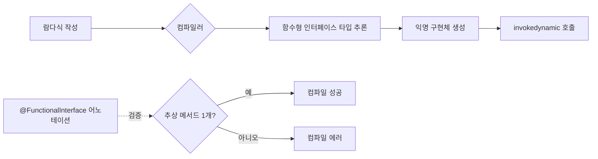

- @FunctionalInterface는 [[함수형 인터페이스]]임을 명시적으로 표기하기 위한 [[어노테이션(Annotation)]]이다.
- Java 8에서 [[람다(lambda)]] 도입과 함께 추가되었으며, 컴파일러가 해당 [[인터페이스(Interface)]]에 추상 [[메서드(Method)]]가 정확히 하나만 존재하는지 검증해준다.

- 추상 [[메서드(Method)]]가 0개이거나 2개 이상이면 컴파일 에러가 발생한다.
- [[디폴트 메서드(Default Method)]]와 [[정적 메서드(Static Method)]]는 개수에 포함되지 않는다.

## 사용 이유

- 안전성: 누군가 인터페이스에 추상 메서드를 추가하면 즉시 컴파일 에러로 잡힌다.
- 의도 표현: "이 인터페이스는 [[람다(lambda)]]로 구현되도록 설계됐다"는 의미를 코드로 드러낸다.
- 어노테이션 없이도 단일 추상 메서드를 가진 인터페이스는 함수형 인터페이스로 동작하지만, 어노테이션을 붙이는 것이 안전하다.

## 예시

```java
@FunctionalInterface
public interface Calculator {
    int calculate(int a, int b);

    default int square(int a) {
        return calculate(a, a);
    }
}

// 람다로 구현
Calculator add = (a, b) -> a + b;
int result = add.calculate(3, 5); // 8
```

## 표준 라이브러리 함수형 인터페이스

| 인터페이스 | 시그니처 | 용도 |
| ---- | ---- | ---- |
| `Runnable` | `void run()` | 인자/반환 없음. 스레드 작업 |
| `Callable<V>` | `V call() throws Exception` | 반환값 있는 작업 |
| `Supplier<T>` | `T get()` | 값을 만들어 반환 |
| `Consumer<T>` | `void accept(T t)` | 값을 받아 소비 |
| `Function<T,R>` | `R apply(T t)` | 변환 |
| `Predicate<T>` | `boolean test(T t)` | 조건 검사 |
| `Comparator<T>` | `int compare(T a, T b)` | 비교 |

## 동작 흐름


