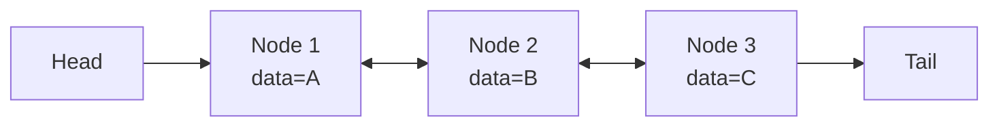

- LinkedList는 [[Collection]] 프레임워크에 포함된 **양방향 연결 리스트(Doubly Linked List)** 자료구조이다.
- `java.util.LinkedList`로 제공되며, `List`, `Deque`, `Queue` [[인터페이스(Interface)]]를 모두 구현한다.

- 각 노드는 데이터와 함께 이전/다음 노드의 참조를 가진다.
- 메모리상 원소가 연속되어 있지 않아 임의 접근(인덱스 조회)이 비효율적이다.

## 시간 복잡도

| 연산 | LinkedList | ArrayList |
| ---- | ---- | ---- |
| 인덱스 조회 `get(i)` | O(n) | O(1) |
| 맨 앞/뒤 추가/삭제 | O(1) | 맨 뒤 O(1), 맨 앞 O(n) |
| 중간 삽입/삭제 (위치를 안다고 가정) | O(1) | O(n) |
| 검색 `contains` | O(n) | O(n) |

## 구조



## 사용 예시

```java
LinkedList<String> list = new LinkedList<>();
list.add("A");         // List 인터페이스
list.addFirst("Z");    // Deque 인터페이스
list.addLast("B");
list.offer("C");       // Queue 인터페이스 (꼬리 추가)
String first = list.poll();  // 머리에서 꺼내기
```

## 언제 LinkedList를 쓰는가

- 큐(Queue)나 덱(Deque)처럼 양 끝에서의 삽입/삭제가 잦을 때.
- 인덱스 접근이 거의 없고 반복자(Iterator)로 순회하면서 삽입/삭제할 때.
- 그 외 대부분의 경우 [[HashMap]]/`ArrayList`/`ArrayDeque`가 더 빠르다.
- 실무에서는 큐/덱 용도라면 `ArrayDeque`를 더 권장한다 (캐시 친화적이라 성능이 보통 더 좋음).
