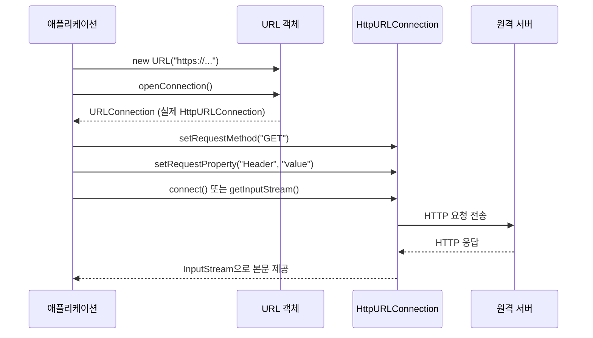

- URLConnection은 `java.net` 패키지의 **추상 [[클래스(Class)]]**로, [[URL(Uniform Resource Locator)]]이 가리키는 리소스에 대한 통신 연결을 표현한다.
- `URL.openConnection()`을 호출해서 인스턴스를 얻으며, HTTP라면 실제로는 하위 클래스인 `HttpURLConnection`을 반환받는다.

- 직접 `new URLConnection(...)`으로 생성할 수 없다.
- 동기 방식 [[HTTP]] 요청·응답 처리에 사용된다.

## 기본 흐름



## 사용 예시

```java
URL url = new URL("https://api.example.com/data");
HttpURLConnection conn = (HttpURLConnection) url.openConnection();
conn.setRequestMethod("GET");
conn.setRequestProperty("Accept", "application/json");
conn.setConnectTimeout(3000);
conn.setReadTimeout(5000);

int status = conn.getResponseCode();
try (BufferedReader br = new BufferedReader(
        new InputStreamReader(conn.getInputStream(), StandardCharsets.UTF_8))) {
    String body = br.lines().collect(Collectors.joining("\n"));
}
conn.disconnect();
```

## 한계와 대안

- API가 오래되고 저수준이라 코드가 길어진다.
- 비동기·HTTP/2·WebSocket을 지원하지 않는다.
- 자원 해제(`disconnect()`, [[InputStream]] close)를 개발자가 직접 챙겨야 한다.

- 그래서 최근에는 다음 대안들을 더 많이 쓴다.
    - **Java 11+ `HttpClient`**: 표준 라이브러리, 비동기·HTTP/2 지원.
    - **OkHttp**: 안드로이드/서버에서 널리 쓰이는 외부 라이브러리.
    - **Spring `RestTemplate`** (구식) / **`WebClient`** (리액티브/비동기).
    - Spring 6.1+ **`RestClient`**: `RestTemplate`의 모던 후속.

## 비교

| 방식 | 비동기 | HTTP/2 | 코드 분량 | 권장 시점 |
| ---- | ---- | ---- | ---- | ---- |
| `URLConnection` | X | X | 많음 | 외부 의존성 못 쓸 때 |
| `HttpClient` (Java 11+) | O | O | 적음 | 표준만 쓸 때 |
| `WebClient` | O | O | 적음 | 스프링 + 비동기 |
| `RestClient` | X (블로킹) | O | 적음 | 스프링 + 동기 |
