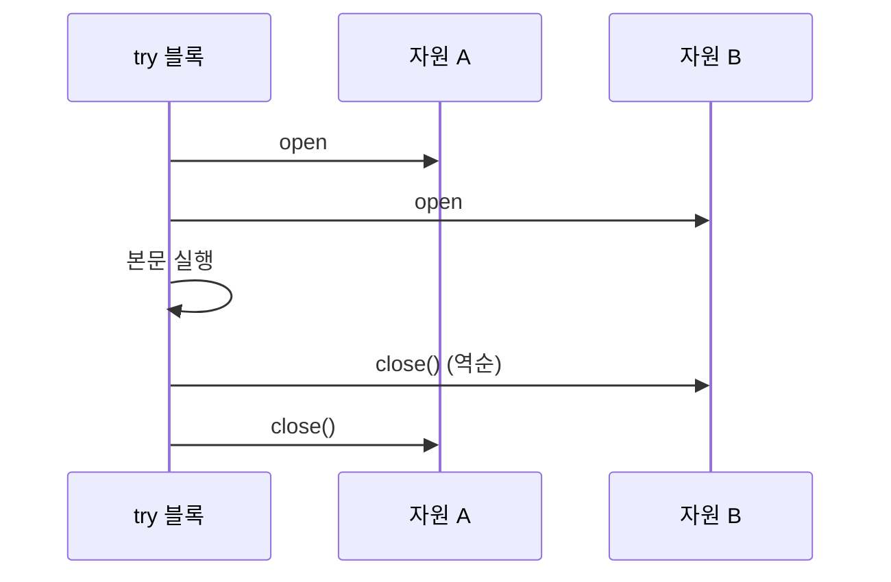

- 자바 언어 자체에 `use`라는 키워드는 존재하지 않는다. (Kotlin의 `use { }` 확장 함수와 혼동 주의)
- 자바에서 "사용 후 자원을 닫는다"는 의미의 표준 패턴은 **try-with-resources** 구문이며, 이 구문은 `AutoCloseable` [[인터페이스(Interface)]]를 구현한 자원에만 적용된다.

## try-with-resources

- 자바 7부터 도입된 자원 자동 해제 구문이다.
- try 블록이 끝나는 시점(정상 종료/예외 발생 무관)에 자동으로 `close()`를 호출해준다.
- 명시적인 `finally { close(); }` 보일러플레이트를 제거한다.

```java
// 전통적인 try-finally
BufferedReader br = null;
try {
    br = new BufferedReader(new FileReader("data.txt"));
    return br.readLine();
} finally {
    if (br != null) br.close();
}

// try-with-resources (권장)
try (BufferedReader br = new BufferedReader(new FileReader("data.txt"))) {
    return br.readLine();
}
```

## AutoCloseable

- try-with-resources에 들어갈 수 있는 자원은 `AutoCloseable`을 구현해야 한다.
- `Closeable`은 `AutoCloseable`을 상속하고, `close()`에서 `IOException`만 던지도록 더 좁힌 [[인터페이스(Interface)]]이다.

```java
public class MyResource implements AutoCloseable {
    @Override
    public void close() {
        System.out.println("자원 해제");
    }
}

try (MyResource r = new MyResource()) {
    // ...
} // 자동으로 close() 호출
```

## 닫히는 순서

- 여러 자원을 선언하면 **선언 역순**으로 닫힌다.
- 본문에서 예외가 발생하고 `close()`에서도 예외가 발생하면 후자는 "Suppressed Exception"으로 첨부된다 (`Throwable#getSuppressed()`).



## 참고: Kotlin의 use

- Kotlin에는 `Closeable.use { ... }` 확장 함수가 있어 비슷한 의도를 함수형으로 표현한다.
- 자바에서는 직접 대응되는 것이 없고, try-with-resources가 그 역할을 한다.
