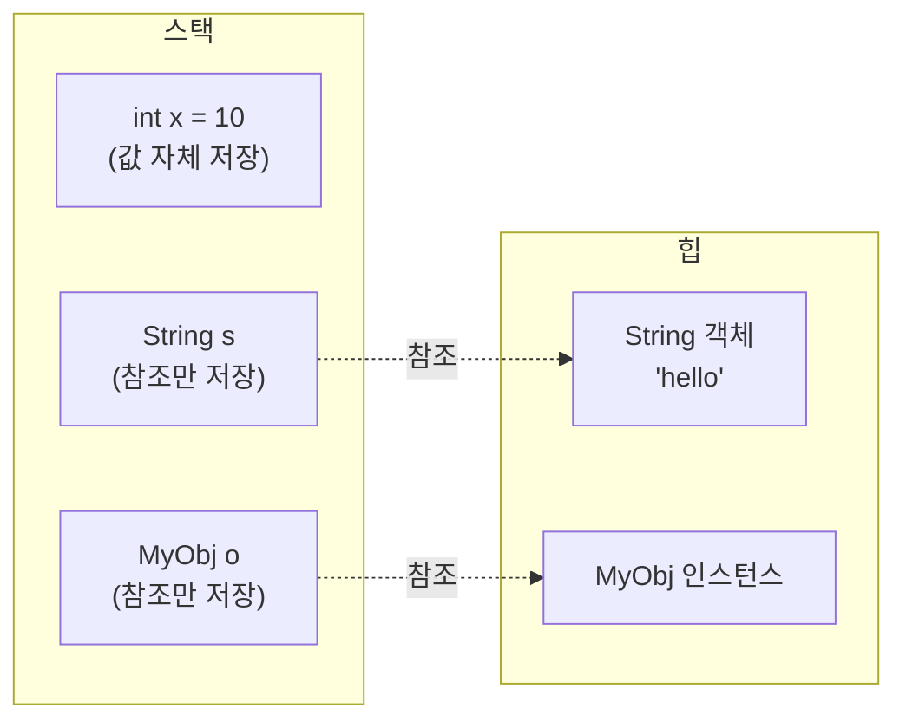

- 참조 타입은 [[변수(Variable)]]가 [[객체(Object)]] 자체가 아니라 **객체의 주소(참조)**를 담는 [[타입(Type)]]이다.
- [[원시 타입(Primitive Type)]]을 제외한 모든 타입(클래스, [[인터페이스(Interface)]], 배열, [[열거(Enum)]], [[String]])이 참조 타입에 해당한다.

## 원시 타입과 참조 타입 비교

| 구분 | 원시 타입 | 참조 타입 |
| ---- | ---- | ---- |
| 예시 | int, long, double, boolean, char | String, 배열, 클래스, 인터페이스, 열거형 |
| 저장 위치 | 스택(지역) / 힙(인스턴스 필드) | 변수는 스택의 참조, 실제 객체는 힙 |
| 기본값 | 0, 0.0, false, ' ' | null |
| null 가능 | 불가 | 가능 |
| 메서드 호출 | 불가 | 가능 (객체 메서드) |
| 비교 | `==` (값 비교) | `==` (참조 비교), `equals()` (값 비교) |
| 메모리 크기 | 타입에 따라 고정 | 참조는 보통 4 또는 8바이트 + 힙에 객체 |

## 메모리 구조



## 동작 차이

```java
// 원시 타입: 값 복사
int a = 10;
int b = a;
b = 20;
// a는 여전히 10

// 참조 타입: 참조 복사 (같은 객체를 가리킴)
StringBuilder sb1 = new StringBuilder("hi");
StringBuilder sb2 = sb1;
sb2.append("!");
// sb1.toString() == "hi!" (같은 객체)
```

## 비교 연산자 주의

```java
String s1 = new String("abc");
String s2 = new String("abc");

System.out.println(s1 == s2);        // false (참조 다름)
System.out.println(s1.equals(s2));   // true  (값 같음)
```

- 참조 타입은 항상 `equals()`로 값 비교해야 한다.
- [[String]] 리터럴은 String Pool 때문에 `==`로도 같은 결과가 나올 수 있지만, 이를 신뢰하지 말고 항상 `equals()`를 사용한다.

## 래퍼 클래스(Wrapper Class)

- [[원시 타입(Primitive Type)]]을 [[객체(Object)]]로 다루기 위해 제공되는 참조 타입이다.
- `int` ↔ `Integer`, `long` ↔ `Long`, `boolean` ↔ `Boolean` 등.
- 오토박싱(autoboxing)/언박싱(unboxing)으로 자동 변환된다.
- [[Collection]]은 제네릭에 원시 타입을 받을 수 없어 래퍼 클래스를 써야 한다 (`List<Integer>`).
