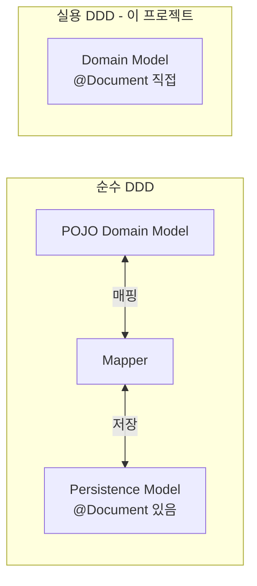

- @Document는 [[Spring Data MongoDB]]에서 **자바 [[클래스(Class)]]를 MongoDB 컬렉션에 매핑**해주는 [[어노테이션(Annotation)]]이다.
- [[JPA(Java Persistence API)]]의 [[@Entity]]에 해당하는 역할이며, `org.springframework.data.mongodb.core.mapping.Document` 패키지에 위치한다.

- 컬렉션 이름을 지정하지 않으면 클래스명을 lowerCamelCase로 변환한 값이 컬렉션명이 된다.
- `collection` 속성으로 명시적으로 지정하는 것이 안전하다.

## 기본 사용

```java
@Getter @Setter @Builder
@NoArgsConstructor @AllArgsConstructor
@Document(collection = "posts")
public class Post {
    @Id
    private String id;

    @Indexed(unique = true)
    private String slug;

    private String title;
    private String content;
    private String authorId;
    private long views;

    @CreatedDate
    private LocalDateTime createdAt;

    @LastModifiedDate
    private LocalDateTime updatedAt;
}
```

## 함께 자주 쓰는 어노테이션

| 어노테이션 | 역할 |
| ---- | ---- |
| `@Id` | 문서의 `_id` 필드와 매핑. 보통 `String` 또는 `ObjectId` |
| `@Indexed` | 인덱스 생성. `unique = true`로 유니크 제약 |
| `@CompoundIndex` (클래스 레벨) | 복합 인덱스 |
| `@CreatedDate` / `@LastModifiedDate` | Auditing 활성화 시 자동 채움 |
| `@Field("name")` | 필드를 다른 BSON 이름으로 매핑 |
| `@Transient` | 영속화 제외 |
| `@DBRef` | 다른 문서 참조 (보통 임베딩 권장, 성능 이유로 잘 안 씀) |

## Pragmatic DDD와 @Document

- 순수 [[DDD(Domain Driven Design)]] 입장에서는 도메인 모델에 영속 프레임워크 어노테이션이 붙는 것을 꺼린다.
- 그러나 실용적 DDD에서는 매핑 코드 중복을 피하기 위해 도메인 모델에 [[@Document]]를 직접 단다.
- 이 프로젝트도 실용 DDD 방식을 채택했다.



## 복합 인덱스 예시

```java
@Document(collection = "view_logs")
@CompoundIndex(
    name = "uniq_entity_ip_hourly",
    def = "{'entityId': 1, 'ipHash': 1}",
    unique = true
)
public class ViewLog {
    @Id
    private String id;
    private String entityId;
    private String ipHash;

    @Indexed(expireAfterSeconds = 3600)
    private Instant createdAt;
}
```

- 유니크 복합 인덱스로 "같은 IP가 같은 글에 같은 시간에 두 번 로그 못 남김"을 DB가 보장.
- `expireAfterSeconds`로 TTL 인덱스 → 1시간 후 자동 삭제.

## 컬렉션 이름 규칙

- 기본값: 클래스명 → lowerCamelCase. `User` → `user`, `VaultNote` → `vaultNote`.
- 명시 권장: `@Document(collection = "users")` — 복수형이나 snake_case 등 팀 규칙을 따른다.

## @Document vs @Entity

| 항목 | `@Entity` (JPA) | `@Document` (Mongo) |
| ---- | ---- | ---- |
| 대상 | [[관계형 데이터베이스(Relational DataBase)]] 테이블 | MongoDB 컬렉션 |
| ID | `@Id` + (`@GeneratedValue`) | `@Id` (Mongo가 ObjectId 자동 생성) |
| 관계 | `@OneToMany`, `@ManyToOne` | 보통 임베딩(중첩 객체), `@DBRef`는 비권장 |
| 스키마 | 사전 정의된 스키마 (DDL) | 동적 스키마 (필드 추가 자유) |
| 트랜잭션 | 기본 지원 | 4.0+ Replica Set에서 다중 문서 트랜잭션 |

## 관련

- [[Spring Data MongoDB]]
- [[MongoTemplate]]
- [[@Entity]]
- [[DDD(Domain Driven Design)]]
