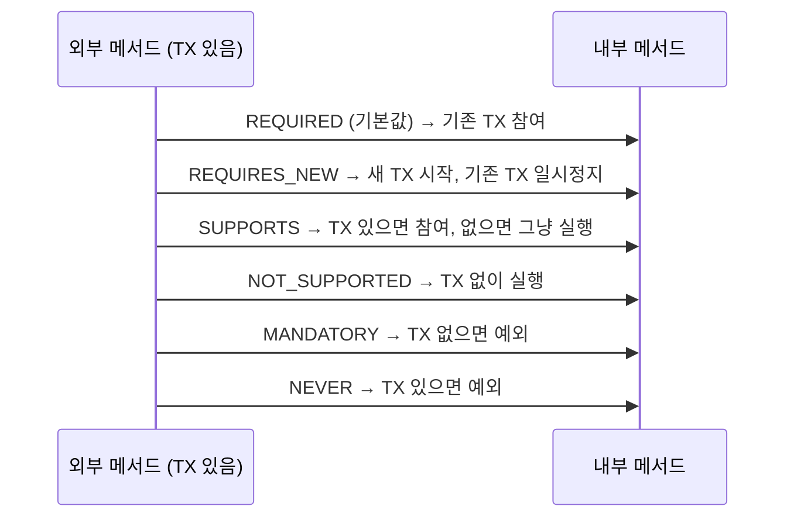

- `@Transactional`은 Spring에서 **메서드 또는 클래스에 트랜잭션 경계를 선언**하는 어노테이션이다.
- 적용된 메서드가 정상 종료되면 COMMIT, 예외가 발생하면 ROLLBACK이 자동으로 처리된다.
- 내부적으로 AOP 프록시를 사용해 동작하므로, **같은 클래스 내부 호출에는 적용되지 않는다**.

## 기본 사용

```java
@Service
@Transactional(readOnly = true)   // 클래스 전체 기본값: 읽기 전용
public class PostService {

    // 읽기 전용 (SELECT 최적화)
    public Post findById(String id) {
        return postRepository.findById(id).orElseThrow();
    }

    @Transactional   // 쓰기 작업은 별도 선언 (readOnly = false 기본값)
    public Post create(CreatePostCommand command) {
        return postRepository.save(Post.of(command));
    }
}
```

## 주요 속성

| 속성 | 기본값 | 설명 |
| ---- | ---- | ---- |
| `readOnly` | `false` | `true`이면 flush 생략, 성능 최적화 |
| `propagation` | `REQUIRED` | 트랜잭션 전파 방식 |
| `isolation` | `DEFAULT` | 격리 수준 (DB 기본값 사용) |
| `rollbackFor` | RuntimeException | 롤백할 예외 타입 지정 |
| `noRollbackFor` | - | 롤백하지 않을 예외 타입 |
| `timeout` | -1 (무제한) | 트랜잭션 제한 시간 (초) |

## 전파 방식 (Propagation)



| 전파 방식 | 설명 | 주 사용 |
| ---- | ---- | ---- |
| `REQUIRED` (기본) | 기존 트랜잭션 참여, 없으면 새로 시작 | 대부분 서비스 메서드 |
| `REQUIRES_NEW` | 항상 새 트랜잭션 시작, 기존 일시 중단 | 이벤트 리스너 DB 작업 |
| `SUPPORTS` | 트랜잭션 있으면 참여, 없어도 실행 | 읽기 전용 |
| `NOT_SUPPORTED` | 트랜잭션 없이 실행 | 배치, 비트랜잭션 로직 |
| `MANDATORY` | 트랜잭션 없으면 예외 | 반드시 트랜잭션 내에서만 실행 |
| `NEVER` | 트랜잭션 있으면 예외 | |
| `NESTED` | 중첩 트랜잭션 (Savepoint) | 부분 롤백 필요 시 |

## rollbackFor

- `@Transactional`은 기본적으로 **RuntimeException (unchecked)** 에서만 롤백한다.
- Checked Exception은 기본 롤백 대상이 아니므로 명시가 필요하다.

```java
@Transactional(rollbackFor = Exception.class)   // 모든 예외에 롤백
public void process() throws IOException { ... }
```

## 주의사항

### 같은 클래스 내부 호출 — 트랜잭션 미적용

```java
@Service
public class PostService {

    public void outer() {
        inner();   // 같은 클래스 내부 호출 → @Transactional 무시됨
    }

    @Transactional
    public void inner() { ... }
}
```

- Spring의 `@Transactional`은 AOP 프록시를 통해 동작하므로 `this.inner()`는 프록시를 거치지 않는다.
- 해결: inner()를 별도 서비스 클래스로 분리하거나, `ApplicationContext`를 통해 프록시를 직접 가져온다.

### readOnly = true 효과

- JPA 영속성 컨텍스트의 Dirty Checking(변경 감지)을 비활성화 → flush 생략.
- DB 드라이버 레벨에서 읽기 전용 최적화.
- `@Transactional(readOnly = true)`는 클래스 레벨에 두고, 쓰기 메서드에만 `@Transactional`을 덮어쓰는 패턴이 권장된다.

## @TransactionalEventListener와 연동

- `@TransactionalEventListener(phase = AFTER_COMMIT)` 핸들러에서 DB 작업이 필요하면 `REQUIRES_NEW`와 함께 사용한다.
- 자세한 내용: [[@TransactionalEventListener]]

## 관련

- [[트랜젝션(transaction)]]
- [[트랜잭션(Transaction)]]
- [[@TransactionalEventListener]]
- [[JPA(Java Persistence API)]]
- [[서비스(Service)]]
