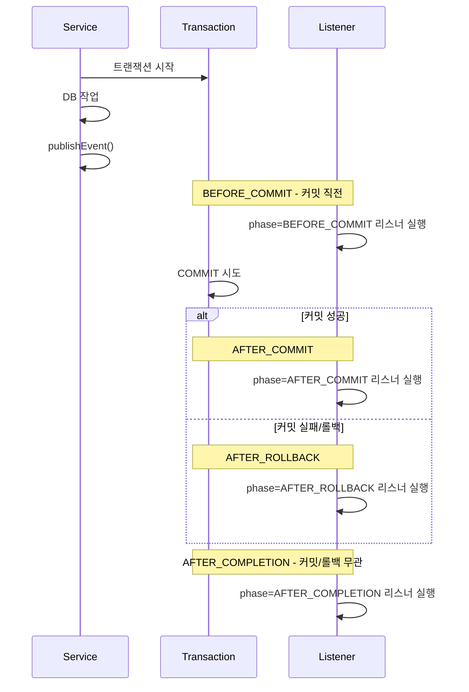

- @TransactionalEventListener는 [[ApplicationEvent]] 리스너를 **트랜잭션의 특정 시점**(커밋 직후, 롤백 직후 등)에 실행시키는 [[어노테이션(Annotation)]]이다.
- 일반 `@EventListener`와 달리 트랜잭션 상태와 동기화되므로, **외부 부수효과(메일/푸시/외부 API)를 안전하게 처리**할 수 있다.

- 메일 전송 같은 부수효과를 commit 후에만 실행해야 트랜잭션 롤백 시 잘못된 알림이 안 나간다.
- 활성 트랜잭션이 없을 때는 기본적으로 리스너가 실행되지 않으므로 주의.

## 왜 필요한가

### 문제 - 일반 @EventListener의 위험

```java
@Service
@Transactional
public class OrderService {
    public void place(Order order) {
        orderRepository.save(order);
        eventPublisher.publishEvent(new OrderPlacedEvent(order.getId()));
        // ↓ 메일이 이미 발송됨
        validatePayment(order); // 여기서 예외 → 트랜잭션 롤백
        // DB는 롤백되지만 메일은 이미 나갔다! 데이터 불일치
    }
}
```

### 해결 - @TransactionalEventListener

```java
@Component
public class OrderNotificationListener {
    @TransactionalEventListener(phase = TransactionPhase.AFTER_COMMIT)
    public void handle(OrderPlacedEvent event) {
        mailSender.send("주문 완료: " + event.orderId());
        // 커밋 후에만 실행 → 롤백되면 안 나감
    }
}
```

## 트랜잭션 페이즈



| Phase | 시점 | 용도 |
| ---- | ---- | ---- |
| `BEFORE_COMMIT` | 커밋 직전, 아직 같은 트랜잭션 안 | 같은 트랜잭션에서 추가 DB 작업 |
| `AFTER_COMMIT` **(기본값)** | 커밋 완료 후 | 메일/푸시/외부 API 등 부수효과 |
| `AFTER_ROLLBACK` | 롤백 후 | 보상 트랜잭션, 알림 |
| `AFTER_COMPLETION` | 커밋/롤백 무관 종료 후 | 정리 작업 |

## 트랜잭션이 없을 때

- 기본적으로 활성 트랜잭션이 없으면 리스너는 **호출되지 않는다**.
- 트랜잭션 없이도 실행하고 싶다면 `fallbackExecution = true` 옵션.

```java
@TransactionalEventListener(
    phase = TransactionPhase.AFTER_COMMIT,
    fallbackExecution = true
)
public void handle(OrderPlacedEvent event) { ... }
```

## AFTER_COMMIT 안에서 DB 작업하기

- AFTER_COMMIT은 이미 트랜잭션이 끝난 뒤이므로, 그 안에서 `save()` 호출은 트랜잭션 없이 실행되거나 실패할 수 있다.
- 새 트랜잭션이 필요하면 `@Transactional(propagation = REQUIRES_NEW)`.

```java
@TransactionalEventListener(phase = TransactionPhase.AFTER_COMMIT)
@Transactional(propagation = Propagation.REQUIRES_NEW)
public void handle(OrderPlacedEvent event) {
    notificationRepository.save(...);  // 새 트랜잭션에서 안전하게 저장
}
```

## 비동기로 만들기

- 기본은 동기 실행 → 메일 전송이 느리면 응답 지연.
- `@Async` + `@EnableAsync`로 별도 스레드에서 실행.

```java
@Component
@RequiredArgsConstructor
public class AdminNightNotificationListener {

    private final RecoveryMailSender mailSender;

    @Async
    @TransactionalEventListener(phase = TransactionPhase.AFTER_COMMIT)
    public void handle(AdminNightNotificationEvent event) {
        try {
            mailSender.send(buildMail(event));
        } catch (Exception e) {
            log.warn("알림 전송 실패", e);
        }
    }
}
```

## 실전 예시 (이 프로젝트)

```java
@Slf4j
@Component
@RequiredArgsConstructor
public class AdminNightNotificationListener {

    private final RecoveryMailSender mailSender;
    private final RecoveryEmailComposer composer;
    private final AdminNightProperties properties;

    @TransactionalEventListener(phase = TransactionPhase.AFTER_COMMIT)
    public void handle(AdminNightNotificationEvent event) {
        if (!mailSender.isAvailable()) return;

        try {
            switch (event.type()) {
                case REQUEST_CREATED -> {
                    mailSender.send(composer.buildRequestConfirmation(event.request()));
                    mailSender.send(composer.buildRequestNotification(
                        event.request(), properties.getAdminEmail()));
                }
                case REQUEST_APPROVED -> {
                    mailSender.send(composer.buildApprovedForRequester(event.request()));
                }
            }
        } catch (Exception e) {
            log.warn("Admin Night 알림 전송 실패", e);
        }
    }
}
```

## 주의사항

- **트랜잭션 없는 호출**: 활성 트랜잭션 없으면 기본은 무시 → 테스트 시 `@Transactional` 확인.
- **예외 처리**: AFTER_COMMIT에서 throw해도 원본 트랜잭션은 이미 커밋됨 → 예외 처리는 리스너 내부에서.
- **순서 보장**: 같은 페이즈 안에서도 여러 리스너 순서는 불확정 → `@Order` 사용.
- **이벤트 직렬화 안 됨**: 같은 JVM 내 객체 전달이므로 mutable 객체면 사이드 이펙트 위험.
- **REQUIRES_NEW + AFTER_COMMIT 조합**: 새 트랜잭션이 또 이벤트를 발행하면 또 다른 AFTER_COMMIT이 트리거됨 → 이벤트 루프 주의.

## 관련

- [[ApplicationEvent]]
- [[@Transactional]]
- [[@Async]]
- [[Bounded Context]]
