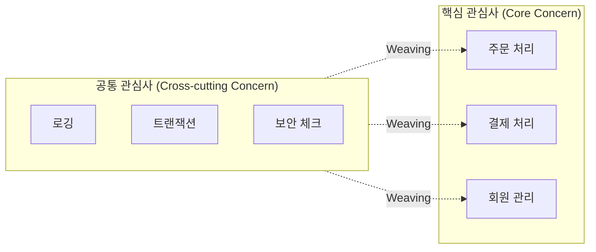
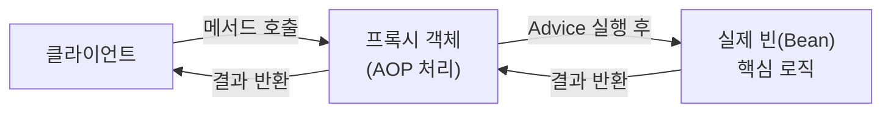

- 관점 지향 프로그래밍(AOP)은 **핵심 관심사와 공통 관심사를 분리하여 프로그래밍**하는 것을 의미한다.
- [[객체(Object)]] 지향 프로그래밍(OOP) 패러다임을 보완하는 기술로, 여러 [[클래스(Class)]]에서 반복되는 코드(로깅, 인증, 트랜잭션 등)를 모듈화한다.
- Spring에서는 **프록시(Proxy) 기반**으로 AOP를 구현하며, [[Spring AOP]] 방식으로 사용한다.

## 핵심 관심사 vs 공통 관심사



- **핵심 관심사**: 각 [[클래스(Class)]]가 가져야 할 본래 비즈니스 기능.
- **공통 관심사**: 여러 클래스에서 공통적으로 사용되는 횡단 관심사(로깅, 트랜잭션, 인증 체크 등).

## AOP 핵심 용어

| 용어 | 설명 |
| ---- | ---- |
| **Aspect** | 공통 관심사를 모듈화한 것 (`@Aspect` 클래스) |
| **Advice** | Aspect에서 실행할 실제 코드 (언제 실행할지도 포함) |
| **Pointcut** | Advice를 적용할 메서드의 조건 (표현식) |
| **JoinPoint** | Advice가 실행되는 시점 (메서드 호출, 실행 등) |
| **Weaving** | Pointcut에 맞는 JoinPoint에 Advice를 적용하는 과정 |

## Advice 종류

| 어노테이션 | 실행 시점 |
| ---- | ---- |
| `@Before` | 메서드 실행 전 |
| `@AfterReturning` | 메서드 정상 반환 후 |
| `@AfterThrowing` | 메서드 예외 발생 후 |
| `@After` | 메서드 종료 후 (정상/예외 모두) |
| `@Around` | 메서드 실행 전후 모두 제어 (가장 강력) |

## @Aspect 실제 사용 예시

### 로깅 AOP

```java
@Aspect
@Component
public class LoggingAspect {

    private static final Logger log = LoggerFactory.getLogger(LoggingAspect.class);

    // Pointcut: 특정 패키지의 모든 public 메서드
    @Pointcut("execution(* com.kscold.blog.*.application.service.*.*(..))")
    public void serviceLayer() {}

    @Around("serviceLayer()")
    public Object logExecutionTime(ProceedingJoinPoint joinPoint) throws Throwable {
        long start = System.currentTimeMillis();
        String methodName = joinPoint.getSignature().getName();

        log.info("[{}] 실행 시작", methodName);
        Object result = joinPoint.proceed();  // 실제 메서드 실행

        long elapsed = System.currentTimeMillis() - start;
        log.info("[{}] 실행 완료 - {}ms", methodName, elapsed);
        return result;
    }
}
```

### 예외 처리 AOP

```java
@Aspect
@Component
public class ExceptionLoggingAspect {

    @AfterThrowing(pointcut = "execution(* com.kscold.blog..*(..))", throwing = "ex")
    public void logException(JoinPoint joinPoint, Exception ex) {
        log.error("[{}] 예외 발생: {}", joinPoint.getSignature().getName(), ex.getMessage());
    }
}
```

### 인증 체크 AOP

```java
// 커스텀 어노테이션 정의
@Target(ElementType.METHOD)
@Retention(RetentionPolicy.RUNTIME)
public @interface RequireAdmin {}

// AOP로 어노테이션 감지
@Aspect
@Component
public class AuthAspect {

    @Before("@annotation(RequireAdmin)")
    public void checkAdminRole(JoinPoint joinPoint) {
        Authentication auth = SecurityContextHolder.getContext().getAuthentication();
        if (!auth.getAuthorities().contains(new SimpleGrantedAuthority("ROLE_ADMIN"))) {
            throw new AccessDeniedException("관리자 권한이 필요합니다");
        }
    }
}
```

## Pointcut 표현식

```
execution(접근제어자 반환타입 패키지.클래스.메서드(파라미터))

execution(* com.example.*.service.*.*(..))
         ↑  ↑                      ↑  ↑ ↑↑
         |  패키지 와일드카드       |  | 파라미터 (..)는 모든 타입
         |                        |  메서드 * = 모두
         반환타입 * = 모두         클래스 * = 모두
```

| 표현식 | 설명 |
| ---- | ---- |
| `execution(* *(..))` | 모든 메서드 |
| `execution(* com.example..*(..)` | 특정 패키지 하위 모두 |
| `@annotation(Transactional)` | @Transactional이 붙은 메서드 |
| `within(com.example.service.*)` | 특정 패키지 내 클래스 |

## Spring AOP의 프록시 동작 방식



- **내부 호출(Self-invocation) 주의**: 같은 [[클래스(Class)]] 안에서 자기 자신의 AOP 적용 메서드를 직접 호출하면 프록시를 거치지 않아 AOP가 동작하지 않는다.
- [[`@Transactional`]]의 내부 호출 문제와 동일한 원리이다.

```java
@Service
public class PostService {
    public void outer() {
        inner();   // 내부 호출 → AOP 프록시 미적용
    }

    @Transactional  // 이 @Transactional은 outer()에서 호출 시 무시됨
    public void inner() { ... }
}
```

## 실무 활용 사례

- **로깅**: 메서드 실행 시간 측정, 파라미터/리턴값 로깅.
- **트랜잭션**: `@Transactional` 자체가 Spring AOP로 구현됨.
- **인증/인가**: 특정 [[어노테이션(Annotation)]]이 붙은 메서드에 권한 체크.
- **캐시**: `@Cacheable`, `@CacheEvict` 처리.
- **성능 모니터링**: 느린 메서드 감지.

## 관련

- [[Spring AOP]]
- [[스프링 컨테이너(Spring Container)]]
- [[Bean]]
- [[@Transactional]]
- [[DI(Dependency Injection)]]
- [[인가(Authorization)]]
