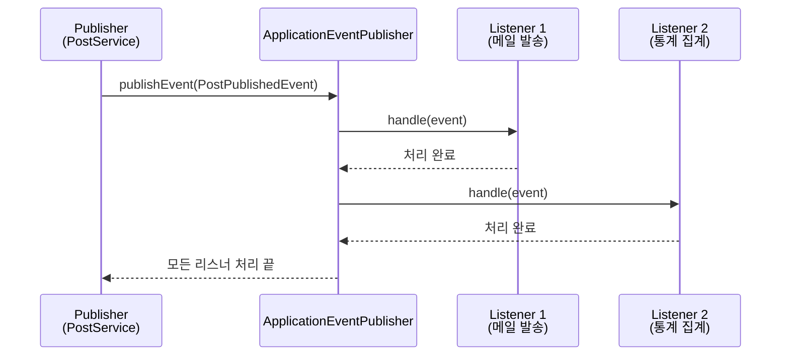
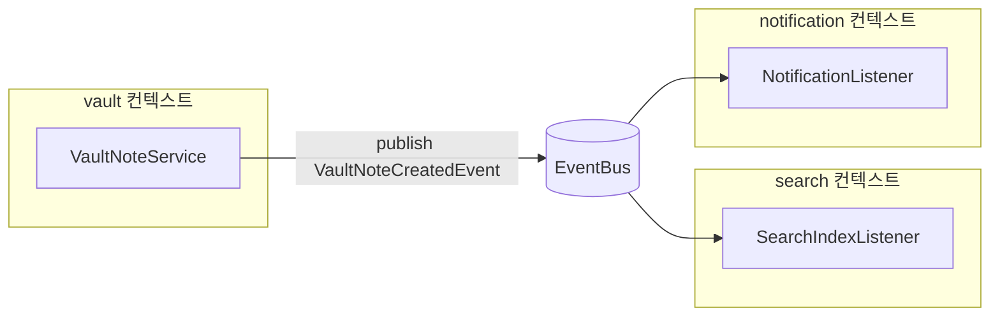

- ApplicationEvent는 [[스프링 컨테이너(Spring Container)]]가 제공하는 **이벤트 발행/구독 메커니즘**으로, 같은 JVM 내의 [[Bean]]들이 직접 의존하지 않고 메시지로만 협력하게 해준다.
- 발행자(Publisher)는 `ApplicationEventPublisher.publishEvent(event)`를 호출하고, 구독자(Listener)는 `@EventListener` 또는 `@TransactionalEventListener`로 받는다.

- Spring 4.2+부터 임의의 [[객체(Object)]]가 이벤트가 될 수 있다 (예전엔 `ApplicationEvent` 상속 필요).
- [[Bounded Context]] 간 결합도를 낮추는 핵심 도구이다.

## 기본 사용

```java
// 1. 이벤트 정의 (단순 record로 충분)
public record PostPublishedEvent(String postId, String authorId, Instant publishedAt) {}

// 2. 발행
@Service
@RequiredArgsConstructor
public class PostApplicationService implements PostUseCase {

    private final ApplicationEventPublisher eventPublisher;
    private final PostRepository postRepository;

    public PostResponse publish(String postId) {
        Post post = postRepository.findById(postId).orElseThrow(...);
        post.publish();
        postRepository.save(post);

        eventPublisher.publishEvent(
            new PostPublishedEvent(post.getId(), post.getAuthorId(), Instant.now())
        );

        return PostResponse.of(post);
    }
}

// 3. 구독 (다른 컨텍스트의 어댑터에서)
@Component
@RequiredArgsConstructor
public class PostPublishedNotificationListener {

    private final MailSender mailSender;

    @EventListener
    public void handle(PostPublishedEvent event) {
        mailSender.send("새 글이 발행되었습니다: " + event.postId());
    }
}
```

## 동작 흐름



- 기본은 **동기**: 모든 리스너가 끝나야 publish 호출이 리턴된다.
- 비동기로 만들려면 `@EventListener` 메서드에 `@Async` + 설정의 `@EnableAsync`.

## 트랜잭션과 함께 - @TransactionalEventListener

- 일반 `@EventListener`는 publish 즉시 실행되므로, **트랜잭션 롤백 시에도 이미 실행된다** → 메일 전송 같은 외부 부수효과는 위험.
- `@TransactionalEventListener`는 트랜잭션의 특정 시점(commit, rollback 등)에만 실행되도록 보장.

```java
@TransactionalEventListener(phase = TransactionPhase.AFTER_COMMIT)
public void handle(AdminNightNotificationEvent event) {
    mailSender.send(buildNotification(event.request()));
}
```

### 트랜잭션 페이즈

| TransactionPhase | 실행 시점 |
| ---- | ---- |
| `BEFORE_COMMIT` | 커밋 직전 |
| `AFTER_COMMIT` (기본) | 커밋 완료 직후 |
| `AFTER_ROLLBACK` | 롤백 직후 |
| `AFTER_COMPLETION` | 커밋/롤백 무관 종료 후 |

- **외부 부수효과(메일, 푸시, 외부 API 호출)는 거의 항상 `AFTER_COMMIT`**.
- DB 작업 결과가 확정된 다음에만 실행해야 일관성이 깨지지 않는다.

## 비동기 이벤트

```java
@Configuration
@EnableAsync
public class AsyncConfig {}

@Component
public class SlowListener {
    @Async
    @TransactionalEventListener
    public void handle(SomeEvent event) {
        // 별도 스레드에서 실행, publish 호출자 블로킹 안 함
    }
}
```

- 비동기로 만들면 호출자 응답이 빨라지지만, 실패 시 retry/DLQ 같은 설계가 필요.

## 활용 패턴 - 컨텍스트 간 결합도 낮추기



- vault 컨텍스트는 search, notification 존재를 모른다.
- 새로운 리스너 추가는 vault 코드를 건드리지 않는다.

## 이벤트 vs 직접 호출 vs 메시지 큐

| 방식 | 결합도 | 트랜잭션 | 다른 프로세스 |
| ---- | ---- | ---- | ---- |
| 직접 호출 | 높음 | 같은 트랜잭션 | 같은 JVM |
| `@TransactionalEventListener` | 낮음 | 분리 가능 | 같은 JVM |
| 메시지 큐(Kafka, RabbitMQ) | 매우 낮음 | 분리 | 다른 프로세스 가능 |

- 같은 JVM이면 `@TransactionalEventListener`가 가성비 좋음.
- 마이크로서비스 간이면 메시지 큐로.

## 주의사항

- **순서 보장 안 됨**: 여러 리스너 실행 순서는 불확정. 필요하면 `@Order`.
- **예외 전파**: 동기 리스너에서 예외 throw 시 발행자에게 전파됨 → 원래 트랜잭션도 롤백될 수 있음. catch하거나 비동기로.
- **AFTER_COMMIT 안의 DB 작업**: 새 트랜잭션이 필요하면 `@Transactional(propagation = REQUIRES_NEW)`.
- **이벤트는 불변 객체로**: 리스너가 수정하면 다른 리스너에 영향. `record` 또는 final 필드.

## 관련

- [[@TransactionalEventListener]]
- [[Bounded Context]]
- [[DDD(Domain Driven Design)]] - 도메인 이벤트
- [[@Transactional]]
- [[@Async]]
