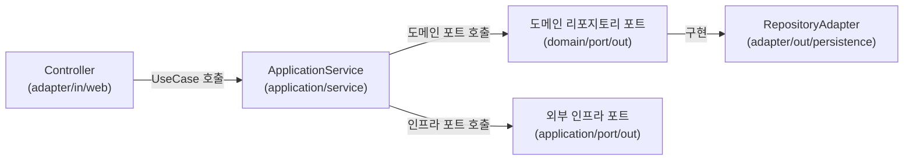

- ApplicationService는 [[헥사고날 아키텍처(Hexagonal Architecture)]]에서 **UseCase 인터페이스를 구현하는 애플리케이션 계층의 서비스 클래스**이다.
- `application/service/` 패키지에 위치하며, 도메인 로직 조율과 인프라 포트 호출을 담당한다.
- 도메인 모델과 외부 인프라(DB, 외부 API) 사이를 연결하는 **오케스트레이터(Orchestrator)** 역할을 한다.

- [[도메인 서비스(Domain Service)]]와 달리 Spring `@Service` 어노테이션을 붙인다.
- 다른 도메인의 기능이 필요하면 해당 도메인의 UseCase 인터페이스를 주입받는다(구체 클래스 직접 주입 금지).

## 위치와 역할



## 코드 예시

```java
@Service
@RequiredArgsConstructor
public class PostApplicationService implements PostUseCase {

    private final PostRepository postRepository;        // domain/port/out
    private final CategoryUseCase categoryUseCase;     // 타 도메인 인바운드 포트

    @Override
    public PostResponse publish(String postId) {
        Post post = postRepository.findById(postId)
            .orElseThrow(() -> new ResourceNotFoundException(ErrorCode.POST_NOT_FOUND));

        post.publish();
        postRepository.save(post);

        return PostResponse.of(post);
    }
}
```

## 규칙

- MongoDB/JPA 등 인프라 구현체 직접 import 금지 → 도메인 포트 인터페이스만 사용
- 다른 `ApplicationService` 구체 클래스 주입 금지 → UseCase 인터페이스로 의존
- 비즈니스 불변식 검증은 도메인 모델에서, 흐름 제어는 ApplicationService에서

## 관련

- [[헥사고날 아키텍처(Hexagonal Architecture)]]
- [[포트와 어댑터(Port and Adapter)]]
- [[DDD(Domain Driven Design)]]
- [[Bounded Context]]
