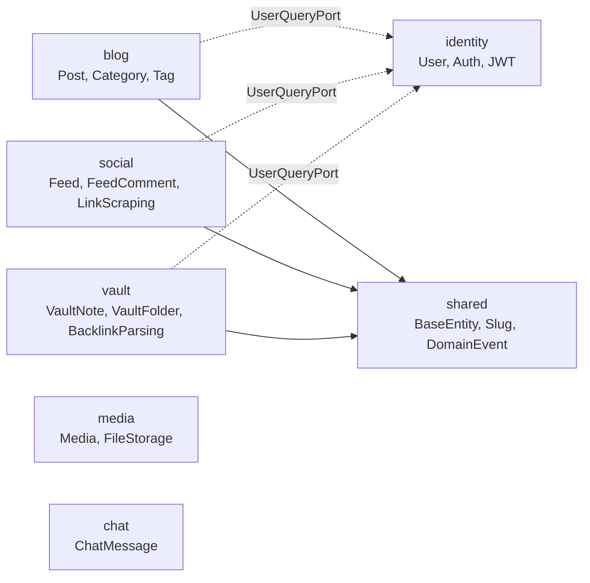

- Bounded Context는 [[DDD(Domain Driven Design)]]의 핵심 개념으로, **하나의 도메인 모델이 일관된 의미를 가지는 명확한 경계**를 말한다.
- 같은 단어("회원", "주문")라도 컨텍스트가 다르면 다른 의미를 가질 수 있으므로, 각자의 모델·언어·로직을 분리한다.

- 한 [[Bounded Context]] 안에서는 유비쿼터스 언어가 통일된다.
- 컨텍스트 간 통신은 명시적인 약속(포트, 이벤트, API)으로만 한다.

## 왜 필요한가

- 모든 도메인 개념을 하나의 거대한 모델로 합치면 ([Big Ball of Mud]) 변경이 한 곳에서 전체로 전염된다.
- 도메인을 경계로 쪼개면 각 경계 내부는 자유롭게 진화할 수 있고, 경계 간에는 명확한 계약만 지키면 된다.

## 이 프로젝트의 Bounded Context 예시



- 각 컨텍스트는 `com.kscold.blog.{context}` 패키지에 독립적으로 존재한다.
- 내부 구조는 동일하게 [[헥사고날 아키텍처(Hexagonal Architecture)]]를 따른다.

## 컨텍스트 간 통신 패턴

### 1. 동기 호출 - 인바운드 포트(UseCase/QueryPort)

- 다른 컨텍스트의 데이터가 즉시 필요할 때.
- 다른 컨텍스트의 **인바운드 포트**(`application/port/in`)만 의존한다.
- 다른 컨텍스트의 도메인 모델은 import 하지 않는다.

```java
// blog 컨텍스트의 PostApplicationService
public class PostApplicationService implements PostUseCase {
    private final PostRepository postRepository;   // 같은 컨텍스트
    private final UserQueryPort userQueryPort;     // identity 컨텍스트의 인바운드 포트

    public PostResponse getPost(String slug) {
        Post post = postRepository.findBySlug(slug).orElseThrow(...);
        UserQueryPort.UserInfo author = userQueryPort.getUserById(post.getAuthorId());
        return PostResponse.of(post, author);
    }
}
```

### 2. 비동기 이벤트 - [[ApplicationEvent]]

- 다른 컨텍스트에 "일이 일어났음"을 알리되, 응답을 즉시 받지 않아도 될 때.
- 결합도가 낮아지고 트랜잭션 경계를 분리할 수 있다.

```java
// 발행
applicationEventPublisher.publishEvent(new AdminNightNotificationEvent(...));

// 수신 (다른 컨텍스트/어댑터)
@TransactionalEventListener(phase = TransactionPhase.AFTER_COMMIT)
public void handle(AdminNightNotificationEvent event) { ... }
```

### 3. Anti-Corruption Layer (ACL)

- 외부(레거시/타사 API)의 모델이 내 도메인에 침투하지 않도록 번역 계층을 둠.
- 이 프로젝트에서는 어댑터(`adapter/out/external`)가 ACL 역할.

## 컨텍스트 간 관계 (Context Map 패턴)

| 패턴 | 설명 |
| ---- | ---- |
| Shared Kernel | 두 컨텍스트가 일부 모델을 공유 (이 프로젝트의 `shared/`) |
| Customer-Supplier | 한쪽이 다른 쪽의 요구를 들어줌 |
| Conformist | 강자에 맞춤 (외부 API 그대로 따름) |
| Anti-Corruption Layer | 외부 모델을 번역해서 받음 |
| Open Host Service | 누구나 호출할 수 있게 공개 (인바운드 포트) |
| Published Language | 공통 표현 형식 (이벤트 페이로드, OpenAPI 스펙) |

## 규칙

- **다른 컨텍스트의 도메인 모델을 직접 import 하지 않는다** — 인바운드 포트만.
- **공통 인프라(BaseEntity, Slug VO)는 `shared/`에 둔다**.
- **사용자(User) 같이 모든 컨텍스트가 참조하는 개념도 한 곳(identity)에 두고 나머지는 ID/QueryPort로만 참조**한다.
- **컨텍스트 간 트랜잭션을 묶지 않는다** — 결국 컨텍스트는 분리될 수 있어야 함. 이벤트로 보장.

## 관련

- [[DDD(Domain Driven Design)]]
- [[헥사고날 아키텍처(Hexagonal Architecture)]]
- [[포트와 어댑터(Port and Adapter)]]
- [[ApplicationEvent]]
