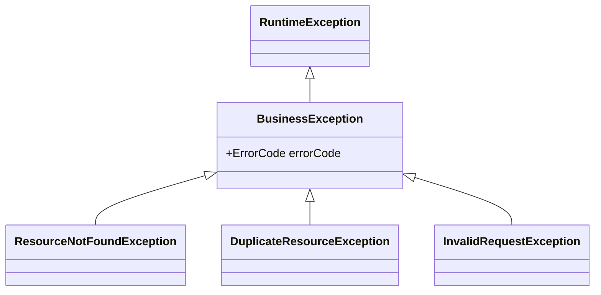

- BusinessException은 **비즈니스 로직 처리 중 발생하는 모든 커스텀 예외의 최상위 [[클래스(Class)]]**로, `RuntimeException`을 상속한다.
- ErrorCode([[열거(Enum)]])를 필드로 가지며, [[GlobalExceptionHandler]]가 이 예외 한 종류만 잡아도 다양한 비즈니스 상황에 대응할 수 있게 한다.

- 체크 예외(Checked)가 아닌 **런타임 예외(Unchecked)**로 만든다 → 시그니처에 throws 안 적어도 됨.
- 도메인 의미가 있는 예외 처리에 사용한다 (vs. NPE 같은 시스템 예외).

## 기본 구조

```java
@Getter
public class BusinessException extends RuntimeException {

    private final ErrorCode errorCode;

    public BusinessException(ErrorCode errorCode) {
        super(errorCode.getMessage());
        this.errorCode = errorCode;
    }

    public BusinessException(ErrorCode errorCode, String message) {
        super(message);
        this.errorCode = errorCode;
    }

    public BusinessException(ErrorCode errorCode, Throwable cause) {
        super(errorCode.getMessage(), cause);
        this.errorCode = errorCode;
    }
}
```

## ErrorCode 열거형

```java
@Getter
@RequiredArgsConstructor
public enum ErrorCode {
    // Common
    INTERNAL_SERVER_ERROR(HttpStatus.INTERNAL_SERVER_ERROR, "C001", "서버 내부 오류"),
    INVALID_INPUT_VALUE(HttpStatus.BAD_REQUEST,           "C002", "잘못된 입력값"),

    // Identity
    UNAUTHORIZED(HttpStatus.UNAUTHORIZED,                 "I001", "인증이 필요합니다"),
    FORBIDDEN(HttpStatus.FORBIDDEN,                       "I002", "접근 권한이 없습니다"),
    INVALID_TOKEN(HttpStatus.UNAUTHORIZED,                "I003", "유효하지 않은 토큰"),

    // Blog
    POST_NOT_FOUND(HttpStatus.NOT_FOUND,                  "B001", "게시글을 찾을 수 없습니다"),
    SLUG_DUPLICATE(HttpStatus.CONFLICT,                   "B002", "이미 사용중인 slug");

    private final HttpStatus status;
    private final String code;
    private final String message;
}
```

## 계층 설계



- `BusinessException`이 모든 비즈니스 예외의 부모.
- HTTP 의미별로 하위 클래스를 두면 가독성이 좋아진다 (선택).

## 하위 클래스 예시

```java
public class ResourceNotFoundException extends BusinessException {
    public ResourceNotFoundException(ErrorCode errorCode) {
        super(errorCode);
    }
}

public class DuplicateResourceException extends BusinessException {
    public DuplicateResourceException(ErrorCode errorCode) {
        super(errorCode);
    }
}
```

## 사용 패턴

### 1. 도메인 검증에서

```java
public class User {
    public void changePassword(String old, String newPwd, PasswordEncoder encoder) {
        if (!encoder.matches(old, this.password)) {
            throw new BusinessException(ErrorCode.INVALID_PASSWORD);
        }
        this.password = encoder.encode(newPwd);
    }
}
```

### 2. 서비스에서

```java
public Post getPost(String slug) {
    return postRepository.findBySlug(slug)
        .orElseThrow(() -> new ResourceNotFoundException(ErrorCode.POST_NOT_FOUND));
}
```

### 3. 어댑터에서 (외부 라이브러리 예외 변환)

```java
try {
    return postRepository.save(post);
} catch (DuplicateKeyException e) {
    throw new DuplicateResourceException(ErrorCode.SLUG_DUPLICATE);
}
```

## RuntimeException으로 만드는 이유

- 체크 예외는 모든 호출 시그니처에 `throws` 표시 강제 → 코드 오염, 위로 전파만 시키는 try-catch 양산.
- 비즈니스 예외는 **개발자가 처리 여부를 선택**할 수 있어야 함.
- 결국 [[GlobalExceptionHandler]]가 잡아주므로 중간에서 catch할 필요 없음.

## GlobalExceptionHandler와의 연계

```java
@RestControllerAdvice
public class GlobalExceptionHandler {

    @ExceptionHandler(BusinessException.class)
    public ResponseEntity<ApiResponse<Void>> handle(BusinessException e) {
        ErrorCode ec = e.getErrorCode();
        return ResponseEntity
            .status(ec.getStatus())
            .body(ApiResponse.error(ec.getCode(), e.getMessage()));
    }
}
```

- 한 핸들러만 등록해도 모든 ErrorCode를 적절한 HTTP status로 변환할 수 있다.

## 안티패턴

- **모든 예외를 BusinessException으로** → NPE 같은 시스템 예외는 잡지 말고 그대로 두기 (별도 핸들러가 500으로).
- **메시지를 코드 안에 하드코딩하지 않고 ErrorCode로 통일** → i18n, 일관성 확보.
- **여러 곳에 흩어진 ErrorCode** → 도메인별로 묶거나 한 enum에 모으되 prefix(B001, I001)로 식별.

## 관련

- [[GlobalExceptionHandler]]
- [[@RestControllerAdvice]]
- [[HTTP 상태 코드(HTTP Status)]]
- [[열거(Enum)]]
