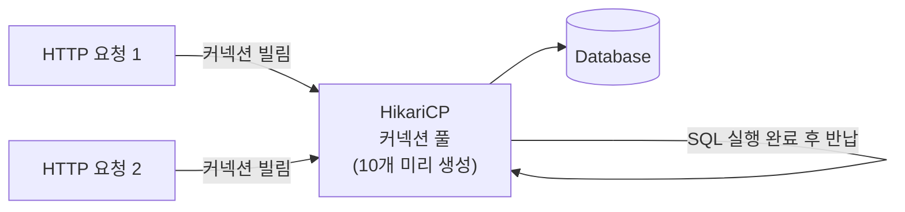

- HikariCP는 **Spring Boot 기본 내장 [[DBCP(Database Connection Pool)]] 라이브러리**이다.
- "오버헤드 제로"를 표방하며, 약 130KB의 경량 라이브러리로 성능이 매우 뛰어나다.
- [[DBCP(Database Connection Pool)]]를 구현한 라이브러리 중 가장 빠른 것으로 알려져 있다.
- Spring Boot 2.0부터 기본 커넥션 풀로 채택되어 별도 설정 없이 자동 적용된다.

## 커넥션 풀이 필요한 이유

- DB 연결(Connection)은 TCP 핸드쉐이크 + 인증 과정으로 **매 요청마다 생성하면 비용이 크다**.
- 커넥션 풀은 **미리 연결을 만들어두고 재사용**하여 이 비용을 없앤다.



## Spring Boot 자동 설정

```yaml
# application.yml — HikariCP 주요 설정
spring:
  datasource:
    url: jdbc:mysql://localhost:3306/mydb
    username: root
    password: password
    driver-class-name: com.mysql.cj.jdbc.Driver
    hikari:
      pool-name: HikariPool-main       # 풀 이름 (로그에서 구분용)
      maximum-pool-size: 10            # 최대 커넥션 수 (기본값 10)
      minimum-idle: 5                  # 유휴 커넥션 최소 유지 수
      connection-timeout: 30000        # 커넥션 획득 대기 최대 시간 (ms, 기본 30초)
      idle-timeout: 600000             # 유휴 커넥션 유지 시간 (ms, 10분)
      max-lifetime: 1800000            # 커넥션 최대 수명 (ms, 30분)
      keepalive-time: 60000            # DB 연결 유지 쿼리 주기 (ms)
      connection-test-query: SELECT 1  # 커넥션 유효성 확인 쿼리
```

## 주요 설정값 설명

| 설정 | 기본값 | 설명 |
| ---- | ---- | ---- |
| `maximum-pool-size` | 10 | 풀의 최대 커넥션 수. 초과 요청은 대기. |
| `minimum-idle` | maximum-pool-size와 동일 | 항상 유지할 최소 유휴 커넥션 수. |
| `connection-timeout` | 30,000ms | 커넥션이 없을 때 대기 최대 시간. 초과 시 [[SQL]]Exception. |
| `idle-timeout` | 600,000ms | 유휴 커넥션이 풀에서 제거되기 전 대기 시간. |
| `max-lifetime` | 1,800,000ms | 커넥션 최대 수명. DB의 wait_timeout보다 짧게 설정해야 함. |
| `keepalive-time` | 0 (비활성) | 설정 시 해당 주기마다 DB에 keepalive 쿼리 전송. |

## 커넥션 풀 크기 튜닝

- 너무 많으면: DB가 처리할 수 있는 동시 연결 수를 초과하여 오히려 성능 저하.
- 너무 적으면: 요청이 몰릴 때 `connection-timeout` 에러 발생.

```
권장 공식 (HikariCP 공식 문서):
  maximum-pool-size = (CPU 코어 수 × 2) + 유효 디스크 수
  예: 4코어 서버 → (4 × 2) + 1 = 9 → 10개 설정
```

- 실제로는 **모니터링(Actuator, Grafana) 보면서 pool 대기 시간을 보고 조정**하는 것이 정확하다.

## 커넥션 풀 모니터링 (Spring Actuator)

```yaml
# actuator로 HikariCP 메트릭 노출
management:
  endpoints:
    web:
      exposure:
        include: health, metrics
```

```bash
# 커넥션 풀 현재 상태 확인
GET /actuator/metrics/hikaricp.connections.active    # 현재 사용 중인 커넥션 수
GET /actuator/metrics/hikaricp.connections.idle      # 유휴 커넥션 수
GET /actuator/metrics/hikaricp.connections.pending   # 대기 중인 요청 수
```

- `pending` 값이 지속적으로 0보다 크면 `maximum-pool-size` 증설 또는 쿼리 최적화가 필요하다.

## max-lifetime과 DB wait_timeout 관계

- [[MySQL(MariaDB)]]의 `wait_timeout` (기본 8시간): 유휴 연결을 DB가 강제로 끊는 시간.
- HikariCP `max-lifetime`은 **항상 DB wait_timeout보다 짧게** 설정해야 한다.
- 그렇지 않으면 DB가 먼저 끊은 연결을 풀이 재사용하여 `Communications link failure` 에러 발생.

```yaml
# MySQL wait_timeout이 8시간(28800초)이면
hikari:
  max-lifetime: 1800000   # 30분 — DB보다 충분히 짧게 설정
```

## 관련

- [[DBCP(Database Connection Pool)]]
- [[JDBC(Java DataBase Connectivity)]]
- [[DataSource]]
- [[트랜잭션(Transaction)]]
- [[MySQL(MariaDB)]]
