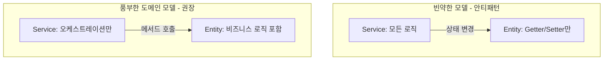

- DDD(Domain-Driven Design)는 **도메인(비즈니스 영역)을 소프트웨어 설계의 중심에 두는 방법론**이다.
- Eric Evans의 2003년 저서에서 정립되었으며, 복잡한 도메인을 모델로 표현하고 도메인 전문가와 같은 언어(유비쿼터스 언어)로 소통하는 것을 목표로 한다.

- 기술이 도메인을 정의하는 것이 아니라, **도메인이 기술을 결정한다**.
- 구현 패턴([[헥사고날 아키텍처(Hexagonal Architecture)]], CQRS, 이벤트 소싱 등)은 DDD를 실현하기 위한 도구일 뿐 DDD 그 자체는 아니다.

## 전략적 설계 (Strategic Design)

- 큰 그림을 정의하는 단계. "이 시스템에는 어떤 도메인들이 있고 어떻게 나눌 것인가?"

### 1. 유비쿼터스 언어 (Ubiquitous Language)

- 개발자·기획자·도메인 전문가가 모두 **같은 단어**를 같은 의미로 쓴다.
- 코드의 클래스/메서드명도 이 언어를 따라야 한다.
- 예: "회원"을 누구는 User, 누구는 Member, 누구는 Customer로 부르면 안 된다.

### 2. [[Bounded Context]] (제한된 컨텍스트)

- 같은 단어라도 컨텍스트에 따라 의미가 달라질 수 있다 → 명확한 경계를 둔다.
- 예: `identity` 컨텍스트의 User와 `social` 컨텍스트의 Author는 다른 모델일 수 있다.
- 컨텍스트 간 통신은 [[포트와 어댑터(Port and Adapter)]]를 통해서만.

### 3. 컨텍스트 맵 (Context Map)

- 컨텍스트들 간의 관계를 표현 (Customer/Supplier, Conformist, Anti-Corruption Layer 등).

## 전술적 설계 (Tactical Design)

- 한 [[Bounded Context]] 안에서 모델을 어떻게 표현할 것인가.

### 빌딩 블록

| 블록 | 설명 | 예시 |
| ---- | ---- | ---- |
| Entity | 식별자(ID)로 구분되는 객체. 상태가 시간에 따라 변함. | `User`, `Post` |
| Value Object (VO) | 값 자체로 동등성을 판단. 불변. ID 없음. | `Email`, `Slug`, `Money` |
| Aggregate | 일관성 경계. 외부에서는 루트(Aggregate Root)만 접근. | `Order`(root) + `OrderLine` |
| Domain Service | 한 엔티티에 속하지 않는 도메인 로직. | `PasswordEncoder`, `BacklinkParsingService` |
| Repository | Aggregate Root를 조회·저장하는 추상화. | `PostRepository` |
| Domain Event | 도메인에서 의미 있는 일이 일어났음을 알림. | `PostPublishedEvent` |
| Factory | 복잡한 객체 생성 로직 캡슐화. | `OrderFactory` |

## 도메인 모델 vs 빈약한 모델 (Anemic Model)

- 빈약한 모델: 도메인 객체는 데이터 그릇이고, 서비스가 모든 로직을 가진다. → 객체지향이 아닌 절차지향.
- 풍부한 모델: `user.changePassword(newPassword)`처럼 객체가 자기 책임을 가진다.

## Pragmatic DDD (실용적 DDD)

- 순수 DDD: 도메인 모델은 어떤 프레임워크 의존도 없는 POJO.
- 실용 DDD: Spring Data MongoDB를 쓰면서 도메인 모델에 [[@Document]], `@Id`, `@Indexed` 정도는 허용.
- 트레이드오프: 100% 순수성 vs 매핑 코드 중복 회피. 팀 상황에 맞춰 결정.
- 이 프로젝트는 실용 DDD를 채택해서 도메인 모델에 영속 어노테이션을 직접 단다.

## 흔한 오해

- "DDD = 헥사고날 = 클린 아키텍처" → **아님**. DDD는 사고방식, 나머지는 아키텍처 패턴.
- "DDD를 하려면 Aggregate를 무조건 만들어야 한다" → **아님**. 도메인이 단순하면 [[엔티티(Entity)]]만 있어도 됨.
- "DDD = 코드 패턴" → **아님**. 도메인 전문가와의 협업과 유비쿼터스 언어가 핵심.

## 관련 개념

- [[Bounded Context]]
- [[헥사고날 아키텍처(Hexagonal Architecture)]]
- [[포트와 어댑터(Port and Adapter)]]
- [[ApplicationEvent]] (도메인 이벤트 발행)
