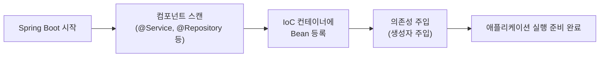

- 의존성 주입(Dependency Injection)은 **한 [[객체(Object)]]가 필요로 하는 의존 객체를 외부에서 주입받는 디자인 패턴**이다.
- 런타임 시 의존 관계를 맺는 대상을 외부(Spring 컨테이너)에서 결정하고 주입한다.
- [[스프링 컨테이너(Spring Container)]]가 [[Bean]]의 생명주기를 관리하며 의존성을 자동으로 연결한다.
- Spring의 3대 핵심 개념 중 하나: [[AOP(Aspect-Oriented Programming)]], DI, IoC([[스프링 컨테이너(Spring Container)]]).

## 왜 DI를 사용하는가?

```java
// DI 없이 직접 생성 — 강한 결합
public class OrderService {
    private OrderRepository repo = new OrderRepositoryImpl();  // 직접 생성 → 교체 불가
}

// DI — 느슨한 결합
public class OrderService {
    private final OrderRepository repo;  // 인터페이스에 의존

    public OrderService(OrderRepository repo) {  // 외부에서 주입
        this.repo = repo;
    }
}
```

- [[인터페이스(Interface)]] 기반으로 설계하면 구현체를 교체해도 코드를 변경할 필요가 없다.
- 테스트 시 실제 구현체 대신 Mock 객체를 주입하기 쉬워진다.

## 주입 방식 3가지

### 1. 생성자 주입 (권장)

```java
@Service
@RequiredArgsConstructor   // Lombok: final 필드로 생성자 자동 생성
public class PostService {

    private final PostRepository postRepository;    // 주입
    private final CategoryUseCase categoryUseCase;  // 주입

    // @RequiredArgsConstructor가 아래 생성자를 자동 생성
    // public PostService(PostRepository postRepository, CategoryUseCase categoryUseCase) {
    //     this.postRepository = postRepository;
    //     this.categoryUseCase = categoryUseCase;
    // }
}
```

- `final` 키워드로 선언하면 **불변성 보장**.
- 객체 생성 시점에 의존성이 모두 주입 → **순환 의존 즉시 감지** (앱 시작 시 에러).
- 테스트 코드에서 `new PostService(mockRepo, mockCategory)` 처럼 직접 생성 가능.

### 2. 필드 주입 (지양)

```java
@Service
public class PostService {

    @Autowired
    private PostRepository postRepository;  // 리플렉션으로 주입 (테스트 어려움)
}
```

- **단점**: `final` 불가, 순환 의존 감지 어려움, 테스트 시 Mock 주입 불편.
- Spring 가이드에서 **사용을 권장하지 않는다**.

### 3. 세터 주입 (선택적 의존에 한해 사용)

```java
@Service
public class PostService {

    private NotificationService notificationService;

    @Autowired(required = false)  // 선택적 — 없어도 동작
    public void setNotificationService(NotificationService notificationService) {
        this.notificationService = notificationService;
    }
}
```

- 의존 객체가 **선택적(Optional)**일 때만 사용.

## 주입 방식 비교

| 항목 | 생성자 주입 | 필드 주입 | 세터 주입 |
| ---- | ---- | ---- | ---- |
| 불변성 | O (`final`) | X | X |
| 순환 의존 감지 | 앱 시작 시 | 런타임 시 | 런타임 시 |
| 테스트 용이성 | 직접 생성 가능 | 어려움 | 가능 |
| 권장 여부 | **권장** | 비권장 | 선택적 의존에만 |

## @Autowired, @Qualifier, @Primary

```java
// 인터페이스 구현체가 여러 개일 때
public interface PaymentService {}
@Service("kakaoPayment")
public class KakaoPaymentService implements PaymentService {}
@Service("naverPayment")
public class NaverPaymentService implements PaymentService {}

// 특정 구현체 지정: @Qualifier
@Service
public class OrderService {
    public OrderService(@Qualifier("kakaoPayment") PaymentService paymentService) {
        this.paymentService = paymentService;
    }
}

// 기본값 지정: @Primary (가장 먼저 선택)
@Primary
@Service
public class KakaoPaymentService implements PaymentService {}
```

## 순환 의존(Circular Dependency) 문제

```
PostService → CommentService → PostService  (순환)
```

- 생성자 주입에서는 앱 시작 시 즉시 감지하여 에러로 알려준다.
- **해결책**: 설계 재검토(도메인 분리), ApplicationEvent 사용, 한쪽을 세터 주입.

## Bean 등록과의 관계

- 의존성 주입은 **먼저 [[스프링 컨테이너(Spring Container)]]에 [[Bean]]으로 등록된 객체들 사이에서만** 동작한다.
- `@Service`, `@Repository`, `@Controller`, `@Component` 등의 [[어노테이션(Annotation)]]이 붙은 클래스가 Bean으로 등록된다.



## 관련

- [[스프링 컨테이너(Spring Container)]]
- [[Bean]]
- [[AOP(Aspect-Oriented Programming)]]
- [[@Autowired]]
- [[어노테이션(Annotation)]]
- [[인터페이스(Interface)]]
