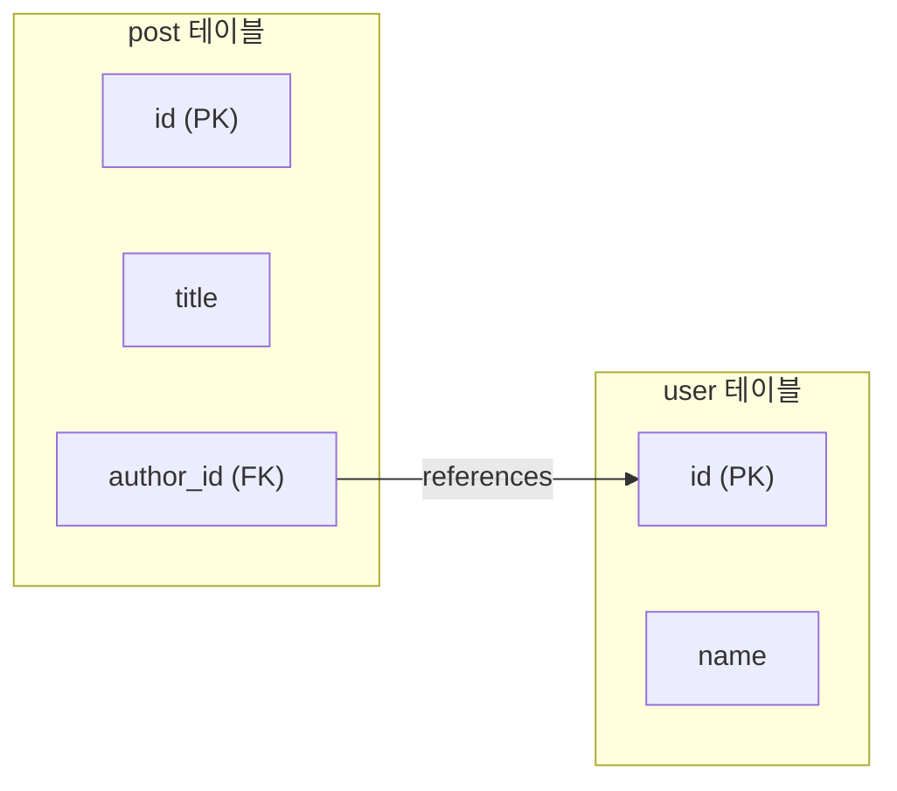

- `@JoinColumn`은 [[JPA(Java Persistence API)]] 연관관계에서 **외래 키(FK) 컬럼을 매핑**하는 [[어노테이션(Annotation)]]이다.
- `@ManyToOne`, `@OneToOne` 등의 연관관계 어노테이션과 함께 사용한다.
- 생략하면 JPA가 자동으로 `{필드명}_{참조엔티티PK컬럼명}` 형식의 컬럼명을 만든다.

## 주요 속성

| 속성 | 기본값 | 설명 |
| ---- | ---- | ---- |
| `name` | `{필드명}_{PK}` | FK 컬럼명 지정 |
| `referencedColumnName` | 참조 테이블 PK | 참조하는 컬럼명 (보통 PK) |
| `nullable` | `true` | FK에 NULL 허용 여부 |
| `unique` | `false` | FK 컬럼 유니크 제약 |
| `insertable` | `true` | INSERT 시 컬럼 포함 여부 |
| `updatable` | `true` | UPDATE 시 컬럼 포함 여부 |
| `columnDefinition` | - | 컬럼 DDL 직접 지정 |
| `foreignKey` | - | FK 제약 이름 지정 |

## 사용 예시

```java
@Entity
public class Post {

    @Id @GeneratedValue(strategy = GenerationType.IDENTITY)
    private Long id;

    // 외래 키 컬럼명을 "author_id"로 지정
    @ManyToOne(fetch = FetchType.LAZY)
    @JoinColumn(name = "author_id", nullable = false)
    private User author;
}
```

```java
@Entity
public class OrderItem {

    // 복합 외래 키 예시 (실무에서 드묾)
    @ManyToOne
    @JoinColumns({
        @JoinColumn(name = "order_id", referencedColumnName = "id"),
        @JoinColumn(name = "order_date", referencedColumnName = "date")
    })
    private Order order;
}
```

## @ManyToOne + @JoinColumn 조합



## 양방향 관계에서 주인 지정

```java
// 연관관계 주인 (FK를 실제로 가진 쪽) — @JoinColumn 사용
@ManyToOne
@JoinColumn(name = "team_id")
private Team team;

// 주인이 아닌 쪽 — mappedBy만 사용, @JoinColumn 없음
@OneToMany(mappedBy = "team")
private List<Member> members;
```

## 관련

- [[@ManyToOne]]
- [[@OneToMany]]
- [[외래 키(Foreign Key)]]
- [[연관 관계(Relationships)]]
- [[단방향]]
- [[양방향]]
- [[JPA(Java Persistence API)]]
