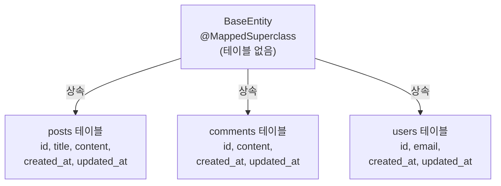

- `@MappedSuperclass`는 **여러 [[엔티티(entity)]]에서 공통으로 사용하는 [[필드(Field)]]를 부모 클래스에 선언하고 상속받아 공유**하는 [[어노테이션(Annotation)]]이다.
- 부모 클래스 자체는 [[데이터베이스(DataBase)]] 테이블로 생성되지 않는다 — 자식 [[엔티티(entity)]]의 컬럼으로만 포함된다.
- 주로 `BaseEntity`를 만들어 `createdAt`, `updatedAt`, `createdBy` 등을 공유할 때 사용한다.
- [[JPA(Java Persistence API)]] Auditing 기능([[@EntityListeners]])과 함께 사용하면 생성일/수정일을 자동으로 관리할 수 있다.

## 기본 사용 — BaseEntity 패턴

```java
@Getter
@MappedSuperclass
@EntityListeners(AuditingEntityListener.class)   // JPA Auditing 활성화
public abstract class BaseEntity {

    @CreatedDate
    @Column(updatable = false)    // 생성 후 변경 불가
    private LocalDateTime createdAt;

    @LastModifiedDate
    private LocalDateTime updatedAt;

    @CreatedBy
    @Column(updatable = false)
    private String createdBy;     // 생성자 ID (Spring Security 연동)

    @LastModifiedBy
    private String updatedBy;     // 수정자 ID
}
```

```java
// 자식 엔티티 — BaseEntity를 상속받아 공통 필드 자동 포함
@Entity
@Table(name = "posts")
public class Post extends BaseEntity {

    @Id @GeneratedValue(strategy = GenerationType.IDENTITY)
    private Long id;

    private String title;
    private String content;
    // createdAt, updatedAt 등은 BaseEntity에서 상속
}

// DB 테이블에는 posts 테이블만 생성됨:
// id, title, content, created_at, updated_at, created_by, updated_by
```

## JPA Auditing 활성화

```java
// Spring Boot 시작 클래스 또는 설정 클래스에 추가
@SpringBootApplication
@EnableJpaAuditing   // Auditing 기능 활성화 필수
public class BlogApplication {
    public static void main(String[] args) {
        SpringApplication.run(BlogApplication.class, args);
    }
}
```

## ID 포함 BaseEntity (더 범용적인 패턴)

```java
@Getter
@MappedSuperclass
@EntityListeners(AuditingEntityListener.class)
public abstract class BaseTimeEntity {

    @Id
    @GeneratedValue(strategy = GenerationType.IDENTITY)
    private Long id;

    @CreatedDate
    @Column(updatable = false)
    private LocalDateTime createdAt;

    @LastModifiedDate
    private LocalDateTime updatedAt;
}

// 자식 엔티티는 id + 시간 필드를 모두 상속
@Entity
public class Comment extends BaseTimeEntity {
    private String content;
    // id, createdAt, updatedAt은 BaseTimeEntity에서 상속
}
```

## @MappedSuperclass vs @Embeddable vs @Inheritance

| 방식 | 설명 | 테이블 생성 |
| ---- | ---- | ---- |
| `@MappedSuperclass` | 공통 필드 상속, 부모 테이블 없음 | 자식 테이블에 컬럼 포함 |
| `@Embeddable` | 값 타입 임베딩, 엔티티가 아님 | 소유 엔티티 테이블에 포함 |
| `@Inheritance` | 상속 계층을 DB에 매핑 | 전략에 따라 다름 |



## MongoDB에서 동일 패턴

```java
// MongoDB는 @Document + @MappedSuperclass 대신 직접 필드 공유
public abstract class BaseDocument {

    @Id
    private String id;

    @CreatedDate
    private LocalDateTime createdAt;

    @LastModifiedDate
    private LocalDateTime updatedAt;
}

@Document(collection = "posts")
public class Post extends BaseDocument {
    private String title;
}
```

## 관련

- [[JPA(Java Persistence API)]]
- [[엔티티(entity)]]
- [[@EntityListeners]]
- [[@CreatedDate]]
- [[@CreatedBy]]
- [[@Entity]]
