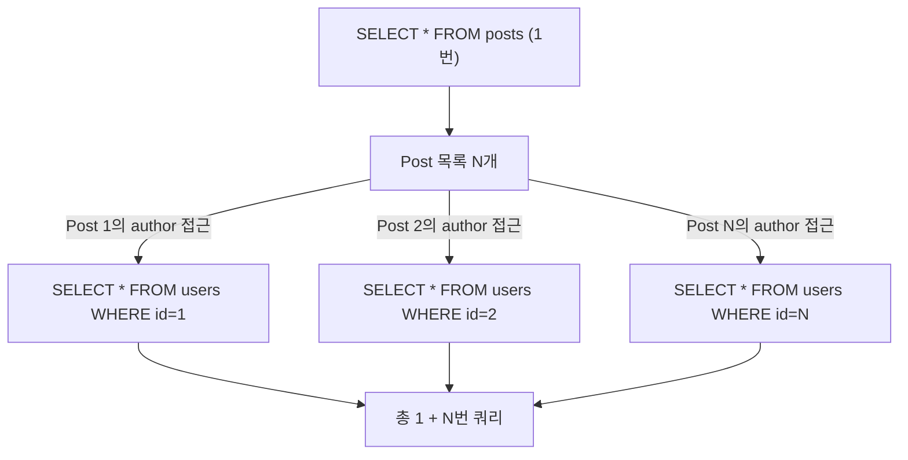

- N+1 문제는 **연관된 엔티티를 조회할 때 예상치 못하게 N개의 추가 쿼리가 발생**하는 JPA 성능 문제이다.
- 1번의 쿼리로 N개의 엔티티를 가져온 뒤, 각 엔티티의 연관 객체를 조회하느라 N번의 추가 쿼리가 실행된다.
- **지연 로딩(LAZY)** 설정에서 연관 객체에 접근할 때 주로 발생한다.

## 발생 원리



```java
// Post - User 다대일 관계 (LAZY 기본)
@Entity
public class Post {
    @ManyToOne(fetch = FetchType.LAZY)
    @JoinColumn(name = "author_id")
    private User author;
}

// N+1 발생 코드
@Transactional
public void problem() {
    List<Post> posts = postRepository.findAll();  // 쿼리 1번
    for (Post post : posts) {
        System.out.println(post.getAuthor().getName());  // 각 Post마다 쿼리 1번 → N번
    }
    // 총 1 + N번 쿼리 실행
}
```

## 해결방법 1: fetch join (JPQL)

- 가장 기본적인 해결책. **연관 엔티티를 한 번의 JOIN 쿼리로 함께 조회**한다.
- 페이징과 함께 `@OneToMany` fetch join은 메모리에서 처리되어 성능 문제 발생 가능.

```java
// Repository
public interface PostRepository extends JpaRepository<Post, Long> {

    @Query("SELECT p FROM Post p JOIN FETCH p.author WHERE p.status = :status")
    List<Post> findAllWithAuthor(@Param("status") String status);
}

// 실행되는 SQL
// SELECT p.*, u.* FROM posts p INNER JOIN users u ON p.author_id = u.id
// → 쿼리 1번으로 Post + User 동시 조회
```

## 해결방법 2: @EntityGraph

- JPQL 없이 어노테이션으로 fetch join과 동일한 효과를 낼 수 있다.
- Spring Data JPA 메서드명 쿼리와 함께 사용 가능.

```java
public interface PostRepository extends JpaRepository<Post, Long> {

    // author 연관 객체를 EAGER로 함께 로딩
    @EntityGraph(attributePaths = {"author"})
    List<Post> findByStatus(String status);

    // 여러 연관 객체 동시 로딩
    @EntityGraph(attributePaths = {"author", "tags"})
    Optional<Post> findById(Long id);
}
```

## 해결방법 3: @BatchSize

- **여러 개의 ID를 IN 쿼리로 묶어서 한 번에 조회**한다.
- fetch join보다 덜 침습적이며, 페이징과 함께 사용할 수 있다.

```java
@Entity
public class Post {
    @ManyToOne(fetch = FetchType.LAZY)
    @JoinColumn(name = "author_id")
    @BatchSize(size = 100)   // 최대 100개 ID를 IN 절로 묶어서 조회
    private User author;
}

// 또는 글로벌 설정 (application.yml)
// spring.jpa.properties.hibernate.default_batch_fetch_size: 100
```

```sql
-- @BatchSize 적용 시 실행 SQL
SELECT * FROM users WHERE id IN (1, 2, 3, ..., 100)
-- N번이 아닌 ceil(N/100)번으로 줄어듦
```

## 해결방법 4: DTO 직접 조회 (가장 성능 좋음)

- 엔티티 대신 **DTO를 직접 반환하는 JPQL**을 작성한다.
- 필요한 컬럼만 SELECT하므로 데이터 전송량도 줄어든다.

```java
// DTO 클래스
public record PostSummaryDto(Long id, String title, String authorName) {}

// JPQL로 DTO 직접 반환
public interface PostRepository extends JpaRepository<Post, Long> {

    @Query("""
        SELECT new com.example.dto.PostSummaryDto(p.id, p.title, u.name)
        FROM Post p JOIN p.author u
        WHERE p.status = :status
        """)
    List<PostSummaryDto> findSummaries(@Param("status") String status);
}
```

## 해결방법 비교

| 방법 | 코드 변경 | 페이징 | 여러 컬렉션 | 권장 상황 |
| ---- | ---- | ---- | ---- | ---- |
| fetch join | 쿼리 작성 | @OneToMany 주의 | 불가 (카테시안 곱) | 단순 연관 조회 |
| @EntityGraph | 어노테이션 | @OneToMany 주의 | 불가 | 메서드명 쿼리 + 연관 |
| @BatchSize | 설정만 | 가능 | 가능 | 컬렉션 페이징 |
| DTO 조회 | 쿼리 작성 | 가능 | 가능 | 읽기 전용 API, 성능 최적화 |

## @OneToMany 컬렉션 페이징 주의사항

```java
// 위험: 페이징 + 컬렉션 fetch join → HHH90003004 경고 → 메모리에서 페이징 처리
@Query("SELECT p FROM Post p JOIN FETCH p.comments")
Page<Post> findAll(Pageable pageable);

// 안전한 방법: @BatchSize + 페이징 분리
@Query("SELECT p FROM Post p")
Page<Post> findAll(Pageable pageable);  // 페이징은 Post만

// Post 엔티티에 @BatchSize 설정
@OneToMany(mappedBy = "post", fetch = FetchType.LAZY)
@BatchSize(size = 100)
private List<Comment> comments;
```

## 관련

- [[JPA(Java Persistence API)]]
- [[fetch Join]]
- [[지연 로딩(Lazy Loading)]]
- [[즉시 로딩(Eager Loading)]]
- [[영속성 컨텍스트(Persistence Context)]]
- [[인덱스(Index)]]
- [[@EntityGraph]]
