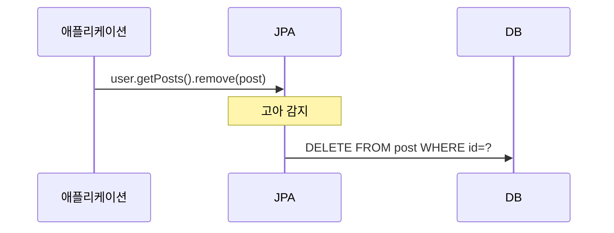

- `orphanRemoval`은 [[JPA(Java Persistence API)]]에서 **부모와 연관관계가 끊긴 자식 엔티티(고아 객체)를 자동으로 DB에서 삭제**하는 옵션이다.
- `@OneToMany` 또는 `@OneToOne`에만 존재하는 옵션이다.
- 기본값은 `false`.

## 사용 예시

```java
@Entity
public class User {

    @OneToMany(mappedBy = "user", cascade = CascadeType.PERSIST, orphanRemoval = true)
    private List<Post> posts = new ArrayList<>();
}
```

```java
// 연관관계를 끊으면 자동으로 DELETE 쿼리가 발생한다
user.getPosts().remove(post);   // 컬렉션에서 제거
post.setUser(null);             // 연관관계 해제
// → DELETE FROM post WHERE id = ?
```

## 동작 조건

- `cascade = CascadeType.PERSIST` (또는 `ALL`) 이 함께 설정되어야 정상 동작한다.
- JPA가 컬렉션 내 엔티티 변화를 추적(dirty checking)해야 고아 감지가 가능하기 때문이다.

## cascade REMOVE와 차이

| 항목 | `orphanRemoval = true` | `cascade = REMOVE` |
| ---- | ---- | ---- |
| 트리거 | 컬렉션에서 제거될 때 (부모는 살아있음) | 부모 엔티티가 삭제될 때 |
| 대상 | 컬렉션에서 빠진 자식 | 부모와 연결된 모든 자식 |



## 관련

- [[cascade]]
- [[@OneToMany]]
- [[JPA(Java Persistence API)]]
- [[영속성(Persistence)]]
