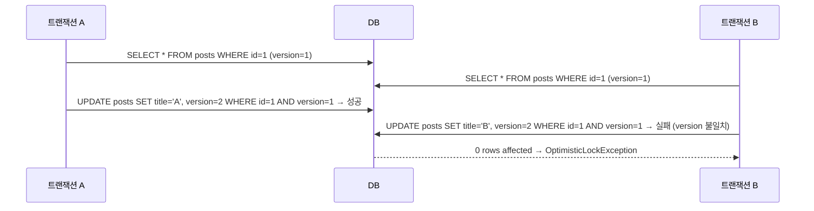

- 낙관적 락(Optimistic Lock)은 **충돌이 드물 것이라고 낙관적으로 가정**하고, 실제 충돌이 발생했을 때 감지하는 동시성 제어 방식이다.
- DB 락을 걸지 않고 `@Version` 컬럼으로 버전 번호를 관리하여 충돌을 감지한다.
- 충돌 감지 시 `OptimisticLockException`을 던지며 [[트랜잭션(Transaction)]]이 롤백된다.
- [[비관적 락(Pessimistic Lock)]]과 달리 DB 락 없이 동작하므로 **읽기 성능이 좋다**.

## 동작 원리



## @Version [[어노테이션(Annotation)]]

```java
@Entity
public class Post {
    @Id @GeneratedValue(strategy = GenerationType.IDENTITY)
    private Long id;

    private String title;

    @Version   // JPA가 자동으로 버전 관리
    private Long version;   // Integer, Long, Short, Timestamp 사용 가능
}
```

- [[엔티티(entity)]] 수정 시 JPA가 자동으로 `WHERE version = ?` 조건을 추가하고 버전을 1 증가시킨다.
- 버전 불일치 → 업데이트된 row가 0개 → `OptimisticLockException` 발생.

## [[UPDATE]] 쿼리 확인

```sql
-- JPA가 내부적으로 실행하는 UPDATE
UPDATE posts
SET title = ?, version = 2   -- 버전 자동 증가
WHERE id = 1 AND version = 1   -- 이전 버전 확인
```

## 예외 처리 패턴

```java
@Service
@RequiredArgsConstructor
public class PostService {

    private final PostRepository postRepository;

    @Transactional
    public void updateTitle(Long id, String newTitle) {
        Post post = postRepository.findById(id)
            .orElseThrow(() -> new ResourceNotFoundException("Post not found"));
        post.setTitle(newTitle);
        // 커밋 시 버전 충돌이면 OptimisticLockException 발생
    }
}

// 컨트롤러에서 처리 (재시도 패턴)
@RestControllerAdvice
public class GlobalExceptionHandler {

    @ExceptionHandler(OptimisticLockingFailureException.class)
    @ResponseStatus(HttpStatus.CONFLICT)
    public ApiResponse handleOptimisticLock(OptimisticLockingFailureException e) {
        return ApiResponse.error(409, "다른 사용자가 이미 수정했습니다. 다시 시도해주세요.");
    }
}
```

## LockModeType 옵션

```java
// Repository에서 명시적 낙관적 락 설정
public interface PostRepository extends JpaRepository<Post, Long> {

    @Lock(LockModeType.OPTIMISTIC)           // 읽기도 버전 체크
    Optional<Post> findById(Long id);

    @Lock(LockModeType.OPTIMISTIC_FORCE_INCREMENT)  // 읽기 시에도 버전 강제 증가
    Optional<Post> findWithLock(Long id);
}
```

| LockModeType | 설명 |
| ---- | ---- |
| `OPTIMISTIC` | @Version 기반 기본 낙관적 락 |
| `OPTIMISTIC_FORCE_INCREMENT` | 읽기 시에도 버전 증가 (집계 엔티티 등 간접 수정 감지) |

## 낙관적 락 vs [[비관적 락(Pessimistic Lock)]]

| 항목 | 낙관적 락 | 비관적 락 |
| ---- | ---- | ---- |
| 충돌 가정 | 드물다 | 자주 발생한다 |
| DB 락 | 없음 | [[SELECT]] FOR UPDATE |
| 성능 | 읽기 빠름 | 락 대기 시간 발생 |
| 충돌 시 | OptimisticLockException | 락 획득 대기 |
| 적합한 상황 | 읽기 많고 충돌 드문 경우 | 재고/잔액 등 충돌 빈번한 경우 |

## 언제 사용?

- 게시글 수정, 설정 변경 등 **같은 데이터를 동시에 수정하는 경우가 드문** 상황.
- 조회가 많고 수정이 적은 데이터 (블로그 포스트, 상품 정보 등).
- 충돌 시 사용자에게 재시도 요청하는 UX가 허용되는 경우.

## 관련

- [[JPA(Java Persistence API)]]
- [[비관적 락(Pessimistic Lock)]]
- [[영속성 컨텍스트(Persistence Context)]]
- [[@Transactional]]
- [[트랜잭션(Transaction)]]
