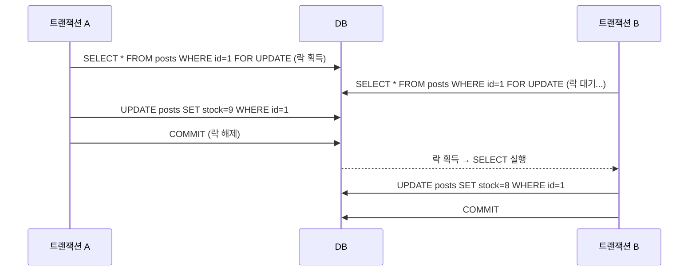

- 비관적 락(Pessimistic Lock)은 **충돌이 자주 발생할 것이라고 비관적으로 가정**하고, 미리 DB 락을 걸어 다른 [[트랜잭션(Transaction)]]의 접근을 막는 동시성 제어 방식이다.
- `SELECT ... FOR UPDATE` [[SQL]]로 동작하며 해당 Row에 배타적 락(X-Lock)을 건다.
- 락을 획득하지 못한 트랜잭션은 **락이 해제될 때까지 대기**한다.
- [[낙관적 락(Optimistic Lock)]]과 달리 충돌 자체를 원천 차단하므로 **데이터 정합성이 강력히 보장**된다.

## 동작 원리



## @Lock [[어노테이션(Annotation)]]

```java
public interface StockRepository extends JpaRepository<Stock, Long> {

    // PESSIMISTIC_WRITE: SELECT FOR UPDATE — 읽기/쓰기 모두 차단
    @Lock(LockModeType.PESSIMISTIC_WRITE)
    @Query("SELECT s FROM Stock s WHERE s.productId = :productId")
    Optional<Stock> findByProductIdWithLock(@Param("productId") Long productId);

    // PESSIMISTIC_READ: SELECT FOR SHARE — 쓰기만 차단, 읽기는 허용
    @Lock(LockModeType.PESSIMISTIC_READ)
    Optional<Stock> findById(Long id);
}
```

## LockModeType 비교

| LockModeType | SQL | 다른 읽기 | 다른 쓰기 |
| ---- | ---- | ---- | ---- |
| `PESSIMISTIC_WRITE` | `SELECT FOR UPDATE` | 대기 | 대기 |
| `PESSIMISTIC_READ` | `SELECT FOR SHARE` ([[MySQL([[MySQL(MariaDB)]])]]: `LOCK IN SHARE MODE`) | 허용 | 대기 |
| `PESSIMISTIC_FORCE_INCREMENT` | `SELECT FOR UPDATE` + version 증가 | 대기 | 대기 |

## 재고 감소 예시 (실무 패턴)

```java
@Service
@RequiredArgsConstructor
public class StockService {

    private final StockRepository stockRepository;

    @Transactional
    public void decrease(Long productId, int quantity) {
        // 비관적 락으로 조회 → 다른 트랜잭션은 이 Row에 접근 불가
        Stock stock = stockRepository.findByProductIdWithLock(productId)
            .orElseThrow(() -> new ResourceNotFoundException("Stock not found"));

        if (stock.getQuantity() < quantity) {
            throw new BusinessException("재고 부족");
        }

        stock.decrease(quantity);  // 재고 감소
        // 트랜잭션 종료 시 락 해제
    }
}
```

## 데드락 (Deadlock) 주의

- 두 트랜잭션이 서로 상대방이 가진 락을 기다리는 상황 → **데드락**.

```
트랜잭션 A: stocks(id=1) 락 획득 → orders(id=1) 락 대기
트랜잭션 B: orders(id=1) 락 획득 → stocks(id=1) 락 대기
→ 서로 대기하며 무한 교착 상태
```

- **해결책**: 항상 같은 순서로 락을 획득한다 (예: 항상 stocks → orders 순서).
- DB에서 데드락 감지 시 한 트랜잭션을 강제 롤백하고 `DeadlockLoserDataAccessException` 발생.

## 타임아웃 설정

```java
// 락 대기 타임아웃 설정 (밀리초)
public interface StockRepository extends JpaRepository<Stock, Long> {

    @Lock(LockModeType.PESSIMISTIC_WRITE)
    @QueryHints(@QueryHint(name = "javax.persistence.lock.timeout", value = "3000"))
    Optional<Stock> findByProductIdWithLock(@Param("productId") Long productId);
}
```

## [[낙관적 락(Optimistic Lock)]] vs 비관적 락 선택 기준

| 상황 | 권장 방식 |
| ---- | ---- |
| 재고 감소, 잔액 차감 (충돌 빈번) | 비관적 락 |
| 게시글 수정, 프로필 수정 (충돌 드묾) | 낙관적 락 |
| 분산 환경 여러 서버 | Redis 분산 락 또는 낙관적 락 |
| 읽기 성능 중요 | 낙관적 락 |
| 정합성 최우선 | 비관적 락 |

## 관련

- [[JPA(Java Persistence API)]]
- [[낙관적 락(Optimistic Lock)]]
- [[영속성 컨텍스트(Persistence Context)]]
- [[@Transactional]]
- [[트랜잭션(Transaction)]]
