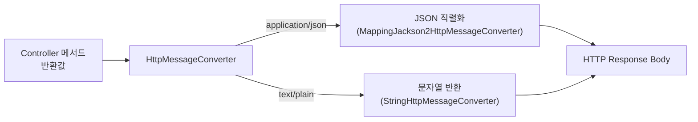

- `@ResponseBody`는 [[컨트롤러(Controller)]] [[메서드(Method)]]의 반환값을 [[HTTP]] 응답 body에 직접 직렬화해서 전송하는 [[어노테이션(Annotation)]]이다.
- `HttpMessageConverter`가 미디어타입(`application/json` 등)에 맞게 자바 [[객체(Object)]]를 변환한다.
- [[@RestController]] 사용 시 클래스 전체에 묵시적으로 적용된다.

## 동작 원리



- 클라이언트의 `Accept` 헤더와 메서드 반환 타입을 확인해 적절한 `HttpMessageConverter`를 선택한다.
- `MappingJackson2HttpMessageConverter`가 객체를 JSON으로 변환하는 것이 일반적이다.

## 사용 예시

```java
// @Controller에서 개별 메서드에 명시
@Controller
public class UserController {

    @ResponseBody
    @GetMapping("/api/users/{id}")
    public UserResponse getUser(@PathVariable Long id) {
        return userService.findById(id);
    }
}

// @RestController를 사용하면 @ResponseBody 생략 가능
@RestController
public class UserController {

    @GetMapping("/api/users/{id}")
    public UserResponse getUser(@PathVariable Long id) {
        return userService.findById(id);
    }
}
```

## @RequestBody와의 차이

| 어노테이션 | 방향 | 역할 |
| ---- | ---- | ---- |
| `@ResponseBody` | 응답 (서버 → 클라이언트) | 반환값 → HTTP body 직렬화 |
| `@RequestBody` | 요청 (클라이언트 → 서버) | HTTP body → 자바 객체 역직렬화 |

## 관련

- [[@RestController]]
- [[@Controller]]
- [[@RequestBody]]
- [[HTTP]]
- [[JSON(Java Script Object Notation)]]
- [[DispatcherServlet]]
