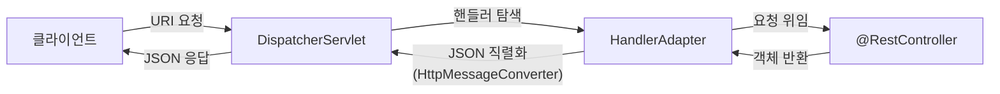

- REST API용으로 사용할 [[컨트롤러(Controller)]]임을 명시하는 [[어노테이션(Annotation)]]이다.
- `@RestController`는 [[@Controller]]에 [[@ResponseBody]]가 자동으로 추가된 것이다.
- 주용도는 [[JSON(Java Script Object Notation)]] 형태로 [[객체(Object)]] 데이터를 반환하는 것이다.
- REST API를 개발할 때 주로 사용하며 객체를 [[ResponseEntity]]로 감싸서 반환한다.

## @RestController 동작과정



1. 클라이언트가 URI 형식으로 요청을 보낸다.
2. [[DispatcherServlet]]이 요청을 처리할 핸들러([[컨트롤러(Controller)]])를 찾는다.
3. HandlerAdapter를 통해 요청을 컨트롤러로 위임한다.
4. 컨트롤러는 요청을 처리한 후 객체를 반환한다.
5. 반환된 객체는 `HttpMessageConverter`에 의해 JSON으로 직렬화되어 클라이언트로 전송된다.

## @Controller vs @RestController

| 항목 | @Controller | @RestController |
| ---- | ---- | ---- |
| 반환값 | [[뷰(View)]] 이름 (String) | 데이터 (JSON/텍스트) |
| @ResponseBody | 메서드마다 명시 필요 | 클래스 전체에 자동 적용 |
| 용도 | SSR (서버사이드 렌더링) | REST API |

```java
// @Controller + @ResponseBody 조합
@Controller
public class UserController {
    @GetMapping("/user")
    @ResponseBody
    public UserResponse getUser() { ... }
}

// @RestController로 단순화 — @ResponseBody 생략 가능
@RestController
public class UserController {
    @GetMapping("/user")
    public UserResponse getUser() { ... }
}
```

## 관련

- [[@Controller]]
- [[@ResponseBody]]
- [[ResponseEntity]]
- [[컨트롤러(Controller)]]
- [[JSON(Java Script Object Notation)]]
- [[DispatcherServlet]]
