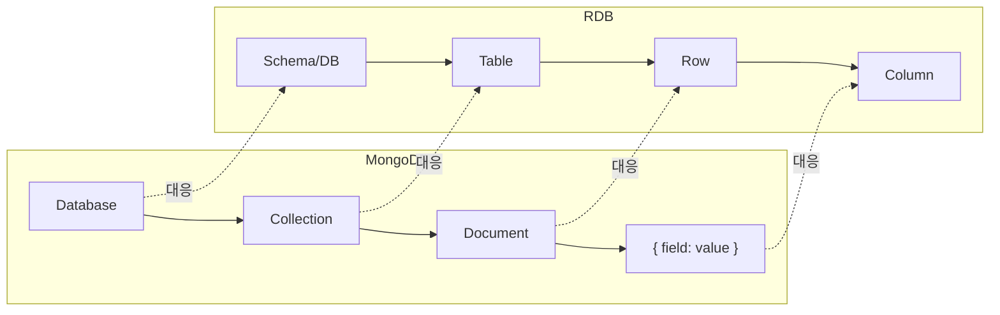

- MongoDB는 JSON 형태의 **도큐먼트(Document)**를 저장하는 대표적인 **NoSQL 데이터베이스**이다.
- 고정된 스키마 없이 데이터를 저장할 수 있어 스키마 변경이 잦거나 비정형 데이터를 다룰 때 유리하다.
- Spring Boot에서는 [[Spring Data MongoDB]]를 통해 편리하게 연동한다.

## 핵심 개념



| MongoDB | 관계형 DB | 설명 |
| ---- | ---- | ---- |
| Database | Database | 최상위 컨테이너 |
| Collection | Table | 도큐먼트의 집합 |
| Document | Row | JSON 형식의 데이터 단위 |
| Field | Column | 키-값 쌍 |
| `_id` | Primary Key | 자동 생성 ObjectId |

## RDB vs MongoDB

| 항목 | RDB (MySQL 등) | MongoDB |
| ---- | ---- | ---- |
| 스키마 | 고정 (DDL 변경 필요) | 유연 (도큐먼트마다 다른 구조 가능) |
| 관계 표현 | JOIN (외래 키) | 임베딩(embed) 또는 참조(reference) |
| 트랜잭션 | ACID 완전 지원 | MongoDB 4.0+부터 멀티 도큐먼트 트랜잭션 지원 |
| 확장 | 수직 확장 | 수평 확장 (샤딩) |
| 쿼리 언어 | SQL | MongoDB Query Language (MQL) |

## 도큐먼트 구조

```json
{
  "_id": "ObjectId(\"64a1b2c3d4e5f6789abc\")",
  "title": "MongoDB 소개",
  "author": {
    "name": "김개발",
    "email": "dev@example.com"
  },
  "tags": ["nosql", "database", "mongodb"],
  "viewCount": 120,
  "createdAt": "2024-01-01T00:00:00Z"
}
```

- 중첩 객체(embed)와 배열을 기본 지원한다.
- `_id`는 자동 생성되는 `ObjectId`이며, 인덱스도 자동으로 붙는다.

## 데이터 모델링 전략

### 임베딩(Embedding)

- 연관 데이터를 같은 도큐먼트 안에 중첩 저장.
- 한 번의 읽기로 모든 데이터를 가져올 수 있다.
- 데이터가 커지거나 변경이 잦으면 부적합.

```json
{
  "postId": "abc",
  "comments": [
    { "text": "좋아요", "author": "user1" }
  ]
}
```

### 참조(Reference)

- 별도 컬렉션에 저장하고 ID로 참조.
- 데이터 중복 없음, 독립적인 수정 가능.
- 여러 번 쿼리가 필요 (RDB의 JOIN과 유사).

```json
{
  "postId": "abc",
  "commentIds": ["cmt1", "cmt2"]
}
```

## Spring Boot 연동

```yaml
# application.yml
spring:
  data:
    mongodb:
      uri: mongodb://localhost:27017/mydb
```

## 관련

- [[Spring Data MongoDB]]
- [[MongoTemplate]]
- [[@Document]]
- [[원자적 업데이트(Atomic Update)]]
- [[MongoDB 인덱스(Index)]]
- [[집계(Aggregation)]]
- [[관계형 데이터베이스(Relational DataBase)]]
