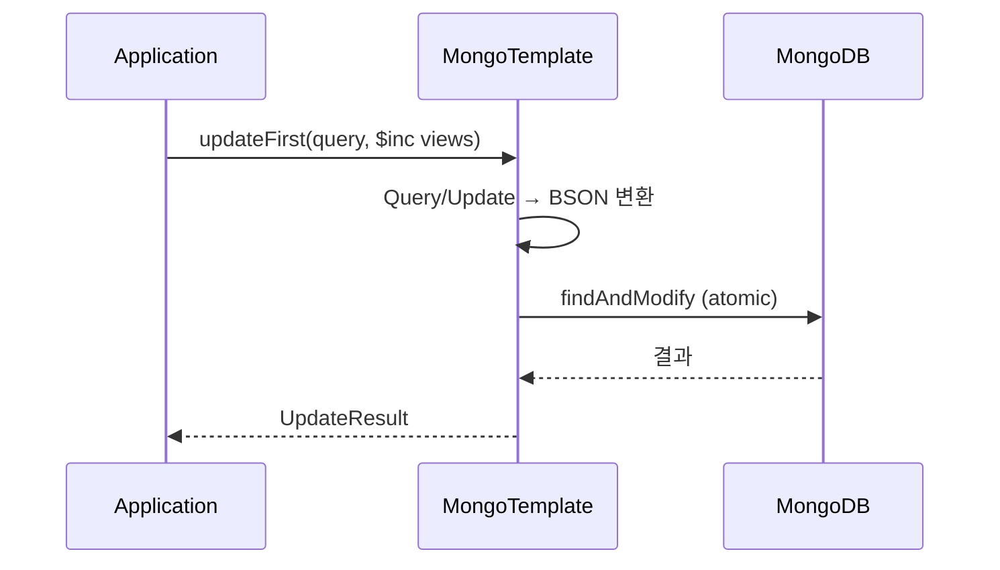

- MongoTemplate은 [[Spring Data MongoDB]]가 제공하는 **저수준 쿼리/업데이트 API**이다.
- `MongoRepository`로 표현하기 어려운 복잡한 쿼리, 부분 업데이트, 원자적 연산, 집계(Aggregation)를 처리할 때 사용한다.

- `@Component` 빈으로 자동 등록되므로 [[생성자(constructor)]] 주입으로 받아 쓴다.
- 내부적으로 MongoDB 드라이버를 감싸고, Spring의 예외 변환(`DataAccessException`)을 적용해준다.

## 기본 사용 패턴

```java
@Component
@RequiredArgsConstructor
public class ViewCounter {
    private final MongoTemplate mongoTemplate;
}
```

## 주요 메서드

| 메서드 | 용도 |
| ---- | ---- |
| `findOne(query, T.class)` | 단건 조회 |
| `find(query, T.class)` | 다건 조회 |
| `findAndModify(query, update, T.class)` | 조회와 동시에 원자적 수정 |
| `insert(obj)` | 새 문서 삽입 (있으면 `DuplicateKeyException`) |
| `save(obj)` | 있으면 update, 없으면 insert |
| `updateFirst(query, update, T.class)` | 첫 매칭 문서만 부분 업데이트 |
| `updateMulti(query, update, T.class)` | 매칭 모두 부분 업데이트 |
| `upsert(query, update, T.class)` | 없으면 insert, 있으면 update |
| `remove(query, T.class)` | 삭제 |
| `aggregate(aggregation, T.class, R.class)` | 집계 파이프라인 |
| `count(query, T.class)` | 카운트 |

## Query와 Criteria

- 조회 조건은 `Query` + `Criteria`로 표현한다.

```java
Query query = Query.query(
    Criteria.where("status").is("PUBLISHED")
            .and("authorId").is(userId)
            .and("createdAt").gte(weekAgo)
);
List<Post> posts = mongoTemplate.find(query, Post.class);
```

## Update

- 부분 업데이트는 `Update` 객체로 표현한다.

```java
Update update = new Update()
    .set("title", "새 제목")
    .inc("viewCount", 1)
    .push("tags", "spring")
    .currentDate("updatedAt");

mongoTemplate.updateFirst(
    Query.query(Criteria.where("_id").is(postId)),
    update,
    Post.class
);
```

| 메서드 | MongoDB 연산자 | 의미 |
| ---- | ---- | ---- |
| `set(field, value)` | `$set` | 값 덮어쓰기 |
| `unset(field)` | `$unset` | 필드 제거 |
| `inc(field, n)` | `$inc` | 원자적 증가/감소 |
| `push(field, value)` | `$push` | 배열에 추가 |
| `pull(field, value)` | `$pull` | 배열에서 제거 |
| `addToSet(field, value)` | `$addToSet` | 중복 없이 배열 추가 |
| `currentDate(field)` | `$currentDate` | 서버 현재 시각 |

## 원자적 업데이트의 중요성

- "조회 후 수정해서 저장" 패턴은 [[Race Condition]]을 만든다.
- `$inc`는 DB가 원자적으로 처리하므로 동시 호출이 있어도 손실 없이 정확히 +1, +1 = +2가 된다.

```java
// 안티패턴 - race condition
Post post = repository.findById(id);
post.setViews(post.getViews() + 1);   // 동시에 두 요청이 들어오면 +1만 반영
repository.save(post);

// 권장 - 원자적
mongoTemplate.updateFirst(
    Query.query(Criteria.where("_id").is(id)),
    new Update().inc("views", 1),
    "posts"
);
```

## 컬렉션 이름 지정

- 도메인 클래스 사용: `mongoTemplate.updateFirst(query, update, Post.class)` — `@Document(collection = ...)` 사용.
- 문자열 직접: `mongoTemplate.updateFirst(query, update, "posts")` — 도메인 import 없이 컬렉션명만.

## 흐름 다이어그램



## 관련

- [[Spring Data MongoDB]]
- [[원자적 업데이트(Atomic Update)]]
- [[Race Condition]]
- [[@Document]]
