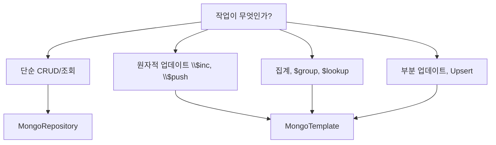

- Spring Data MongoDB는 **Spring Data 프로젝트의 MongoDB 모듈**로, MongoDB를 객체-문서 매핑(ODM)으로 다룰 수 있게 해주는 라이브러리이다.
- [[JPA(Java Persistence API)]]가 [[관계형 데이터베이스(Relational DataBase)]]를 객체로 매핑하듯, Spring Data MongoDB는 MongoDB 문서를 자바 [[객체(Object)]]로 매핑한다.

- 두 가지 사용 방식이 있다.
    - **Repository 인터페이스**: `MongoRepository<T, ID>`를 상속하면 CRUD 메서드 자동 생성.
    - **MongoTemplate**: 더 세밀한 쿼리·업데이트가 필요할 때.

## 설정

```gradle
dependencies {
    implementation 'org.springframework.boot:spring-boot-starter-data-mongodb'
}
```

```yaml
spring:
  data:
    mongodb:
      uri: mongodb://localhost:27017/blog
      auto-index-creation: true
```

## MongoRepository 사용

```java
public interface MongoUserRepository extends MongoRepository<User, String> {
    Optional<User> findByEmail(String email);
    boolean existsByUsername(String username);
}
```

- 메서드 이름만으로 쿼리 자동 생성(쿼리 메서드).
- `@Query`로 직접 쿼리 작성 가능.

## 핵심 [[어노테이션(Annotation)]]

| 어노테이션 | 위치 | 역할 |
| ---- | ---- | ---- |
| `@Document(collection = "...")` | 클래스 | MongoDB 컬렉션 매핑 |
| `@Id` | 필드 | 문서 `_id`에 매핑 |
| `@Indexed` | 필드 | 단일 필드 인덱스. `unique = true`로 유니크 |
| `@CompoundIndex` | 클래스 | 복합 인덱스 |
| `@DBRef` | 필드 | 다른 문서 참조 (보통 임베딩 권장) |
| `@CreatedDate` / `@LastModifiedDate` | 필드 | Auditing으로 자동 채움 |
| `@Field` | 필드 | 매핑할 BSON 필드명 변경 |

## 도메인 모델 예시

```java
@Getter @Setter @Builder
@NoArgsConstructor @AllArgsConstructor
@Document(collection = "users")
public class User {
    @Id
    private String id;

    @Indexed(unique = true)
    private String email;

    @Indexed(unique = true)
    private String username;

    @CreatedDate
    private LocalDateTime createdAt;

    @LastModifiedDate
    private LocalDateTime updatedAt;
}
```

## Repository vs MongoTemplate 선택 기준



- 단순 조회/저장은 `MongoRepository`로 충분.
- "조회 후 수정해서 저장"이 [[Race Condition]]을 만들 수 있는 카운터·플래그는 [[MongoTemplate]]의 `$inc`/`$set`로 원자적 처리.

## 인덱스 전략

- 자주 조회되는 필드는 `@Indexed`로 단일 인덱스.
- 항상 함께 검색되는 필드 조합은 `@CompoundIndex`로 복합 인덱스.
- 유니크 제약은 `unique = true` + DB 레벨에서 보장 (애플리케이션 체크는 [[Race Condition]] 위험).

```java
@Document(collection = "view_logs")
@CompoundIndex(
    name = "uniq_entity_ip_hourly",
    def = "{'entityId': 1, 'ipHash': 1, 'createdAt': 1}",
    unique = true,
    expireAfterSeconds = 3600
)
public class ViewLog { ... }
```

## 주의사항

- `_id`는 기본적으로 `ObjectId`이지만 `String`으로 받아도 됨.
- `MongoRepository.save()`는 ID가 있으면 update, 없으면 insert (upsert가 아니라 replace).
- 부분 업데이트가 필요하면 `mongoTemplate.updateFirst()`로 명시.
- `findByXxx()`로 다건 조회 시 N+1 주의 → 가능하면 한 번에 받아서 가공.

## 관련

- [[MongoTemplate]]
- [[@Document]]
- [[원자적 업데이트(Atomic Update)]]
- [[JPA(Java Persistence API)]] (관계형 버전)
