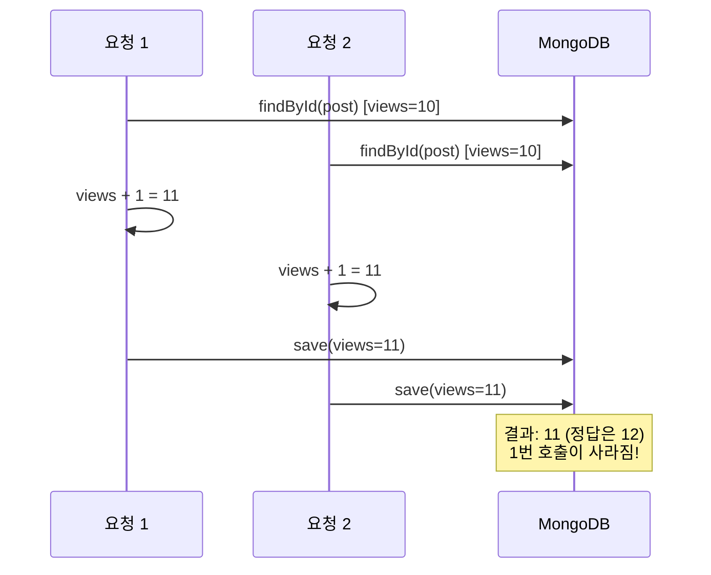

- 원자적 업데이트(Atomic Update)는 **여러 연산이 하나의 분할 불가능한 단위로 실행**되어, 중간에 다른 작업이 끼어들 수 없는 업데이트이다.
- 동시성 환경에서 [[Race Condition]]을 막기 위해 필수적인 패턴이다.

- MongoDB는 단일 문서 수준에서 원자성을 보장한다 (`$inc`, `$set`, `$push` 등).
- 여러 문서를 묶을 땐 트랜잭션(`@Transactional` + Replica Set)이 필요하다.

## 왜 필요한가

### 문제 시나리오 - "조회 후 수정" 안티패턴



```java
// 안티패턴 - 절대 이렇게 하면 안 됨
Post post = postRepository.findById(id).orElseThrow();
post.setViews(post.getViews() + 1);
postRepository.save(post);
```

### 해결 - 원자적 연산

```java
// 권장 - MongoDB가 한 번에 처리
mongoTemplate.updateFirst(
    Query.query(Criteria.where("_id").is(postId)),
    new Update().inc("views", 1),
    "posts"
);
```

- MongoDB 서버가 `$inc` 연산을 단일 트랜잭션으로 처리.
- 동시 요청 10번이 들어와도 정확히 +10이 보장된다.

## 자주 쓰이는 원자적 연산자

| MongoDB 연산자 | Spring Update 메서드 | 용도 |
| ---- | ---- | ---- |
| `$inc` | `.inc(field, n)` | 숫자 필드 증가/감소 (조회수, 좋아요 수) |
| `$set` | `.set(field, value)` | 필드 값 덮어쓰기 |
| `$unset` | `.unset(field)` | 필드 제거 |
| `$push` | `.push(field, value)` | 배열에 추가 |
| `$pull` | `.pull(field, value)` | 배열에서 제거 |
| `$addToSet` | `.addToSet(field, value)` | 중복 없이 배열 추가 |
| `$min` / `$max` | `.min(...)`, `.max(...)` | 더 작/큰 값으로만 갱신 |
| `$currentDate` | `.currentDate(field)` | 서버 시각으로 갱신 |

## 실전 예시 - 조회수 카운터

```java
@Component
@RequiredArgsConstructor
public class ViewCounter {
    private final MongoTemplate mongoTemplate;

    public boolean incrementIfUnique(String collection, String entityId, String ipHash) {
        // 1. 중복 방지용 ViewLog 삽입 시도 (유니크 인덱스가 dedup)
        try {
            mongoTemplate.insert(ViewLog.builder()
                .entityId(entityId).ipHash(ipHash).createdAt(Instant.now())
                .build());
        } catch (DuplicateKeyException e) {
            return false; // 이미 카운트됨
        }

        // 2. 원자적 카운트 증가
        mongoTemplate.updateFirst(
            Query.query(Criteria.where("_id").is(entityId)),
            new Update().inc("views", 1),
            collection
        );
        return true;
    }
}
```

## 슬러그 유니크 보장 패턴

- "exists 체크 → 없으면 insert"도 [[Race Condition]] 위험이 있다.
- 유니크 인덱스 + `DuplicateKeyException` catch로 처리.

```java
@Indexed(unique = true)
private String slug;

try {
    return postRepository.save(newPost);
} catch (DuplicateKeyException e) {
    throw new DuplicateResourceException(ErrorCode.SLUG_DUPLICATE);
}
```

## findAndModify - 조회와 수정을 한 번에

- "원자적으로 한 건을 잠그고, 그 값을 가져온 뒤 수정"이 필요할 때.

```java
Post locked = mongoTemplate.findAndModify(
    Query.query(Criteria.where("_id").is(id).and("status").is("DRAFT")),
    new Update().set("status", "PROCESSING"),
    FindAndModifyOptions.options().returnNew(true),
    Post.class
);
// locked는 status가 PROCESSING으로 바뀐 후의 상태
// 다른 요청은 DRAFT 조건에 안 걸리므로 같은 문서를 못 잠금
```

## 단일 문서 vs 다중 문서 원자성

| 범위 | MongoDB 보장 | 도구 |
| ---- | ---- | ---- |
| 한 문서 내 여러 필드 | 항상 원자적 | `$inc`, `$set` 등 |
| 여러 문서 / 여러 컬렉션 | 4.0+ Replica Set 필요 | `@Transactional` + `MongoTransactionManager` |

## 관련

- [[Race Condition]]
- [[MongoTemplate]]
- [[Spring Data MongoDB]]
- [[동기화(Synchronization)]] - 자바 레벨 동기화
- [[@Transactional]]
