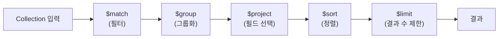

- MongoDB 집계(Aggregation)는 **여러 단계의 파이프라인(Pipeline)을 통해 도큐먼트를 변환·그룹화·분석**하는 기능이다.
- SQL의 `GROUP BY`, `JOIN`, `HAVING`, 집계 함수(`SUM`, `COUNT` 등)에 해당한다.
- Spring Data MongoDB에서는 `MongoTemplate`의 `Aggregation` 클래스 또는 MongoDB Shell의 `aggregate()` 명령어로 사용한다.

## 파이프라인 구조



- 각 단계의 출력이 다음 단계의 입력이 된다.
- 필요한 단계만 조합해서 사용한다.

## 주요 파이프라인 스테이지

| 스테이지 | SQL 대응 | 설명 |
| ---- | ---- | ---- |
| `$match` | `WHERE` | 조건으로 도큐먼트 필터링 |
| `$group` | `GROUP BY` | 필드 기준 그룹화 + 집계 함수 |
| `$project` | `SELECT` | 반환할 필드 지정/변환 |
| `$sort` | `ORDER BY` | 정렬 |
| `$limit` | `LIMIT` | 결과 수 제한 |
| `$skip` | `OFFSET` | 결과 건너뛰기 |
| `$lookup` | `JOIN` | 다른 컬렉션과 조인 |
| `$unwind` | - | 배열을 개별 도큐먼트로 펼치기 |
| `$addFields` | `SELECT ... AS` | 새 필드 추가 |

## 집계 함수

| 함수 | 설명 |
| ---- | ---- |
| `$sum` | 합계 |
| `$avg` | 평균 |
| `$min` / `$max` | 최솟값 / 최댓값 |
| `$count` | 도큐먼트 수 (`{ $sum: 1 }` 로도 사용) |
| `$push` | 값들을 배열로 수집 |
| `$first` / `$last` | 그룹 내 첫 번째/마지막 값 |

## MongoDB Shell 예시

```javascript
// 카테고리별 게시글 수와 평균 조회수 집계
db.posts.aggregate([
  { $match: { status: "published" } },          // 공개된 글만
  { $group: {
      _id: "$category",
      postCount: { $sum: 1 },
      avgViews: { $avg: "$viewCount" }
  }},
  { $sort: { postCount: -1 } },                 // 글 수 내림차순
  { $limit: 10 }
])
```

## Spring MongoTemplate 사용

```java
Aggregation agg = Aggregation.newAggregation(
    Aggregation.match(Criteria.where("status").is("published")),
    Aggregation.group("category")
        .count().as("postCount")
        .avg("viewCount").as("avgViews"),
    Aggregation.sort(Sort.Direction.DESC, "postCount"),
    Aggregation.limit(10)
);

AggregationResults<CategoryStats> results =
    mongoTemplate.aggregate(agg, "posts", CategoryStats.class);

List<CategoryStats> stats = results.getMappedResults();
```

## $lookup (다른 컬렉션 조인)

```javascript
// posts 컬렉션에 authors 컬렉션을 조인
db.posts.aggregate([
  { $lookup: {
      from: "authors",
      localField: "authorId",
      foreignField: "_id",
      as: "authorInfo"
  }},
  { $unwind: "$authorInfo" }
])
```

## 관련

- [[MongoDB]]
- [[MongoTemplate]]
- [[Spring Data MongoDB]]
- [[GROUP]]
