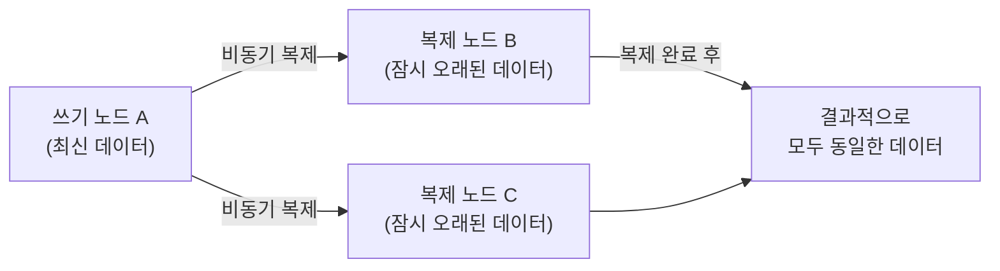

- ACID와 BASE는 **분산 데이터베이스 시스템의 두 가지 일관성 모델**이다.
- ACID는 **관계형 데이터베이스(RDBMS)**의 트랜잭션 보장 원칙이다.
- BASE는 **NoSQL 분산 데이터베이스**에서 가용성과 성능을 위해 일관성을 일부 포기하는 모델이다.

## ACID

- **관계형 DB(MySQL, PostgreSQL)가 트랜잭션에서 보장하는 4가지 성질**.

| 속성 | 영문 | 설명 |
| ---- | ---- | ---- |
| **원자성** | Atomicity | 트랜잭션의 모든 연산이 성공하거나 전부 실패한다. 중간 상태 없음. |
| **일관성** | Consistency | 트랜잭션 전후로 DB가 정의된 무결성 제약(FK, UNIQUE 등)을 유지한다. |
| **격리성** | Isolation | 동시에 실행되는 트랜잭션이 서로 영향을 주지 않는다. |
| **지속성** | Durability | 커밋된 트랜잭션은 장애가 발생해도 영구적으로 유지된다. |


### 원자성 예시 (계좌 이체)

```sql
BEGIN;
    UPDATE accounts SET balance = balance - 10000 WHERE id = 1;  -- A 출금
    UPDATE accounts SET balance = balance + 10000 WHERE id = 2;  -- B 입금
COMMIT;
-- 두 UPDATE 중 하나라도 실패하면 ROLLBACK → A 잔액 복구
```

### 격리성과 격리 수준

- 격리성을 얼마나 엄격하게 적용하느냐에 따라 4단계 격리 수준이 있다.
- 자세한 내용은 [[트랜잭션(Transaction)]] 참고.

## BASE

- **분산 NoSQL DB(MongoDB, Cassandra, DynamoDB 등)**에서 사용하는 일관성 모델.
- ACID의 강한 일관성 대신 **가용성과 성능을 우선시**한다.

| 속성 | 영문 | 설명 |
| ---- | ---- | ---- |
| **기본적 가용성** | Basically Available | 장애가 발생해도 시스템이 항상 응답한다. (응답 내용이 오래된 데이터일 수 있음) |
| **소프트 상태** | Soft State | 입력 없이도 내부 상태가 변할 수 있다. (복제 동기화 중) |
| **결과적 일관성** | Eventually Consistent | 즉각적 일관성 대신, 시간이 지나면 결국 모든 노드가 동일한 상태가 된다. |



### 결과적 일관성 예시

- SNS 좋아요 수: 방금 누른 좋아요가 다른 지역 서버에는 몇 초 뒤에 반영됨. 허용 가능.
- 장바구니 시스템: 장바구니 항목이 잠깐 다르게 보일 수 있지만 결국 동기화됨.
- 재고 감소: 수량이 정확해야 하므로 ACID 필요 — BASE 부적합.

## ACID vs BASE 비교

| 항목 | ACID | BASE |
| ---- | ---- | ---- |
| 일관성 | 강한 일관성 (즉각) | 결과적 일관성 (Eventually) |
| 가용성 | 트랜잭션 중 잠금 | 항상 응답 |
| 성능 | 낮음 (잠금, 롤백 비용) | 높음 (잠금 없음) |
| 확장성 | 수직 확장 (Scale Up) | 수평 확장 (Scale Out) |
| 대표 DB | MySQL, PostgreSQL, Oracle | MongoDB, Cassandra, DynamoDB |
| 적합한 데이터 | 금융, 재고, 결제 | SNS 피드, 로그, 캐시 |

## 혼합 사용 전략

- 실무에서는 한 시스템에서도 **데이터 특성에 따라 다른 DB를 혼합**한다.

```
결제/잔액 → MySQL (ACID 필수)
피드/타임라인 → MongoDB (BASE, 대용량 쓰기)
세션/캐시 → Redis (In-memory, 빠른 읽기)
전문 검색 → Elasticsearch (역방향 인덱스)
```

## 관련

- [[트랜잭션(Transaction)]]
- [[관계형 데이터베이스(Relational DataBase)]]
- [[MongoDB]]
- [[CAP 정리(CAP Theorem)]]
- [[MySQL(MariaDB)]]
- [[PostgreSQL]]
