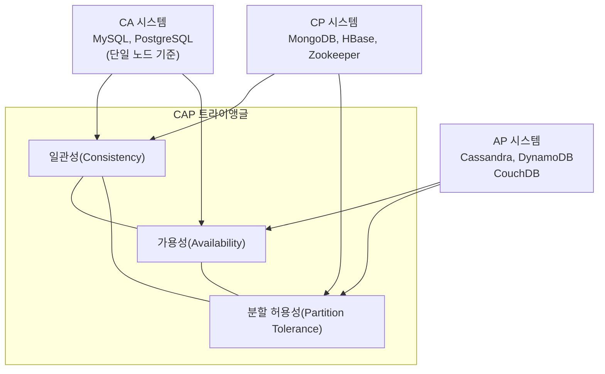

- CAP 정리는 **분산 데이터베이스 시스템이 동시에 세 가지 속성(Consistency, Availability, Partition Tolerance)을 모두 만족하는 것은 불가능**하다는 이론이다.
- 2000년 에릭 브루어(Eric Brewer)가 제안, 2002년 Gilbert와 Lynch가 수학적으로 증명했다.
- 실제 분산 시스템에서 **네트워크 분할(Partition)은 피할 수 없기 때문에**, 결국 일관성(C)과 가용성(A) 중 하나를 선택해야 한다.

## 세 가지 속성

| 속성 | 영문 | 설명 |
| ---- | ---- | ---- |
| **일관성** | Consistency | 모든 노드가 동시에 같은 데이터를 본다. 읽기는 항상 최신 쓰기 결과를 반환한다. |
| **가용성** | Availability | 모든 요청이 (오래된 데이터일지라도) 응답을 받는다. 노드 장애 시에도 응답. |
| **분할 허용성** | Partition Tolerance | 네트워크 분할(노드 간 통신 장애) 상황에서도 시스템이 동작한다. |



## 실제 분산 환경에서의 CAP

- **네트워크는 항상 장애(Partition)가 발생할 수 있다** — 케이블 단절, 지연, 패킷 손실 등.
- 따라서 실제 분산 시스템은 **P를 포기할 수 없고**, 결국 C와 A 중 하나를 선택한다.

### CP 시스템 (일관성 + 분할 허용)

- 네트워크 분할 발생 시 **응답을 거부(에러 반환)**하여 일관성을 유지한다.
- 오래된 데이터를 절대 반환하지 않는다.
- 예: [[MongoDB]] (기본 설정), HBase, Zookeeper, Redis

```
노드 A: 쓰기 완료 (재고=9)
노드 B: 네트워크 분할로 A와 통신 불가
→ 노드 B는 응답 거부 (503 Error) — 불일치 데이터 반환 안 함
```

### AP 시스템 (가용성 + 분할 허용)

- 네트워크 분할 발생 시 **오래된 데이터라도 응답**하여 가용성을 유지한다.
- 결과적 일관성([[ACID vs BASE]] 참고) 모델을 따른다.
- 예: Cassandra, DynamoDB, CouchDB, Amazon S3

```
노드 A: 쓰기 완료 (재고=9)
노드 B: 네트워크 분할로 A와 통신 불가
→ 노드 B는 오래된 데이터(재고=10) 반환 — 나중에 동기화
```

### CA 시스템 (일관성 + 가용성)

- **분산 환경에서는 이론적으로 불가능** — 네트워크 분할을 완전히 막을 수 없기 때문.
- 단일 노드 RDBMS([[[[MySQL(MariaDB)]]]], [[PostgreSQL]] 단독 서버)가 여기에 해당하지만, 분산 환경에서는 P가 발생한다.

## 주요 DB의 CAP 분류

| DB | 분류 | 이유 |
| ---- | ---- | ---- |
| MySQL (단독) | CA | 단일 서버, 분산 아님 |
| MySQL (Galera Cluster) | CP | 클러스터에서 일관성 우선 |
| MongoDB | CP | 기본적으로 Primary만 읽기/쓰기 |
| Cassandra | AP | 모든 노드에서 읽기/쓰기, 결과적 일관성 |
| DynamoDB | AP | Eventually Consistent 기본 |
| Redis Cluster | CP | Partition 시 일관성 유지 |
| Zookeeper | CP | 분산 코디네이션, 일관성 필수 |
| Elasticsearch | AP | 샤드 복제 실패 시에도 응답 |

## PACELC 확장 이론

- CAP은 네트워크 분할 상황만 다루는 한계가 있다.
- **PACELC**: 정상 상태에서도 지연(Latency)과 일관성(Consistency) 간의 트레이드오프가 존재함을 추가.

```
P: Partition 발생 시
A 또는 C 선택

E: 정상 Else 상황에서는
L 또는 C 선택 (Latency vs Consistency)
```

| DB | P 발생 시 | 정상 시 |
| ---- | ---- | ---- |
| MySQL | C 선택 | C 선택 |
| Cassandra | A 선택 | L 선택 |
| DynamoDB | A 선택 | L 선택 |
| MongoDB | C 선택 | C 선택 |

## 실무 설계 적용

- **금융, 결제, 재고**: 일관성 우선 → CP 시스템 또는 단일 RDBMS.
- **SNS 피드, 뉴스 피드**: 가용성 우선 → AP 시스템 (Cassandra, MongoDB).
- **글로벌 [[서비스(Service)]] 캐싱**: 각 리전별 독립 + 결과적 일관성 허용.

## 관련

- [[ACID vs BASE]]
- [[트랜잭션(Transaction)]]
- [[관계형 데이터베이스(Relational DataBase)]]
- [[MongoDB]]
- [[MySQL(MariaDB)]]
- [[PostgreSQL]]
