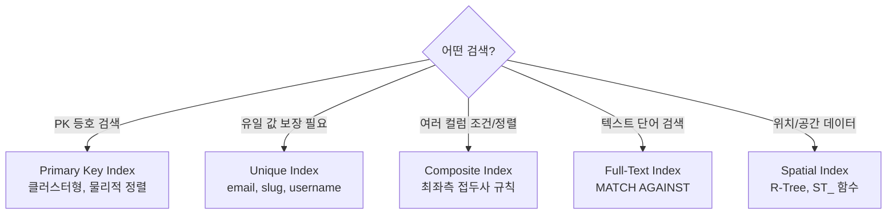

- 인덱스(Index)는 **테이블의 특정 컬럼에 대한 검색 속도를 높이기 위해 별도로 만드는 자료구조**이다.
- MySQL의 기본 스토리지 엔진 InnoDB는 **B+Tree 인덱스**를 사용한다.
- 인덱스가 없으면 `WHERE` 조건 검색 시 테이블 전체를 순회(Full Table Scan)하므로 데이터가 많을수록 느려진다.
- 자세한 자료구조 원리는 [[데이터베이스 인덱스 구조(Index Structure)]] 참고.

## 인덱스 종류



| 인덱스 종류 | 자료구조 | 주 사용 목적 | NULL 허용 | 유니크 보장 |
| ---- | ---- | ---- | ---- | ---- |
| Primary Key | B+Tree (클러스터형) | PK 조회 | X | O |
| Unique | B+Tree | 중복 방지 컬럼 | O (복수 NULL) | O |
| Composite | B+Tree | 다중 컬럼 조건/정렬 | O | X (기본) |
| Full-Text | Inverted Index | 텍스트 단어 검색 | O | X |
| Spatial | R-Tree | 공간/지리 검색 | O | X |

---

### Primary Key Index (기본 키 인덱스)

- **클러스터형 인덱스**로, 테이블 데이터를 PK 순서로 **물리적으로 정렬하여 저장**한다.
- 테이블당 1개만 존재하며 PK 선언 시 자동으로 생성된다.
- B+Tree 리프 노드에 실제 데이터 행이 있어 추가 I/O 없이 바로 반환한다.

```sql
-- PK 생성 → 클러스터형 인덱스 자동 생성
CREATE TABLE posts (
    id BIGINT AUTO_INCREMENT PRIMARY KEY,
    title VARCHAR(255)
);

-- PK 조회 → 가장 빠른 조회 방법
SELECT * FROM posts WHERE id = 1;
```

- 단조 증가하는 숫자(AUTO_INCREMENT)를 PK로 쓰면 B+Tree 페이지 분할이 최소화되어 성능이 좋다.
- UUID를 PK로 쓰면 랜덤 삽입으로 페이지 분할이 잦아 성능 저하 — 대안으로 `ULID`나 `UUID v7` 사용.

---

### Unique Index (유니크 인덱스)

- **중복을 허용하지 않는 인덱스**. `UNIQUE` 제약을 걸면 내부적으로 자동 생성된다.
- 이메일, 슬러그, 사용자명 등 **유일성이 보장되어야 하는 컬럼**에 사용한다.
- PK와 달리 **NULL은 여러 개 허용** (NULL != NULL 이므로).

```sql
-- 명시적 Unique Index 생성
CREATE UNIQUE INDEX idx_email ON users(email);

-- 컬럼에 직접 선언
ALTER TABLE posts ADD UNIQUE (slug);

-- 삽입 시 중복 값이 있으면 에러
INSERT INTO users (email) VALUES ('test@example.com');  -- Duplicate entry 에러
```

- **언제 활용?** email, slug, 사업자번호 등 비즈니스 규칙상 중복이 없어야 하는 필드.

---

### Composite Index (복합 인덱스)

- **여러 컬럼을 묶어서 하나의 인덱스**로 만든 것.
- **최좌측 접두사 규칙(Leftmost Prefix Rule)** — 왼쪽 컬럼부터 순서대로만 인덱스가 동작한다.

```sql
-- 복합 인덱스 생성
CREATE INDEX idx_author_status_created
    ON posts(author_id, status, created_at DESC);

-- 인덱스 사용 O
SELECT * FROM posts WHERE author_id = 1 AND status = 'published';  -- 앞 두 컬럼 사용
SELECT * FROM posts WHERE author_id = 1;                            -- 첫 번째 컬럼만 사용

-- 인덱스 사용 X — author_id(첫 번째 컬럼) 없음
SELECT * FROM posts WHERE status = 'published';
SELECT * FROM posts WHERE status = 'published' AND created_at > '2024-01-01';
```

- **설계 원칙**:
  - **카디널리티(Cardinality)**가 높은 컬럼(값 종류가 많은 컬럼)을 앞에 배치한다.
  - `WHERE` 등호(=) 컬럼 → `ORDER BY` 컬럼 → 범위(`BETWEEN`, `>`) 컬럼 순서로 배치한다.
  - 범위 조건 이후 컬럼은 인덱스 효과가 없다.

- **언제 활용?** 게시글 목록 `WHERE author_id = ? AND status = ? ORDER BY created_at` 같이 여러 조건+정렬이 반복되는 쿼리.

---

### Full-Text Index (전문 검색 인덱스)

- **텍스트 컬럼에서 단어 단위 전문 검색**을 위한 인덱스.
- B-Tree가 아닌 **역방향 인덱스(Inverted Index)** 구조 — 단어 → 포함된 행 목록 매핑.
- `MATCH ... AGAINST` 문법으로 쿼리한다.
- `LIKE '%검색어%'`는 인덱스를 타지 못하지만 Full-Text는 인덱스를 탄다.

```sql
-- Full-Text 인덱스 생성
ALTER TABLE posts ADD FULLTEXT INDEX idx_ft_content(title, content);

-- NATURAL LANGUAGE MODE — 자연어 검색, 관련도 점수(score) 반환
SELECT *, MATCH(title, content) AGAINST ('Spring Boot') AS score
FROM posts
WHERE MATCH(title, content) AGAINST ('Spring Boot' IN NATURAL LANGUAGE MODE)
ORDER BY score DESC;

-- BOOLEAN MODE — 연산자 사용
SELECT * FROM posts
WHERE MATCH(title, content) AGAINST ('+Spring -Legacy' IN BOOLEAN MODE);
-- + : 반드시 포함 / - : 반드시 제외
```

```sql
-- 한국어 지원: ngram 파서 (최소 n글자 토큰 단위 분리)
ALTER TABLE posts ADD FULLTEXT INDEX idx_ft_korean(content) WITH PARSER ngram;
```

- **언제 활용?** 블로그 본문 검색, 상품 설명 검색 등 자유 텍스트 검색. 대규모 트래픽에서는 Elasticsearch 같은 전문 검색 엔진 도입을 고려한다.

---

### Spatial Index (공간 인덱스)

- **지리 좌표, 폴리곤 등 공간 데이터(GEOMETRY 타입)** 검색을 위한 인덱스.
- **R-Tree(Rectangle Tree)** 자료구조를 사용 — 공간을 직사각형으로 분할하여 계층적으로 관리.
- `ST_Contains`, `ST_Within`, `ST_Distance_Sphere` 같은 공간 함수와 함께 사용한다.

```sql
-- 공간 인덱스 생성
CREATE TABLE locations (
    id BIGINT AUTO_INCREMENT PRIMARY KEY,
    name VARCHAR(100),
    coord POINT NOT NULL SRID 4326
);
CREATE SPATIAL INDEX idx_coord ON locations(coord);

-- 반경 5km 내 장소 검색
SELECT name,
    ST_Distance_Sphere(coord, ST_PointFromText('POINT(127.02 37.49)', 4326)) / 1000 AS km
FROM locations
WHERE ST_Distance_Sphere(coord, ST_PointFromText('POINT(127.02 37.49)', 4326)) < 5000;
```

- **언제 활용?** 배달앱 근처 식당 검색, 부동산 지도 검색, 물류 배송 경로 최적화 등 위치 기반 서비스.

---

## 커버링 인덱스 (Covering Index)

- 쿼리에 필요한 모든 컬럼이 인덱스 안에 포함되어 **테이블 접근 없이 인덱스만으로 결과 반환**.
- 가장 성능이 좋은 인덱스 활용 패턴이다.

```sql
-- (author_id, status, title) 복합 인덱스가 있을 때
SELECT title FROM posts WHERE author_id = 1 AND status = 'published';
-- → title까지 인덱스에 있어 테이블 I/O 없이 반환 (커버링 인덱스)

-- EXPLAIN Extra: "Using index" → 커버링 인덱스 사용 중
```

## JPA에서 인덱스 선언

```java
@Entity
@Table(name = "posts", indexes = {
    @Index(name = "idx_slug", columnList = "slug", unique = true),         // Unique Index
    @Index(name = "idx_author_status", columnList = "author_id, status"),  // Composite Index
    @Index(name = "idx_created", columnList = "created_at DESC")           // 단일 인덱스
})
public class Post {
    @Id @GeneratedValue(strategy = GenerationType.IDENTITY)
    private Long id;

    @Column(unique = true)
    private String slug;

    private String authorId;
    private String status;
    private LocalDateTime createdAt;
}
```

## EXPLAIN으로 인덱스 사용 확인

```sql
EXPLAIN SELECT * FROM posts WHERE slug = 'my-post';
```

| 컬럼 | 확인 항목 |
| ---- | ---- |
| `type` | `const`, `ref`, `range` → 인덱스 사용 / `ALL` → Full Scan |
| `key` | 실제 사용된 인덱스 이름 (NULL이면 인덱스 미사용) |
| `rows` | 예상 스캔 행 수 (적을수록 좋음) |
| `Extra` | `Using index` (커버링), `Using filesort` (추가 정렬), `Using temporary` (임시 테이블) |

## 인덱스를 타지 못하는 케이스

```sql
-- 컬럼에 함수 적용
WHERE YEAR(created_at) = 2024          -- X
WHERE created_at >= '2024-01-01'       -- O

-- 묵시적 형변환 (id가 BIGINT인데 문자열 비교)
WHERE id = '123'                       -- X
WHERE id = 123                         -- O

-- LIKE 앞 와일드카드
WHERE title LIKE '%검색어'             -- X
WHERE title LIKE '검색어%'             -- O

-- OR 조건 (옵티마이저가 Full Scan 선택할 수 있음)
WHERE status = 'A' OR category = 'B'  -- 주의, UNION ALL 고려
```

## 인덱스 주의사항

- 인덱스는 **읽기 성능 향상, 쓰기 성능 저하** — INSERT/UPDATE/DELETE 시마다 인덱스도 갱신된다.
- 인덱스가 너무 많으면 오히려 느려질 수 있다. 자주 조회되는 컬럼에만 선별적으로 생성한다.
- 선택도(Selectivity)가 낮은 컬럼(예: 성별 `M/F` 두 가지)은 인덱스 효과가 없다.

## 관련

- [[MySQL(MariaDB)]]
- [[데이터베이스 인덱스 구조(Index Structure)]]
- [[관계형 데이터베이스(Relational DataBase)]]
- [[트랜잭션(Transaction)]]
- [[JPA(Java Persistence API)]]
- [[N+1 문제(N+1 Problem)]]
