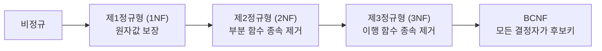

- 정규화(Normalization)는 **데이터 중복을 최소화하고 데이터 무결성을 높이기 위해 테이블을 분리하는 설계 기법**이다.
- 이상(Anomaly) — 삽입 이상, 갱신 이상, 삭제 이상 — 을 방지하는 것이 목적이다.
- 실무에서는 주로 **제3정규형(3NF)까지** 적용한다.

## 이상(Anomaly) 현상

| 종류 | 설명 |
| ---- | ---- |
| 삽입 이상 | 불필요한 데이터를 함께 삽입해야 하는 상황 |
| 갱신 이상 | 중복 데이터 중 일부만 수정되어 불일치 발생 |
| 삭제 이상 | 삭제 시 원하지 않는 다른 데이터도 사라짐 |

## 정규형 단계

### 제1정규형 (1NF) — 원자값

- 모든 컬럼 값이 **원자값(Atomic Value)**, 즉 더 이상 분리할 수 없는 값이어야 한다.

| 위반 예 (컬럼에 복수 값) | 수정 후 |
| ---- | ---- |
| `tags = "java,spring,jpa"` | `tags` 테이블로 분리 |

### 제2정규형 (2NF) — 완전 함수 종속

- 기본 키가 복합 키일 때, 기본 키의 일부에만 종속된 컬럼(부분 함수 종속)을 분리한다.
- 기본 키가 단일 컬럼이면 자동으로 2NF를 만족한다.

### 제3정규형 (3NF) — 이행 함수 종속 제거

- 기본 키 → A → B 처럼 **기본 키가 아닌 컬럼을 거쳐 종속**되는 이행 함수 종속을 제거한다.

**예시**: `주문 테이블`에 `고객ID`, `고객주소`가 함께 있으면
- `주문ID → 고객ID` 이고 `고객ID → 고객주소` 이므로 이행 종속
- `고객` 테이블을 분리해서 `고객주소`를 거기에만 유지

## 역정규화(De-normalization)

- 정규화를 진행할수록 JOIN이 많아져 읽기 성능이 저하될 수 있다.
- 조회 성능이 중요한 경우 의도적으로 중복을 허용하는 **역정규화**를 적용한다.
- 역정규화는 데이터 일관성 관리 비용이 늘어나므로 신중히 적용한다.

## JPA 엔티티 설계와 정규화

- JPA 엔티티 설계 시 3NF를 기준으로 테이블을 분리하고, 연관관계를 `@OneToMany`/`@ManyToOne`으로 표현한다.
- 역정규화가 필요한 경우 조회용 필드를 `@Column`으로 직접 추가하고 동기화를 명시적으로 관리한다.

## 관련

- [[MySQL(MariaDB)]]
- [[관계형 데이터베이스(Relational DataBase)]]
- [[JPA(Java Persistence API)]]
- [[기본 키(Primary Key)]]
- [[외래 키(Foreign Key)]]
