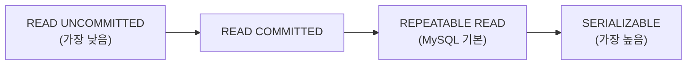

- 트랜잭션(Transaction)은 **데이터베이스에서 하나의 논리적 작업 단위**로, 전부 성공하거나 전부 실패해야 한다(All or Nothing).
- MySQL InnoDB 엔진은 트랜잭션을 완전히 지원하며, Spring에서는 [[@Transactional]] 어노테이션으로 관리한다.

## ACID 속성

| 속성 | 설명 |
| ---- | ---- |
| **A**tomicity (원자성) | 트랜잭션 내 작업은 전부 성공하거나 전부 롤백 |
| **C**onsistency (일관성) | 트랜잭션 전후로 데이터가 항상 유효한 상태 유지 |
| **I**solation (격리성) | 동시 실행되는 트랜잭션이 서로 간섭하지 않음 |
| **D**urability (지속성) | 커밋된 데이터는 장애가 발생해도 영구 보존 |

## SQL 트랜잭션 명령어

```sql
START TRANSACTION;   -- 또는 BEGIN

INSERT INTO orders (user_id, amount) VALUES (1, 50000);
UPDATE accounts SET balance = balance - 50000 WHERE user_id = 1;

COMMIT;              -- 모두 성공 시 확정

-- 오류 발생 시
ROLLBACK;            -- 모두 취소
```

## 트랜잭션 격리 수준 (Isolation Level)



| 격리 수준 | Dirty Read | Non-Repeatable Read | Phantom Read |
| ---- | ---- | ---- | ---- |
| READ UNCOMMITTED | 가능 | 가능 | 가능 |
| READ COMMITTED | 방지 | 가능 | 가능 |
| REPEATABLE READ | 방지 | 방지 | 가능 (InnoDB는 방지) |
| SERIALIZABLE | 방지 | 방지 | 방지 |

- **MySQL InnoDB 기본값은 `REPEATABLE READ`**.
- `READ COMMITTED`는 Oracle, PostgreSQL의 기본값이기도 하다.

### 문제 유형 설명

- **Dirty Read**: 커밋되지 않은 다른 트랜잭션의 변경값을 읽음.
- **Non-Repeatable Read**: 같은 트랜잭션 내에서 같은 쿼리를 두 번 실행했을 때 결과가 다름.
- **Phantom Read**: 같은 조건으로 조회했을 때 새로운 행이 나타남.

## Spring @Transactional과 연동

```java
@Service
@Transactional(readOnly = true)   // 기본은 읽기 전용
public class OrderService {

    @Transactional   // 쓰기 트랜잭션은 별도 지정
    public void placeOrder(OrderRequest request) {
        orderRepository.save(new Order(request));
        paymentService.charge(request.getAmount());
        // 하나라도 실패하면 둘 다 롤백
    }
}
```

## 관련

- [[@Transactional]]
- [[MySQL(MariaDB)]]
- [[관계형 데이터베이스(Relational DataBase)]]
- [[JPA(Java Persistence API)]]
