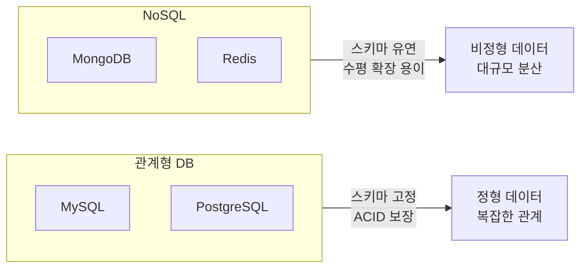

- 관계형 데이터베이스(Relational Database, RDB)는 **데이터를 행과 열로 구성된 테이블** 형식으로 저장하고, 테이블 간 관계를 외래 키로 표현하는 데이터베이스이다.
- 구조화된 데이터는 하나의 [[테이블(Table)]]로 표현할 수 있다.
- 사전에 정의된 테이블을 Relation이라고도 부르기 때문에, 이를 사용하는 데이터베이스를 관계형 데이터베이스라고 한다.
- SQL로 데이터를 조작하며, ACID 트랜잭션을 보장한다.

## 관계형 데이터베이스 구조

- "데이터베이스 > 테이블 > 레코드·칼럼 > 데이터" 의 계층적 구조를 가진다.
- 관계형 데이터베이스 용어는 SQL 용어와 혼용하여 쓰인다.

| RDB 용어 | SQL 용어 | 설명 |
| ---- | ---- | ---- |
| 릴레이션(Relation) | 테이블(Table) | [[레코드(Record)]]와 [[속성(Attribute)]]의 모임 |
| 튜플(Tuple) | 로우(Row) / 레코드 | 하나의 항목을 대표하는 데이터 (예: 이름) |
| 속성(Attribute) | 칼럼(Column) / 필드 | 항목을 구분하는 데이터 (예: 나이, 성별) |
| 도메인(Domain) | 데이터 타입 | 속성이 가질 수 있는 값의 범위 |

## RDB vs NoSQL

| 항목 | 관계형 DB | NoSQL |
| ---- | ---- | ---- |
| 스키마 | 고정 (DDL) | 유연 |
| 트랜잭션 | ACID 완전 지원 | 제한적 (BASE) |
| 확장 | 수직 확장 | 수평 확장 |
| 대표 | MySQL, PostgreSQL | MongoDB, Redis |

## 주요 구현체

- **[[MySQL(MariaDB)]]**: 가장 널리 쓰이는 오픈소스 RDB. MariaDB는 MySQL 포크.
- **[[PostgreSQL]]**: 표준 SQL 준수, JSONB 지원, 고급 기능이 강점.
- **오라클(Oracle)**: 엔터프라이즈 환경에서 많이 사용.

## JPA에서의 연관관계

- JPA는 객체 간 연관관계를 [[관계형 데이터베이스(Relational DataBase)]]의 외래 키로 매핑한다.
- 자세한 내용은 JPA 전용 노트 참고:

| JPA 어노테이션 | 관계 | 참고 |
| ---- | ---- | ---- |
| `@OneToOne` | 1:1 | [[@OneToMany]] 노트 참고 |
| `@OneToMany` | 1:N | [[@OneToMany]] |
| `@ManyToOne` | N:1 | [[@ManyToOne]] |
| `@ManyToMany` | N:M (중간 테이블 필요) | [[다대다(ManyToMany)]] |

- fetch 전략(지연/즉시 로딩): [[지연 로딩(Lazy Loading)]], [[즉시 로딩(Eager Loading)]]
- 영속성 전파: [[cascade]]
- 고아 객체 관리: [[orphanRemoval]]

## 관련

- [[데이터베이스(DataBase)]]
- [[SQL]]
- [[MySQL(MariaDB)]]
- [[PostgreSQL]]
- [[JPA(Java Persistence API)]]
- [[연관 관계(Relationships)]]
- [[외래 키(Foreign Key)]]
