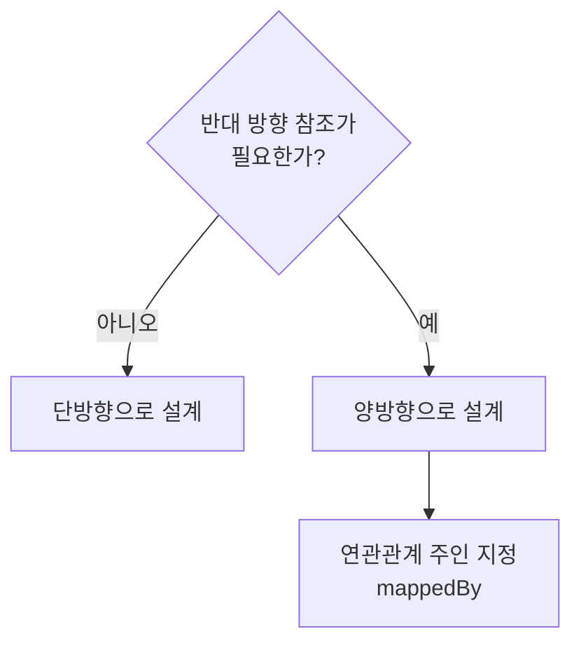

- 단방향(Unidirectional)은 [[객체(Object)]] 두 개 중 **한쪽만** 상대방을 참조하는 관계이다.
- [[데이터베이스(DataBase)]]에서는 [[외래 키(Foreign Key)]] 하나로 양방향 [[JOIN]]이 가능하기 때문에 단방향/양방향 구분이 없다.
- 객체에서만 참조 필드가 있는 쪽에서만 상대방을 알 수 있으므로 방향성이 생긴다.

- 비즈니스 로직에서 한쪽 방향으로만 탐색이 필요하면 단방향으로 설계하는 것이 단순하다.
- 불필요한 [[양방향]] 설정은 [[엔티티(Entity)]] 복잡도를 높이고 무한루프 위험을 만들 수 있다.

## 다대일 단방향 예시

- `Member`는 `Team`을 참조하지만, `Team`은 `Member`를 참조하지 않는다.

```java
@Entity
public class Member {

    @Id @GeneratedValue
    @Column(name = "MEMBER_ID")
    private Long id;

    private String username;

    @ManyToOne
    @JoinColumn(name = "TEAM_ID")
    private Team team;  // Member → Team 단방향
}

@Entity
public class Team {

    @Id @GeneratedValue
    @Column(name = "TEAM_ID")
    private Long id;

    private String name;
    // Member 참조 필드 없음 → Team → Member 방향 없음
}
```

## 단방향 vs 양방향 선택 기준



| 항목 | 단방향 | 양방향 |
| ---- | ---- | ---- |
| 코드 복잡도 | 낮음 | 높음 |
| 무한루프 위험 | 없음 | 주의 필요 |
| 탐색 방향 | 한쪽만 | 양쪽 가능 |
| 사용 추천 | 기본 설계 | 반드시 필요할 때만 |

## 관련

- [[양방향]]
- [[연관 관계(Relationships)]]
- [[외래 키(Foreign Key)]]
- [[다대일(ManyToOne)]]
- [[일대다(OnetoMany)]]
- [[JPA(Java Persistence API)]]
