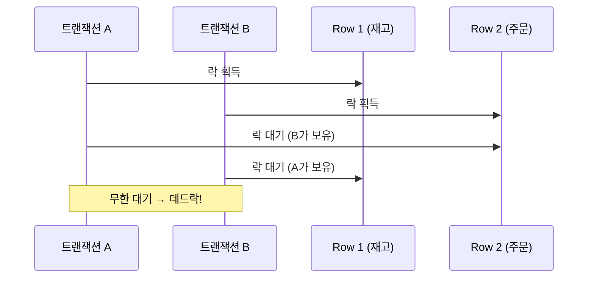

- 데드락(Deadlock)은 **두 개 이상의 [[트랜잭션(Transaction)]]이 서로 상대방이 가진 락을 기다리며 영원히 대기하는 상태**이다.
- 아무도 먼저 양보하지 않으면 두 트랜잭션 모두 진행할 수 없어 교착 상태에 빠진다.
- DB(MySQL InnoDB, PostgreSQL)는 자동으로 데드락을 감지하고 한 트랜잭션을 강제 롤백한다.

## 발생 원리



## MySQL InnoDB의 데드락 감지

- InnoDB는 **Wait-for 그래프(Waits-for Graph)**로 사이클을 감지한다.
- 데드락 감지 시 **롤백 비용이 적은 트랜잭션을 victim으로 선택하여 강제 롤백**한다.
- 강제 롤백된 트랜잭션에서 `DeadlockLoserDataAccessException` 발생 (Spring 기준).

```sql
-- MySQL 데드락 이력 확인
SHOW ENGINE INNODB STATUS;
-- "LATEST DETECTED DEADLOCK" 섹션에서 확인 가능
```

## 발생 시나리오 예시

```java
// 트랜잭션 A: stocks(id=1) → orders(id=1) 순서로 락
// 트랜잭션 B: orders(id=1) → stocks(id=1) 순서로 락

// 이 두 트랜잭션이 동시에 실행되면 데드락 발생
```

```sql
-- 트랜잭션 A
BEGIN;
SELECT * FROM stocks WHERE id = 1 FOR UPDATE;   -- stocks 락 획득
-- (B가 orders 락 획득)
SELECT * FROM orders WHERE id = 1 FOR UPDATE;   -- orders 락 대기 → 데드락!

-- 트랜잭션 B
BEGIN;
SELECT * FROM orders WHERE id = 1 FOR UPDATE;   -- orders 락 획득
SELECT * FROM stocks WHERE id = 1 FOR UPDATE;   -- stocks 락 대기 → 데드락!
```

## 예방 방법

### 방법 1: 일정한 락 획득 순서 유지

- **항상 동일한 순서**로 락을 획득하면 사이클이 생기지 않는다.

```java
@Transactional
public void processOrder(Long stockId, Long orderId) {
    // 항상 작은 ID 먼저 → 큰 ID 순서로 락 획득
    Long first = Math.min(stockId, orderId);
    Long second = Math.max(stockId, orderId);

    stockRepository.findWithLock(first);
    orderRepository.findWithLock(second);
}
```

### 방법 2: 트랜잭션 범위 최소화

- [[트랜잭션(Transaction)]] 안에서 불필요한 처리를 줄여 락 보유 시간을 단축한다.

```java
@Transactional
public void decreaseStock(Long stockId, int qty) {
    // 락이 필요한 작업만 트랜잭션 안에 포함
    Stock stock = stockRepository.findWithLock(stockId);
    stock.decrease(qty);
    // 알림 전송, 외부 API 호출 등은 트랜잭션 밖에서 처리
}
```

### 방법 3: 낙관적 락 활용

- [[비관적 락(Pessimistic Lock)]] 대신 [[낙관적 락(Optimistic Lock)]]을 사용하면 DB 락 자체가 없어 데드락이 발생하지 않는다.
- 충돌 시 `OptimisticLockException` 후 재시도.

### 방법 4: SELECT 범위 최소화

```sql
-- 불필요하게 넓은 범위 락 (데드락 위험 증가)
SELECT * FROM orders WHERE status = 'PENDING' FOR UPDATE;

-- 특정 ID만 락 (범위 최소화)
SELECT * FROM orders WHERE id = ? FOR UPDATE;
```

## Spring에서 데드락 처리

```java
@Service
public class OrderService {

    @Transactional
    @Retryable(
        value = DeadlockLoserDataAccessException.class,
        maxAttempts = 3,
        backoff = @Backoff(delay = 100)
    )
    public void processOrder(OrderRequest request) {
        // 데드락 발생 시 최대 3회 자동 재시도
        stockRepository.decreaseStock(request.getProductId(), request.getQty());
    }
}
```

- `spring-retry` 라이브러리의 `@Retryable`로 데드락 재시도 자동화 가능.

## InnoDB Gap Lock과 데드락

- InnoDB의 **Gap Lock** (범위 레코드 락)은 `REPEATABLE READ` 격리 수준에서 Phantom Read를 방지하기 위해 사용되지만, 데드락의 원인이 되기도 한다.
- `READ COMMITTED` 격리 수준으로 낮추면 Gap Lock이 없어 데드락 가능성이 줄어든다.

```yaml
# application.yml — 격리 수준 조정
spring:
  datasource:
    hikari:
      transaction-isolation: TRANSACTION_READ_COMMITTED
```

## 관련

- [[트랜잭션(Transaction)]]
- [[비관적 락(Pessimistic Lock)]]
- [[낙관적 락(Optimistic Lock)]]
- [[MySQL(MariaDB)]]
- [[ACID vs BASE]]
- [[HikariCP]]
