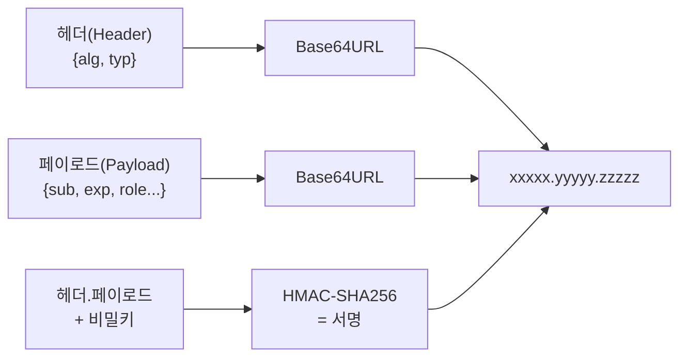
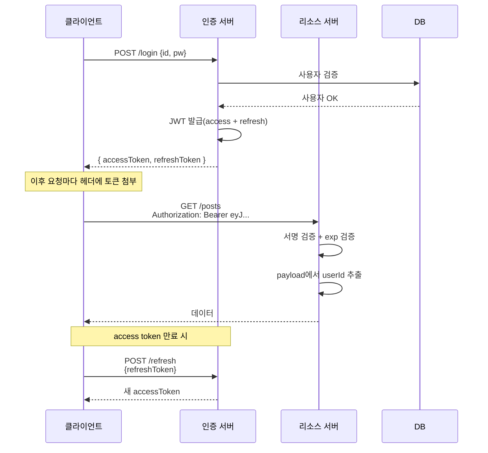

- JWT(JSON Web Token)는 **클라이언트와 서버가 인증/인가 정보를 주고받기 위한 표준 토큰 포맷**(RFC 7519)이다.
- "헤더(Header).페이로드(Payload).서명(Signature)" 3개의 Base64URL 인코딩 문자열을 점(`.`)으로 이어붙인 형태이다.

- 서버에 세션을 저장하지 않아도 되는 **무상태(stateless)** [[인증(Authentication)]] 방식의 대표 주자.
- 토큰 자체에 정보가 들어 있어 서버 확장이 쉽지만, 한 번 발급된 토큰은 **만료 전 무효화가 어렵다**.

## 구조

```
xxxxx.yyyyy.zzzzz
```



### 1. Header

```json
{ "alg": "HS256", "typ": "JWT" }
```

### 2. Payload (Claims)

- **Registered Claims**: 표준 클레임. `iss`(발급자), `sub`(주체), `exp`(만료), `iat`(발급시각), `nbf`(시작시각), `jti`(고유 ID).
- **Public Claims**: 누구나 정의 가능. (충돌 방지를 위해 URI 권장)
- **Private Claims**: 발급자/사용자 간 합의된 커스텀. `role`, `type` 등.

```json
{
  "sub": "user-123",
  "role": "ADMIN",
  "type": "access",
  "iat": 1700000000,
  "exp": 1700003600
}
```

### 3. Signature

- `HMACSHA256(base64(header) + "." + base64(payload), secret)`
- 서명으로 위변조를 막는다. 비밀키를 모르면 서명을 재현할 수 없음.

## 동작 흐름



## Access Token vs Refresh Token

| 항목 | Access Token | Refresh Token |
| ---- | ---- | ---- |
| 용도 | 매 요청마다 인증 | Access Token 재발급 |
| 수명 | 짧음 (15분~1시간) | 길음 (1주~1달) |
| 저장 위치 | 메모리/HttpOnly 쿠키 | HttpOnly 쿠키, DB(서버 측 저장 권장) |
| 노출 시 위험 | 만료까지만 |  큼 (장기간 인증 가능) |

## Spring Boot에서의 구현 예시

```java
@Component
public class JwtTokenProvider {
    @Value("${jwt.secret}") private String secret;
    private SecretKey accessSecretKey;

    @PostConstruct
    void init() {
        accessSecretKey = new SecretKeySpec(secret.getBytes(StandardCharsets.UTF_8),
            Jwts.SIG.HS256.key().build().getAlgorithm());
    }

    public String createAccessToken(String userId, String role) {
        Date now = new Date();
        return Jwts.builder()
            .subject(userId)
            .claim("role", role)
            .claim("type", "access")
            .issuedAt(now)
            .expiration(new Date(now.getTime() + 3600_000))
            .signWith(accessSecretKey, Jwts.SIG.HS256)
            .compact();
    }

    public String getUserId(String token) {
        return Jwts.parser().verifyWith(accessSecretKey).build()
            .parseSignedClaims(token).getPayload().getSubject();
    }
}
```

## 장단점

### 장점
- 무상태: 서버에 세션 저장소 불필요. 수평 확장 쉬움.
- 자기 기술(self-contained): 토큰 자체에 클레임 포함.
- 다양한 클라이언트 지원: 모바일/SPA/서버 간 통신 모두 가능.

### 단점
- **무효화 어려움**: 한번 발급된 토큰은 만료 전까지 유효. 로그아웃/탈취 대응은 별도 블랙리스트 또는 Refresh 회전 필요.
- **페이로드 크기**: 매 요청마다 헤더에 실려 가므로 무거운 클레임은 부적합.
- **비밀키 관리**: 유출 시 모든 토큰 위조 가능. 정기 로테이션 필요.

## 보안 권장사항

- 비밀키는 충분히 길게(256bit 이상) + 환경변수로 관리.
- `HttpOnly`, `Secure`, `SameSite=Lax/Strict` 쿠키로 XSS 방어.
- Refresh Token은 반드시 회전(rotation)하고, 서버에 저장 후 사용 시 검증.
- 알고리즘 혼동 공격 방지: `alg: none` 거부, 라이브러리가 알아서 거르긴 함.
- 짧은 access 토큰 수명 + refresh 토큰 회전 조합.

## 관련

- [[인증(Authentication)]]
- [[인가(Authorization)]]
- [[Spring Security]]
- [[JwtAuthenticationFilter]]
- [[CORS(Cross-Origin Resource Sharing Policy)]]
