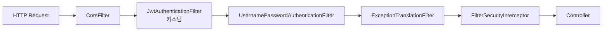
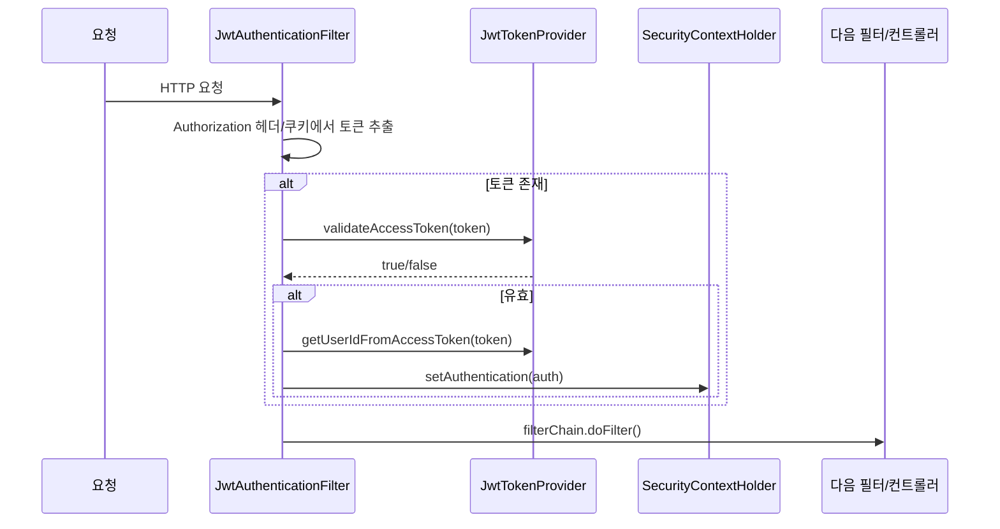

- JwtAuthenticationFilter는 [[Spring Security]] 필터 체인 안에서 **요청마다 [[JWT(Json Web Token)]]을 검증하고 [[인증(Authentication)]] 객체를 SecurityContext에 등록**하는 사용자 정의 필터이다.
- 보통 `OncePerRequestFilter`를 상속하여 한 요청당 한 번만 실행되도록 만든다.

- 검증된 토큰이 있으면 `SecurityContextHolder`에 `Authentication`을 세팅 → 이후 [[컨트롤러(Controller)]]에서 `@AuthenticationPrincipal` 등으로 사용자 정보 사용 가능.
- 검증 실패/토큰 없음 → SecurityContext는 비어 있고, 보호된 엔드포인트라면 `SecurityFilterChain`이 401을 응답.

## 위치



- 보통 `UsernamePasswordAuthenticationFilter` **앞**에 등록한다 (`addFilterBefore`).

## 기본 구조

```java
@Component
@RequiredArgsConstructor
public class JwtAuthenticationFilter extends OncePerRequestFilter {

    private final JwtTokenProvider jwtTokenProvider;

    @Override
    protected void doFilterInternal(
            @NonNull HttpServletRequest request,
            @NonNull HttpServletResponse response,
            @NonNull FilterChain filterChain
    ) throws ServletException, IOException {

        String token = resolveToken(request);

        if (token != null && jwtTokenProvider.validateAccessToken(token)) {
            String userId = jwtTokenProvider.getUserIdFromAccessToken(token);
            String role = jwtTokenProvider.getRoleFromAccessToken(token);

            UsernamePasswordAuthenticationToken authentication =
                    new UsernamePasswordAuthenticationToken(
                        userId,
                        null,
                        Collections.singletonList(new SimpleGrantedAuthority("ROLE_" + role))
                    );

            SecurityContextHolder.getContext().setAuthentication(authentication);
        }

        filterChain.doFilter(request, response);
    }

    private String resolveToken(HttpServletRequest request) {
        String bearer = request.getHeader("Authorization");
        if (StringUtils.hasText(bearer) && bearer.startsWith("Bearer ")) {
            return bearer.substring(7);
        }
        // 쿠키도 함께 지원
        Cookie[] cookies = request.getCookies();
        if (cookies != null) {
            for (Cookie c : cookies) {
                if ("auth-token".equals(c.getName())) return c.getValue();
            }
        }
        return null;
    }
}
```

## 동작 흐름



## OncePerRequestFilter를 쓰는 이유

- 한 요청이 여러 디스패처를 거치면(forward/include) 일반 `Filter`는 여러 번 실행될 수 있다.
- `OncePerRequestFilter`는 request 속성에 마커를 두어 **한 번만 실행**되도록 보장한다.
- Spring Security 표준 패턴.

## 등록 (SecurityConfig)

```java
@Configuration
@EnableWebSecurity
@RequiredArgsConstructor
public class SecurityConfig {
    private final JwtAuthenticationFilter jwtAuthenticationFilter;

    @Bean
    SecurityFilterChain filterChain(HttpSecurity http) throws Exception {
        http
            .csrf(AbstractHttpConfigurer::disable)
            .sessionManagement(s -> s.sessionCreationPolicy(SessionCreationPolicy.STATELESS))
            .authorizeHttpRequests(auth -> auth
                .requestMatchers("/api/auth/**").permitAll()
                .anyRequest().authenticated()
            )
            .addFilterBefore(jwtAuthenticationFilter, UsernamePasswordAuthenticationFilter.class);
        return http.build();
    }
}
```

## 토큰 추출 우선순위 (이 프로젝트)

1. `Authorization: Bearer xxx` 헤더
2. `auth-token` 쿠키 (HttpOnly 쿠키 기반 인증 지원)

- 둘 다 없으면 익명 사용자로 처리 → 보호된 리소스는 `permitAll` 외 401.

## 주의사항

- **SecurityContext 청소**: `SecurityContextHolder`는 ThreadLocal 기반이라 스레드 풀 재사용 시 누수 위험. Spring Security가 요청 끝에 자동 청소해주지만, 비동기 작업은 직접 챙겨야 함.
- **예외 처리**: 필터 안에서 throw하면 `ExceptionTranslationFilter`가 못 잡을 수 있음. 검증 실패는 단순히 인증 안 한 채로 다음 필터에 넘기고, 보호된 엔드포인트라면 그쪽에서 401 응답.
- **토큰 갱신**: access 만료 시 클라이언트가 refresh 요청을 별도로 보내도록 설계. 필터에서 자동 갱신은 보통 안 함.
- **로깅 주의**: 토큰 자체를 로그에 찍지 말 것 (탈취 위험).

## 관련

- [[JWT(Json Web Token)]]
- [[Spring Security]]
- [[인증(Authentication)]]
- [[SecurityFilterChain]]
