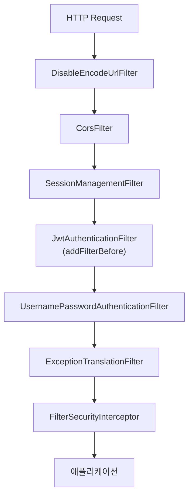

- SecurityFilterChain은 [[Spring Security]] 5.4+에서 도입된 **필터 체인 설정 방식**으로, `HttpSecurity` DSL을 [[Bean]]으로 등록해 보안 규칙을 정의한다.
- 이전의 `WebSecurityConfigurerAdapter` (Spring Security 5.7부터 deprecated, 6.0에서 제거)를 대체한다.

- 한 애플리케이션에 여러 SecurityFilterChain을 등록할 수 있고, `@Order`로 우선순위를 정한다.
- 각 체인은 자체 `securityMatcher`로 적용 범위를 좁힐 수 있다.

## 기본 구조

```java
@Configuration
@EnableWebSecurity
@EnableMethodSecurity   // @PreAuthorize 등 메서드 보안
@RequiredArgsConstructor
public class SecurityConfig {

    private final JwtAuthenticationFilter jwtAuthenticationFilter;

    @Bean
    public SecurityFilterChain filterChain(HttpSecurity http) throws Exception {
        http
            // 1. CSRF/CORS/세션 설정
            .csrf(AbstractHttpConfigurer::disable)
            .cors(cors -> cors.configurationSource(corsConfigurationSource()))
            .sessionManagement(s -> s.sessionCreationPolicy(SessionCreationPolicy.STATELESS))

            // 2. 인증 실패/접근 거부 처리
            .exceptionHandling(ex -> ex
                .authenticationEntryPoint((req, res, e) -> writeError(res, 401))
                .accessDeniedHandler((req, res, e) -> writeError(res, 403))
            )

            // 3. URL별 인가 규칙
            .authorizeHttpRequests(auth -> auth
                .requestMatchers(HttpMethod.GET, "/api/posts/**").permitAll()
                .requestMatchers("/api/auth/login", "/api/auth/register").permitAll()
                .requestMatchers("/api/admin/**").hasRole("ADMIN")
                .anyRequest().authenticated()
            )

            // 4. JWT 필터 등록
            .addFilterBefore(jwtAuthenticationFilter, UsernamePasswordAuthenticationFilter.class);

        return http.build();
    }

    @Bean
    public PasswordEncoder passwordEncoder() {
        return new BCryptPasswordEncoder();
    }
}
```

## 핵심 설정 항목

### CSRF

- API 서버(무상태)는 보통 비활성화. CSRF는 쿠키 기반 세션을 가정하기 때문.
- 폼 기반 + 쿠키 세션이라면 켜둬야 함.

### 세션 정책

| 정책 | 설명 |
| ---- | ---- |
| `STATELESS` | 세션 만들지 않음. [[JWT(Json Web Token)]] 같은 무상태 인증에 적합 |
| `IF_REQUIRED` | 기본값. 필요하면 만듦 |
| `ALWAYS` | 항상 세션 |
| `NEVER` | Spring Security가 직접 만들진 않지만 있으면 사용 |

### 인가 규칙 - matcher 우선순위

- 위에서부터 순서대로 매칭. **구체적인 규칙을 먼저** 적어야 한다.
- `permitAll()`: 모두 허용
- `authenticated()`: 인증된 사용자만
- `hasRole("ADMIN")`: `ROLE_ADMIN` 권한 필요 (접두사 자동)
- `hasAuthority("READ")`: 권한 명 그대로
- `denyAll()`: 모두 거부

### 필터 등록

- `addFilterBefore(filter, beforeClass)`: 지정한 필터 **앞**에 삽입.
- `addFilterAfter(filter, afterClass)`: 지정한 필터 **뒤**에 삽입.
- `addFilterAt(filter, atClass)`: 같은 위치에 추가.

## 필터 체인 흐름



## 여러 체인 등록

```java
@Bean
@Order(1)
public SecurityFilterChain apiChain(HttpSecurity http) throws Exception {
    http.securityMatcher("/api/**")
        .csrf(c -> c.disable())
        .authorizeHttpRequests(a -> a.anyRequest().authenticated());
    return http.build();
}

@Bean
@Order(2)
public SecurityFilterChain webChain(HttpSecurity http) throws Exception {
    http.authorizeHttpRequests(a -> a.anyRequest().permitAll());
    return http.build();
}
```

- `/api/**`는 첫 체인이 처리, 나머지는 두 번째 체인.

## 인증 실패/접근 거부 응답 커스터마이징

- **AuthenticationEntryPoint**: 인증 안 됨 (401). 보통 JSON으로 에러 응답.
- **AccessDeniedHandler**: 인증은 됐지만 권한 없음 (403).

```java
.exceptionHandling(ex -> ex
    .authenticationEntryPoint((req, res, e) -> {
        res.setStatus(401);
        res.setContentType("application/json");
        objectMapper.writeValue(res.getWriter(),
            ApiResponse.error("UNAUTHORIZED", "로그인이 필요합니다"));
    })
)
```

## PasswordEncoder

- 비밀번호는 반드시 단방향 해싱하여 저장.
- `BCryptPasswordEncoder`가 표준. 솔트 자동 포함, work factor로 강도 조절.

```java
@Bean
PasswordEncoder passwordEncoder() {
    return new BCryptPasswordEncoder();
}

// 사용
String hashed = passwordEncoder.encode("plain");
boolean ok = passwordEncoder.matches("plain", hashed);
```

## 자주 하는 실수

- **CSRF 끄지 않고 API 호출** → 403. 무상태 API는 `csrf(disable)`.
- **`permitAll()`과 `authenticated()` 순서 잘못** → 위에서부터 매칭이라 구체적인 것 먼저.
- **`hasRole("ROLE_ADMIN")`** → `hasRole("ADMIN")`로 적어야 함 (접두사 자동).
- **필터 빈 안 등록** → `@Component`나 `@Bean`으로 등록 후 주입.
- **CORS 빈 따로 등록 안 함** → `cors()`만 켜면 안 됨. `CorsConfigurationSource` 빈 필요.

## 관련

- [[Spring Security]]
- [[JwtAuthenticationFilter]]
- [[JWT(Json Web Token)]]
- [[CORS(Cross-Origin Resource Sharing Policy)]]
- [[인증(Authentication)]]
- [[인가(Authorization)]]
