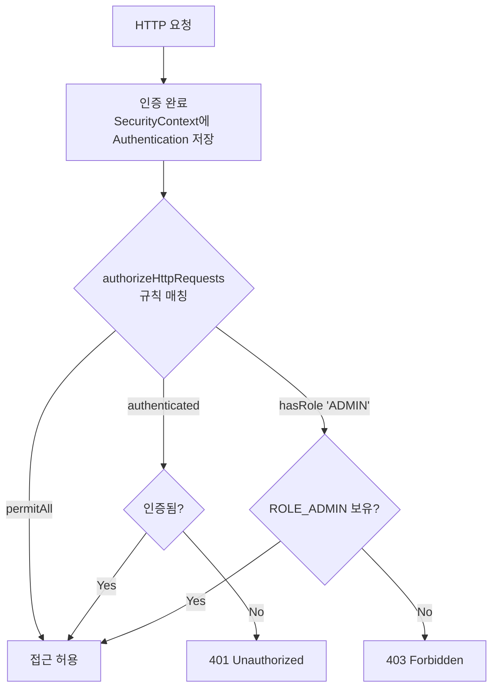

- 인가(Authorization)는 **인증된 사용자가 요청한 리소스에 접근할 권한이 있는지 확인**하는 과정이다.
- 인가는 항상 [[인증(Authentication)]] 이후에 일어난다.
- 인가에 실패하면 `403 FORBIDDEN` 응답을 반환한다.

## 인증 vs 인가

| 구분 | 인증 (Authentication) | 인가 (Authorization) |
| ---- | ---- | ---- |
| 목적 | "너 누구야?" | "너 이거 해도 돼?" |
| 실패 응답 | 401 Unauthorized | 403 Forbidden |
| Spring 처리 | `AuthenticationEntryPoint` | `AccessDeniedHandler` |

## Spring Security 인가 흐름



## SecurityFilterChain에서 URL 기반 인가

```java
.authorizeHttpRequests(auth -> auth
    .requestMatchers(HttpMethod.GET, "/api/posts/**").permitAll()      // 모두 허용
    .requestMatchers("/api/auth/**").permitAll()                        // 모두 허용
    .requestMatchers("/api/admin/**").hasRole("ADMIN")                 // ROLE_ADMIN만
    .requestMatchers("/api/user/**").hasAnyRole("USER", "ADMIN")       // 두 역할 모두
    .anyRequest().authenticated()                                       // 나머지는 로그인 필요
)
```

## 메서드 레벨 인가 (@PreAuthorize)

```java
@Configuration
@EnableMethodSecurity   // 메서드 보안 활성화
public class SecurityConfig { ... }

// 컨트롤러 또는 서비스에서 사용
@PreAuthorize("hasRole('ADMIN')")
@DeleteMapping("/api/admin/users/{id}")
public ResponseEntity<Void> deleteUser(@PathVariable Long id) { ... }

@PreAuthorize("hasRole('ADMIN') or #userId == authentication.principal.id")
public void updateUser(Long userId, UpdateRequest request) { ... }
```

## 역할(Role) vs 권한(Authority)

| 개념 | 설명 | 접두사 |
| ---- | ---- | ---- |
| Role (역할) | 사용자 역할 그룹 | `ROLE_` 자동 붙음 |
| Authority (권한) | 세부 권한 | 없음 (그대로) |

```java
// Role 설정 (내부적으로 "ROLE_ADMIN"으로 저장)
.hasRole("ADMIN")

// Authority 설정 (정확한 이름 그대로 비교)
.hasAuthority("ROLE_ADMIN")
```

## 접근 거부 핸들러 설정

```java
.exceptionHandling(ex -> ex
    .authenticationEntryPoint((req, res, e) -> {
        // 인증 실패 → 401
        res.setStatus(401);
        res.setContentType("application/json");
        objectMapper.writeValue(res.getWriter(),
            ApiResponse.error("UNAUTHORIZED", "로그인이 필요합니다"));
    })
    .accessDeniedHandler((req, res, e) -> {
        // 인가 실패 → 403
        res.setStatus(403);
        res.setContentType("application/json");
        objectMapper.writeValue(res.getWriter(),
            ApiResponse.error("FORBIDDEN", "접근 권한이 없습니다"));
    })
)
```

## 관련

- [[인증(Authentication)]]
- [[SecurityFilterChain]]
- [[Spring Security]]
- [[JWT(Json Web Token)]]
- [[HTTP 상태 코드(HTTP Status)]]
- [[권한(Authority)]]
