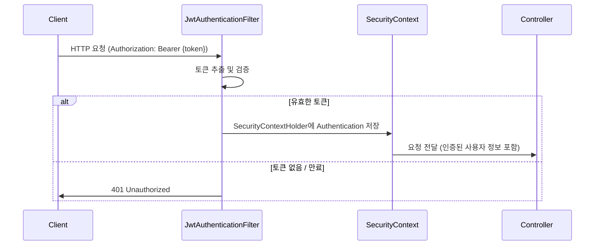

- 인증(Authentication)은 **시스템에 접근하는 주체(사용자)가 누구인지 확인**하는 과정이다.
- 인증은 [[인가(Authorization)]] 이전에 반드시 완료되어야 한다.
- 인증에 실패하면 `401 UNAUTHORIZED` 응답을 반환한다.

## Spring Security 인증 흐름



## 인증 방식 비교

| 방식 | 특징 | 사용 상황 |
| ---- | ---- | ---- |
| 세션 기반 | 서버에 세션 저장, 쿠키로 세션 ID 전달 | 전통적인 웹 앱 |
| [[JWT(Json Web Token)]] | 서버 무상태(Stateless), 토큰 자체에 정보 포함 | REST API, 모바일 앱 |
| OAuth 2.0 | 외부 제공자(Google, Kakao 등)에 인증 위임 | 소셜 로그인 |

## Spring Security 인증 핵심 컴포넌트

| 클래스/인터페이스 | 역할 |
| ---- | ---- |
| `SecurityContextHolder` | 인증 정보를 저장하는 ThreadLocal 컨테이너 |
| `Authentication` | 인증 주체 정보 (principal, credentials, authorities) |
| `UsernamePasswordAuthenticationToken` | 이름/비밀번호 기반 인증 토큰 구현체 |
| `UserDetailsService` | 사용자 정보를 로드하는 인터페이스 |
| `UserDetails` | Spring Security가 사용하는 사용자 상세 정보 |
| `AuthenticationManager` | 인증을 처리하는 핵심 인터페이스 |

## JWT 기반 인증 코드

```java
// JwtAuthenticationFilter에서 인증 처리
UsernamePasswordAuthenticationToken authentication =
    new UsernamePasswordAuthenticationToken(
        userDetails,
        null,                          // 비밀번호 (인증 완료 후 null)
        userDetails.getAuthorities()   // 권한 목록
    );

SecurityContextHolder.getContext().setAuthentication(authentication);
```

## 현재 인증된 사용자 가져오기

```java
// Controller에서 현재 로그인 사용자 조회
@GetMapping("/me")
public UserResponse getCurrentUser(@AuthenticationPrincipal UserDetails userDetails) {
    return UserResponse.of(userDetails);
}

// 서비스에서 직접 꺼내기
Authentication auth = SecurityContextHolder.getContext().getAuthentication();
String username = auth.getName();
```

## 관련

- [[인가(Authorization)]]
- [[JWT(Json Web Token)]]
- [[JwtAuthenticationFilter]]
- [[SecurityFilterChain]]
- [[HTTP 상태 코드(HTTP Status)]]
- [[Spring Security]]
