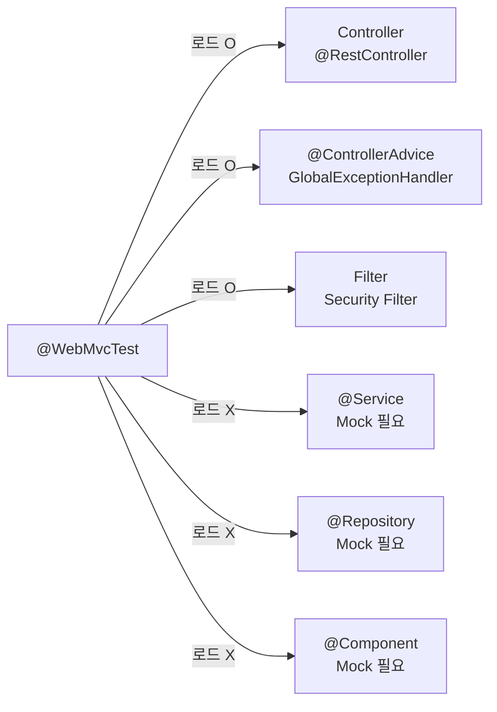

- `@WebMvcTest`는 **[[컨트롤러(Controller)]] 레이어만 로드하여 빠르게 테스트**하는 [[어노테이션(Annotation)]]이다.
- [[스프링 컨테이너(Spring Container)]] 전체를 띄우는 [[@SpringBootTest]]와 달리 웹 계층만 로드하므로 **빠르다**.
- 로드되는 [[Bean]]: Controller, `@ControllerAdvice`, Filter, `HandlerInterceptor`.
- 로드되지 않는 [[Bean]]: `@Service`, `@Repository`, `@Component` → `@MockBean`으로 대체한다.

## 기본 사용

```java
// 특정 컨트롤러만 로드 (권장)
@WebMvcTest(PostController.class)
class PostControllerTest {

    @Autowired
    private MockMvc mockMvc;

    @Autowired
    private ObjectMapper objectMapper;   // JSON 직렬화

    @MockBean
    private PostUseCase postUseCase;    // 서비스 레이어 Mock 필수

    @Test
    @DisplayName("[GET] /api/posts/{id} - 정상 조회")
    void getPost_success() throws Exception {
        // Given
        given(postUseCase.findById(1L))
            .willReturn(new PostResponse(1L, "제목", "PUBLISHED"));

        // When & Then
        mockMvc.perform(get("/api/posts/1")
                .contentType(MediaType.APPLICATION_JSON))
            .andExpect(status().isOk())
            .andExpect(jsonPath("$.id").value(1L))
            .andExpect(jsonPath("$.title").value("제목"))
            .andDo(print());
    }

    @Test
    @DisplayName("[POST] /api/posts - 게시글 생성 시 201 반환")
    void createPost_success() throws Exception {
        // Given
        CreatePostRequest request = new CreatePostRequest("제목", "내용");
        given(postUseCase.create(any())).willReturn(new PostResponse(1L, "제목", "DRAFT"));

        // When & Then
        mockMvc.perform(post("/api/posts")
                .contentType(MediaType.APPLICATION_JSON)
                .content(objectMapper.writeValueAsString(request)))
            .andExpect(status().isCreated())
            .andExpect(jsonPath("$.id").value(1L));
    }

    @Test
    @DisplayName("[GET] /api/posts/{id} - 없는 ID → 404 반환")
    void getPost_notFound_returns404() throws Exception {
        given(postUseCase.findById(999L))
            .willThrow(new ResourceNotFoundException("Post not found"));

        mockMvc.perform(get("/api/posts/999"))
            .andExpect(status().isNotFound());
    }
}
```

## Spring Security 비활성화 방법

```java
// 방법 1: 필터 제거 (인증 없이 테스트)
@WebMvcTest(PostController.class)
@AutoConfigureMockMvc(addFilters = false)
class PostControllerTest { ... }

// 방법 2: @WithMockUser로 인증된 사용자 시뮬레이션
@Test
@WithMockUser(username = "user@example.com", roles = "USER")
void getPost_authenticated_returns200() throws Exception {
    mockMvc.perform(get("/api/posts/1"))
        .andExpect(status().isOk());
}

// 방법 3: Security 설정 자체를 제외
@WebMvcTest(value = PostController.class, excludeAutoConfiguration = SecurityAutoConfiguration.class)
class PostControllerTest { ... }
```

## @WebMvcTest 로드 범위



## @WebMvcTest vs @SpringBootTest

| 항목 | @WebMvcTest | @SpringBootTest |
| ---- | ---- | ---- |
| 로드 범위 | 웹 레이어만 | 전체 컨텍스트 |
| 속도 | **빠름** | 느림 |
| 실제 DB | X | O |
| @MockBean 필요 | 서비스/리포지토리 | 선택적 |
| 용도 | 컨트롤러 단위 테스트 | 통합/E2E 테스트 |

## 관련

- [[MockMvc]]
- [[@SpringBootTest]]
- [[@MockBean]]
- [[컨트롤러(Controller)]]
- [[JUnit5]]
- [[AssertJ]]
- [[Given-When-Then]]
