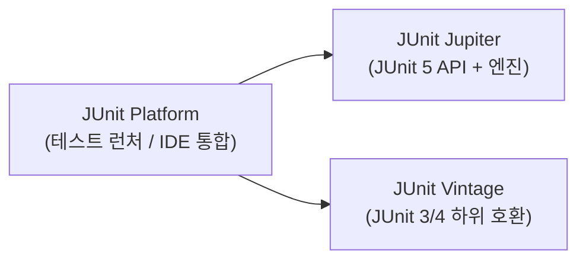

- JUnit 5는 자바(Java)에서 가장 널리 쓰이는 **단위 테스트 프레임워크**이다.
- JUnit 4와 달리 JUnit 5는 세 가지 모듈로 구성된다: `JUnit Platform` + `JUnit Jupiter` + `JUnit Vintage`.
- Spring Boot 2.2+ 부터 기본 의존성으로 포함되어 있어 별도 추가 없이 바로 사용 가능하다.

## 모듈 구성



| 모듈 | 역할 |
| ---- | ---- |
| Platform | 테스트 런처 API, IDE·빌드 도구 통합 |
| Jupiter | JUnit 5 테스트 작성 API와 엔진 |
| Vintage | JUnit 3/4 기반 테스트 실행 지원 |

## 주요 어노테이션

| 어노테이션 | 설명 |
| ---- | ---- |
| [[@Test]] | 테스트 메서드 표시 |
| [[@BeforeEach]] | 각 테스트 전 실행 |
| `@AfterEach` | 각 테스트 후 실행 |
| `@BeforeAll` | 전체 테스트 전 1회 실행 (static) |
| `@AfterAll` | 전체 테스트 후 1회 실행 (static) |
| [[@DisplayName]] | 테스트 이름 커스터마이징 |
| [[@ParameterizedTest]] | 파라미터화 테스트 |
| `@Nested` | 중첩 테스트 클래스 |
| `@Disabled` | 테스트 비활성화 |

## 기본 구조

```java
@DisplayName("OrderService 테스트")
class OrderServiceTest {

    private OrderService orderService;

    @BeforeEach
    void setUp() {
        orderService = new OrderService();
    }

    @Test
    @DisplayName("주문 생성 시 상태가 PENDING이어야 한다")
    void createOrder_ShouldHavePendingStatus() {
        // Given
        OrderRequest request = new OrderRequest("item-1", 2);

        // When
        Order order = orderService.create(request);

        // Then
        assertThat(order.getStatus()).isEqualTo(OrderStatus.PENDING);
    }
}
```

## AssertJ와 함께 사용

- JUnit 5의 기본 `Assertions`보다 [[AssertJ]]의 `assertThat()`이 더 풍부한 검증 API를 제공한다.

```java
// JUnit 5 기본
assertEquals(expected, actual);
assertTrue(condition);

// AssertJ (권장)
assertThat(actual).isEqualTo(expected);
assertThat(list).hasSize(3).contains("a", "b");
```

## Given-When-Then 패턴

- JUnit 5와 함께 [[Given-When-Then]] 패턴을 사용하면 테스트 의도가 명확해진다.

```java
@Test
void 재고가_없으면_주문이_실패해야_한다() {
    // Given
    Product outOfStock = new Product("item-1", 0);

    // When & Then
    assertThatThrownBy(() -> orderService.order(outOfStock, 1))
        .isInstanceOf(OutOfStockException.class);
}
```

## Spring Boot 연동

- `@SpringBootTest`: 전체 컨텍스트 로드, 통합 테스트
- `@WebMvcTest`: Controller 레이어만 테스트
- `@MockBean`: Spring 컨텍스트에 Mock 빈 등록

## 관련

- [[@Test]]
- [[@BeforeEach]]
- [[@DisplayName]]
- [[@ParameterizedTest]]
- [[@SpringBootTest]]
- [[@WebMvcTest]]
- [[AssertJ]]
- [[Given-When-Then]]
- [[TDD(Test Driven Development)]]
