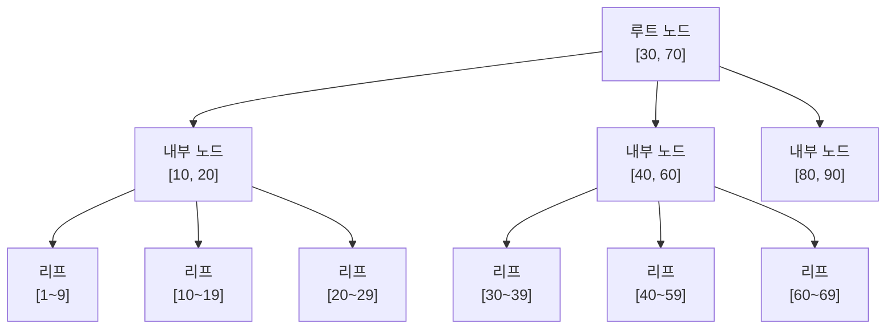
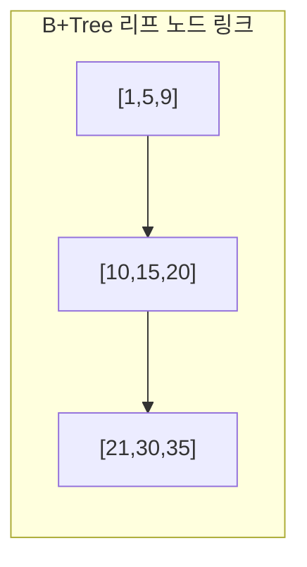
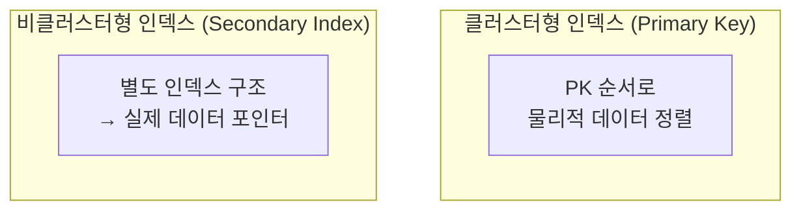
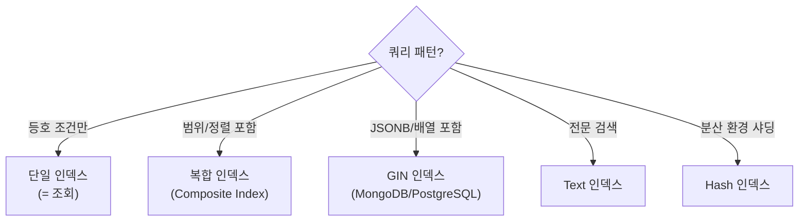

- 데이터베이스 인덱스는 **빠른 검색을 위해 데이터를 특정 자료구조로 정렬·색인해두는 구조체**이다.
- MySQL/PostgreSQL은 주로 **B-Tree 인덱스**를, MongoDB는 **B-Tree**와 **해시**, **GIN** 등을 사용한다.
- 인덱스 없이 조회하면 Full Table Scan(컬렉션 스캔)으로 O(n) 시간복잡도가 발생한다.

## B-Tree (Balanced Tree)



- 모든 리프 노드가 같은 깊이 → **균형 트리(Balanced)** 유지.
- 검색, 삽입, 삭제 모두 `O(log n)`.
- 범위 검색(`BETWEEN`, `>`, `<`, `LIKE 'abc%'`)에 효율적.

## B-Tree vs B+Tree

- 실제 RDBMS(MySQL InnoDB, PostgreSQL)는 **B+Tree**를 사용한다.

| 항목 | B-Tree | B+Tree |
| ---- | ---- | ---- |
| 데이터 저장 위치 | 내부 노드 + 리프 노드 | **리프 노드에만** |
| 리프 노드 연결 | 없음 | **링크드 리스트**로 연결 |
| 범위 검색 | 느림 (전체 트리 순회) | **빠름** (리프 순회) |
| 메모리 효율 | 낮음 | 높음 (내부 노드에 키만) |



- B+Tree의 리프 노드는 연결 리스트로 이어져 있어 범위 조회 시 순서대로 읽기 가능.

## 클러스터형 vs 비클러스터형 인덱스



| 항목 | 클러스터형 (Clustered) | 비클러스터형 (Non-Clustered) |
| ---- | ---- | ---- |
| 정의 | 실제 데이터를 인덱스 순서로 정렬 저장 | 인덱스와 데이터 분리 |
| 테이블당 개수 | 1개 (기본 키) | 여러 개 |
| 범위 조회 | 매우 빠름 | 상대적으로 느림 |
| MySQL InnoDB | Primary Key = 클러스터형 | Secondary Key = 비클러스터형 |

- MySQL InnoDB에서 PK로 조회하면 클러스터형 인덱스를 타므로 매우 빠르다.
- Secondary Index(일반 인덱스)로 조회 → 인덱스에서 PK를 찾고 → PK로 실제 데이터 조회 (2단계).

## 해시 인덱스 (Hash Index)

- 키를 **해시 함수**에 넣어 버킷에 저장.
- 등호(`=`) 조회는 `O(1)` — 매우 빠름.
- **범위 검색 불가** (`>`, `<`, `BETWEEN`, `LIKE`).
- MySQL MEMORY 스토리지 엔진, MongoDB 해시 인덱스에 사용.

## MongoDB 인덱스 구조

| 인덱스 종류 | 내부 구조 | 적합한 쿼리 |
| ---- | ---- | ---- |
| 단일/복합 인덱스 | B-Tree | 일반 등호, 범위 |
| 해시 인덱스 | Hash | 등호 (`=`), 샤딩 키 |
| GIN (Generalized Inverted) | 역방향 인덱스 | JSONB 포함 검색, 배열 검색 |
| 텍스트 인덱스 | 단어→도큐먼트 매핑 | 전문 검색 (`$text`) |
| 공간 인덱스 | R-Tree | 지리 데이터 |

## 인덱스 선택 원리



## 복합 인덱스 최좌측 접두사 규칙 (Leftmost Prefix Rule)

```sql
-- 복합 인덱스: (author_id, status, created_at)
SELECT * FROM posts WHERE author_id = 1 AND status = 'published'   -- O (인덱스 사용)
SELECT * FROM posts WHERE author_id = 1                             -- O (부분 사용)
SELECT * FROM posts WHERE status = 'published'                      -- X (author_id 없음)
SELECT * FROM posts WHERE status = 'published' AND created_at > ?  -- X
```

- 왼쪽 컬럼부터 순서대로 조건이 있어야 인덱스를 탄다.
- `author_id`를 건너뛰면 나머지 컬럼의 인덱스는 무효.

## 인덱스를 타지 못하는 케이스

```sql
-- 컬럼에 함수 적용 시
WHERE YEAR(created_at) = 2024          -- X
WHERE created_at >= '2024-01-01'       -- O

-- 묵시적 형변환
WHERE id = '123'   -- id가 INT인데 문자열로 비교 → X

-- LIKE 앞 와일드카드
WHERE title LIKE '%검색어'             -- X
WHERE title LIKE '검색어%'             -- O

-- OR 조건 (각각 인덱스 있어도 옵티마이저가 무시할 수 있음)
WHERE status = 'A' OR category = 'B'  -- 주의
```

## 인덱스 vs 쿼리 성능 실측

- MySQL: `EXPLAIN SELECT ...` — `type: ALL` (풀스캔) vs `type: ref/range` (인덱스)
- MongoDB: `.explain("executionStats")` — `COLLSCAN` (풀스캔) vs `IXSCAN` (인덱스)

## 관련

- [[인덱스(Index)]] (MySQL)
- [[MongoDB 인덱스(Index)]] (MongoDB)
- [[MySQL(MariaDB)]]
- [[PostgreSQL]]
- [[MongoDB]]
- [[원자적 업데이트(Atomic Update)]]
