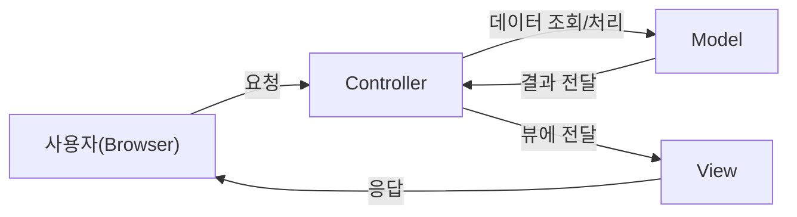
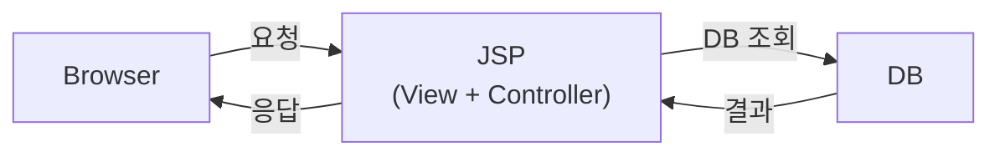
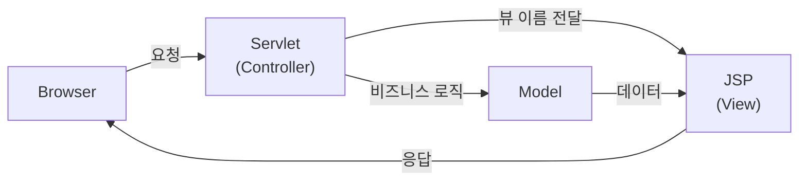
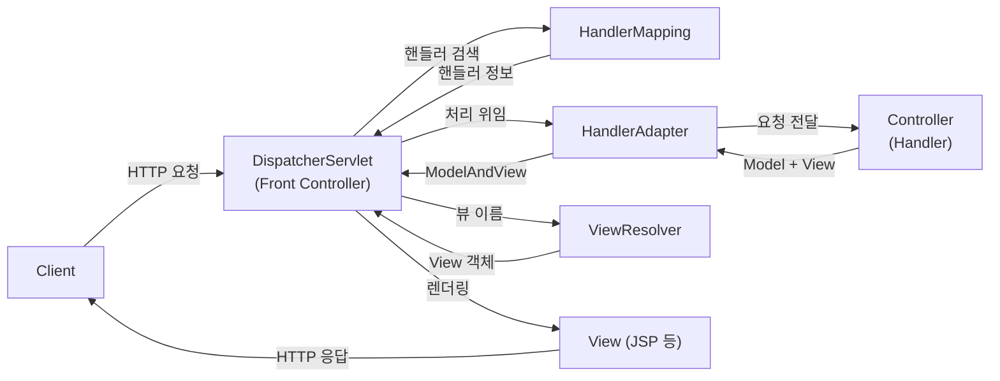

- MVC는 [[모델(Model)]]-[[뷰(View)]]-[[컨트롤러(Controller)]]의 약자이며, 애플리케이션을 구성하는 요소를 역할에 따라 세 가지 모듈로 나누어 구분한 패턴이다.
- 현재 MVC 패턴은 MVC1, MVC2 아키텍처에서 발전된 패턴이다.



## MVC1 패턴



- 브라우저(사용자)로부터 요청이 들어오면 DB로부터 필요한 데이터를 받은 Model [[객체(Object)]]([[Bean]])를 [[JSP]] 페이지([[뷰(View)]])에 담아 응답으로 보내는 패턴이다.
- JSP가 View와 Controller 역할을 모두 담당하기 때문에 JSP 파일 내에 너무 많은 코드가 들어가 가독성이 떨어진다.
- 이러한 단점을 보완해 [[컨트롤러(Controller)]] 역할을 하는 [[Servlet]]이 추가된 MVC2 패턴이 나오게 됐다.

## MVC2 패턴



- MVC2 패턴의 서블릿([[Servlet]])은 요청에 대한 [[비즈니스 로직(Business Logic)]]을 처리한 후, 이를 [[JSP]] 파일에 반영하는 역할을 수행한다.
- View와 Controller 역할이 분리됐다.

## Spring MVC



- Spring Framework에서 MVC2 모델을 더욱 발전시킨 것이 Spring MVC이다.
- [[프론트 패턴(Front Pattern)]]의 프론트 컨트롤러인 [[DispatcherServlet]]이 모든 요청을 우선적으로 받는다.
- 실제 요청 처리는 개별 [[컨트롤러(Controller)]] 클래스(핸들러)로 위임한다.
- 컨트롤러는 [[DI(Dependency Injection)]]로 주입된 [[Bean]]을 통해 비즈니스 로직 처리 결과를 Model에 담아 반환한다.
- DispatcherServlet은 ViewResolver를 통해 적절한 [[뷰(View)]]에 Model을 전달해 응답을 생성한다.


### 1. [[톰캣(Tomcat)]]([[WAS(Web Application Sever)]]) 구동 (web.xml 기반 레거시 설정)

- 스프링 MVC 프로젝트를 구동하면 [[WAS(Web Application Sever)]]가 먼저 구동된다.
- 스프링도 자바의 서블릿 컨테이너([[Servlet Container]]) 구동 방식 위에서 동작하는 라이브러리 집합체이다.

#### 1-1. Context Path 설정

- 톰캣의 `server.xml`에서 Context Path와 프로젝트(애플리케이션)의 이름이 매핑된다.
- 이 Path를 달고 들어오는 URL은 해당 프로젝트에 대한 요청이라는 것이다.

```xml
<Context docBase="hssweb" path="/" reloadable="true" source="org.eclipse.jst.jee.server:hssweb"/>
```

#### 1-2. 루트 컨테이너 생성

- 구동 시 참조하는 설정 파일은 `WEB-INF/web.xml`이다.
- 루트 컨테이너(애플리케이션 컨텍스트)는 애플리케이션에 딱 하나 생성되는 최상위 부모 컨테이너이다.
- [[스프링 컨테이너(Spring Container)]]는 루트 컨테이너, 서블릿용 컨테이너, 개발자 직접 생성 컨테이너로 구분된다.
- 루트 컨테이너에는 웹 기술과 관계없는 공통 [[Bean]]을 생성해 관리한다.
- 서블릿용 컨테이너는 루트 컨테이너의 자식이며, 부모 컨테이너에서 필요한 것을 가져다 사용할 수 있지만 그 반대는 불가하다.

```xml
<!-- Root Spring Container 설정 -->
<context-param>
    <param-name>contextConfigLocation</param-name>
    <param-value>/WEB-INF/spring/root-context.xml</param-value>
</context-param>

<listener>
    <listener-class>org.springframework.web.context.ContextLoaderListener</listener-class>
</listener>
```

#### 1-3. URL 매핑

- 서블릿 컨테이너가 클라이언트로부터 URL 요청을 받았을 때 어떤 서블릿 클래스로 넘겨줄지 매핑하는 설정이다.
- 스프링에서는 [[DispatcherServlet]] 클래스를 제공해 모든 요청("/")을 처리한다.
- 첫 서블릿 생성 시 초기화 파라미터로 `servlet-context.xml`을 제공하며, 서블릿은 이 설정대로 동작한다.

```xml
<!-- DispatcherServlet 설정 -->
<servlet>
    <servlet-name>appServlet</servlet-name>
    <servlet-class>org.springframework.web.servlet.DispatcherServlet</servlet-class>
    <init-param>
        <param-name>contextConfigLocation</param-name>
        <param-value>/WEB-INF/spring/appServlet/servlet-context.xml</param-value>
    </init-param>
    <load-on-startup>1</load-on-startup>
</servlet>

<servlet-mapping>
    <servlet-name>appServlet</servlet-name>
    <url-pattern>/</url-pattern>
</servlet-mapping>
```

#### 1-4. 필터 설정 적용

- 서블릿으로 요청이 들어가기 전, 최종 응답 전에 공통으로 수행될 기능을 설정한다.
- 가장 필수적인 용도가 인코딩 설정이며, 스프링 시큐리티 등 다양한 공통 처리도 필터로 설정한다.

```xml
<!-- 인코딩 필터 -->
<filter>
    <filter-name>encodingFilter</filter-name>
    <filter-class>org.springframework.web.filter.CharacterEncodingFilter</filter-class>
    <init-param>
        <param-name>encoding</param-name>
        <param-value>UTF-8</param-value>
    </init-param>
    <init-param>
        <param-name>forceEncoding</param-name>
        <param-value>true</param-value>
    </init-param>
</filter>
<filter-mapping>
    <filter-name>encodingFilter</filter-name>
    <url-pattern>/*</url-pattern>
</filter-mapping>
```


### 2. 클라이언트 요청에 따른 서블릿 구동

#### 2-1. [[DispatcherServlet]] 로드 및 [[스프링 컨테이너(Spring Container)]] 생성

- 첫 요청이 들어오면 서블릿 컨테이너가 URL 매핑된 서블릿을 메모리에 로드한다.
- Spring MVC에서는 [[DispatcherServlet]]이 프론트 컨트롤러 역할을 담당한다.
- 서블릿용 컨테이너(서블릿 컨텍스트)를 생성해 핸들러, [[컨트롤러(Controller)]] 등의 [[Bean]]을 관리한다.
- 여러 서블릿을 사용한다면 각자 하나씩 컨테이너를 가지게 된다.

#### 2-2. servlet-context.xml의 설정대로 기능 분배

- [[@Controller]], [[@RequestMapping]] 등의 [[어노테이션(Annotation)]]을 처리하기 위한 설정이다.
- `<annotation-driven />`으로 어노테이션 기반 MVC를 활성화한다.
- `<context:component-scan>`으로 컨트롤러 클래스를 스캔할 패키지를 지정한다.

```xml
<!-- 어노테이션 기반 MVC 활성화 -->
<annotation-driven />

<context:component-scan base-package="com.hsweb.springweb" />
```

- 정적 리소스(css, js, 이미지)는 [[컨트롤러(Controller)]]를 거치지 않고 직접 서빙한다.
- `WEB-INF` 폴더는 외부에서 직접 접속할 수 없으므로 정적 리소스를 넣으면 안 된다.

```xml
<resources mapping="/resources/**" location="/resources/" />
```

- ViewResolver를 설정해 컨트롤러가 반환한 뷰 이름을 실제 JSP 파일로 매핑한다.

```xml
<beans:bean class="org.springframework.web.servlet.view.InternalResourceViewResolver">
    <beans:property name="prefix" value="/WEB-INF/views/" />
    <beans:property name="suffix" value=".jsp" />
</beans:bean>
```


### 3. 개발자가 짠 로직 전개

#### 3-1. 서블릿 컨테이너가 요청을 처리할 스레드([[Thread]]) 생성

- 서블릿은 멀티 스레드 환경으로 구동된다.
- 하나의 요청을 하나의 스레드에서 처리하며, [[WAS(Web Application Sever)]]가 스레드 풀([[Thread Pool]])을 관리한다.
- 서블릿 구동 시 생성된 컨테이너와 객체들은 [[싱글톤(Singleton)]] 패턴으로 모든 스레드에서 공유된다.
- 따라서 컨트롤러 클래스의 처리기 [[메서드(Method)]]는 기존 객체를 참조해 사용하며, 해당 메서드에서 생성하는 [[지역 변수(local variable)]]를 저장할 스택 프레임만 메모리에 할당된다.

#### 3-2. 메서드 안에서 직접 컨테이너 생성 — 잘못된 패턴

- [[메서드(Method)]] 안에서 개발자용 컨테이너를 [[지역 변수(local variable)]]로 생성하면, 메서드가 리턴되는 순간 컨테이너도 GC 대상이 된다.
- `close()`를 하지 않으면 잦은 GC를 유발해 성능에 악영향을 미친다.

```java
@Controller
@RequestMapping(value = "/board")
public class HomeController {

    @RequestMapping(value = "/list")
    public String home2() {

        // 지역 변수로 컨테이너 생성 — 매 요청마다 새로 생성/소멸, 비효율적
        GenericXmlApplicationContext ctx = new GenericXmlApplicationContext(
                "classpath:appCTX.xml");
        Test test = ctx.getBean("test", Test.class);
        System.out.println("Test ---- " + test);
        System.out.println("CTX -----" + ctx);
        return "/board/list";
    }
}
```

#### 3-3. 컨트롤러 필드 멤버로 컨테이너 생성 — 싱글톤 활용

- 컨트롤러 클래스는 서블릿용 컨테이너에서 참조하는 [[싱글톤(Singleton)]] [[Bean]]이다.
- 필드 멤버로 컨테이너를 생성하면 애플리케이션이 종료될 때까지 딱 하나만 유지되어 재활용된다.
- 실제 개발에서는 `@Component` 계열 어노테이션으로 루트 컨테이너에 Bean을 등록해 사용하므로, 직접 컨테이너를 생성할 일은 거의 없다.

```java
@Controller
@RequestMapping(value = "/board")
public class HomeController {

    // 필드 멤버로 컨테이너와 Bean 생성 — 싱글톤으로 재사용
    GenericXmlApplicationContext ctx = new GenericXmlApplicationContext(
            "classpath:appCTX.xml");

    @RequestMapping(value = "/list")
    public String home2() {
        Test test = ctx.getBean("test", Test.class);
        System.out.println("Test ---- " + test);
        System.out.println("CTX -----" + ctx);
        return "/board/list";
    }
}
```

## 관련

- [[모델(Model)]]
- [[뷰(View)]]
- [[컨트롤러(Controller)]]
- [[DispatcherServlet]]
- [[Servlet]]
- [[JSP]]
- [[스프링 컨테이너(Spring Container)]]
- [[DI(Dependency Injection)]]
- [[프론트 패턴(Front Pattern)]]
- [[WAS(Web Application Sever)]]
