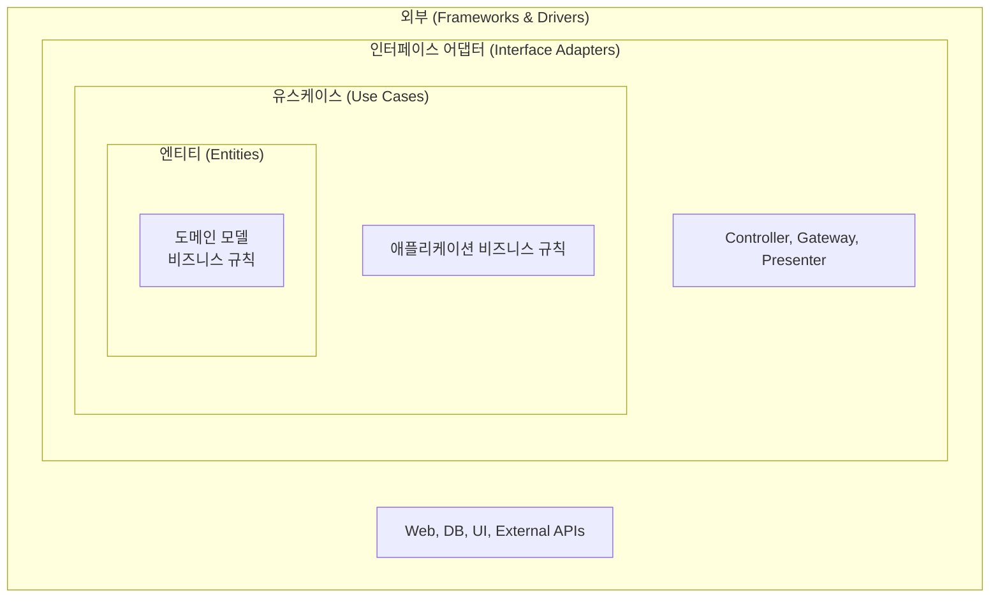

- 클린 아키텍처(Clean Architecture)는 Robert C. Martin(Uncle Bob)이 제안한 **동심원(Concentric Circle) 구조의 소프트웨어 아키텍처 패턴**이다.
- 안쪽 원(핵심 비즈니스)이 바깥쪽 원(프레임워크, 인프라)에 의존하지 않도록 **의존성 방향을 항상 안쪽으로** 향하게 한다.
- [[헥사고날 아키텍처(Hexagonal Architecture)]]는 클린 아키텍처의 변형 버전이다.

## 계층 구조

| 계층 | 내용 | 의존 방향 |
| ---- | ---- | ---- |
| Entities (가장 안쪽) | 핵심 도메인 모델, 비즈니스 규칙 | 아무것도 의존하지 않음 |
| Use Cases | 애플리케이션 비즈니스 로직 | Entities에만 의존 |
| Interface Adapters | Controller, Repository 구현체 | Use Cases에 의존 |
| Frameworks & Drivers | Spring, JPA, DB, Web | 가장 바깥 |

## 핵심 원칙 - 의존성 규칙

- **안쪽 원은 바깥쪽 원을 절대 알지 못한다.**
- `import`는 항상 안쪽 방향으로만 허용된다.
- 도메인 엔티티는 Spring 어노테이션, JPA, HTTP 등 외부 의존성이 없어야 한다.

## 클린 아키텍처 vs 헥사고날 아키텍처

| 항목 | 클린 아키텍처 | 헥사고날 아키텍처 |
| ---- | ---- | ---- |
| 구조 표현 | 동심원 | 포트와 어댑터 (육각형) |
| 핵심 원칙 | 의존성 방향 (안쪽) | 포트 인터페이스로 외부와 격리 |
| 공통점 | 도메인/비즈니스 로직을 외부로부터 격리 | |

- 두 아키텍처 모두 같은 목표를 추구하며, 실무에서는 함께 혼용하거나 동의어처럼 사용하기도 한다.

## 관련

- [[헥사고날 아키텍처(Hexagonal Architecture)]]
- [[포트와 어댑터(Port and Adapter)]]
- [[DDD(Domain Driven Design)]]
- [[Bounded Context]]
