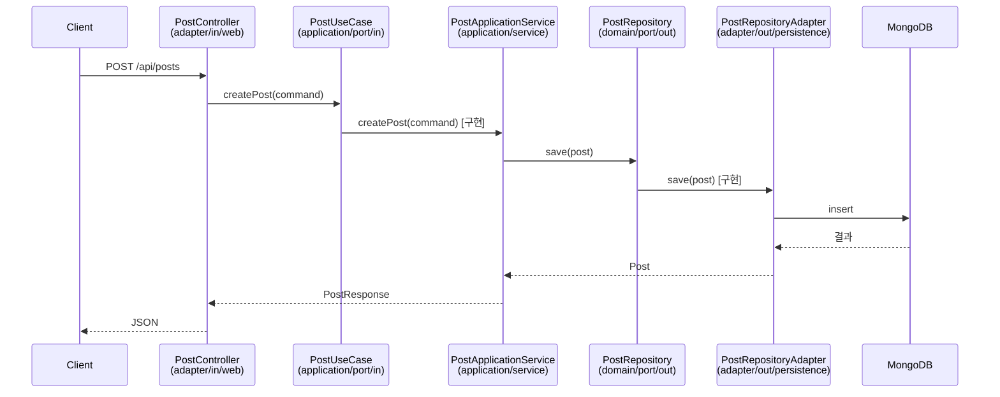

- 포트(Port)는 **[[인터페이스(Interface)]]**이고, 어댑터(Adapter)는 그 인터페이스의 **구현체**이다.
- [[헥사고날 아키텍처(Hexagonal Architecture)]]의 핵심 구성 요소로, 도메인과 외부 세계의 소통 규약을 정의한다.

- 포트의 위치(누가 정의하는가)는 도메인/애플리케이션 계층이다.
- 어댑터의 위치(누가 구현하는가)는 외곽 계층이다.
- 즉 **의존성이 안쪽으로만 흐른다** (의존성 역전 원칙, DIP).

## 포트의 종류

### 1. 인바운드 포트 (Inbound Port, Driving Port)

- 위치: `application/port/in/`
- 외부(컨트롤러, 스케줄러, 메시지 리스너)가 애플리케이션을 **호출하기 위해** 사용하는 [[인터페이스(Interface)]].
- 보통 "UseCase" 접미사를 붙인다: `PostUseCase`, `AuthUseCase`.

```java
public interface PostUseCase {
    PostResponse createPost(CreatePostCommand command);
    PostResponse getPost(String slug);
}
```

### 2. 아웃바운드 포트 (Outbound Port, Driven Port)

- 위치: 두 군데로 나뉜다.
    - `domain/port/out/`: **도메인 리포지토리 포트**. 도메인이 영속 계층에게 요구하는 약속.
    - `application/port/out/`: **외부 인프라 포트**. 애플리케이션이 외부 서비스에 요구하는 약속(메일, OAuth, 토큰 등).

```java
// 도메인 리포지토리 포트
public interface PostRepository {
    Post save(Post post);
    Optional<Post> findBySlug(String slug);
}

// 외부 인프라 포트
public interface TokenProvider {
    String generateAccessToken(String userId, String role);
    boolean validate(String token);
}
```

## 어댑터의 종류

### 1. 인바운드 어댑터 (Adapter In)

- 위치: `adapter/in/web/`, `adapter/in/ws/`, `adapter/in/scheduler/` 등
- 외부 요청을 받아 인바운드 포트(UseCase)로 위임한다.
- [[컨트롤러(Controller)]], WebSocket 핸들러, 메시지 리스너 등.

```java
@RestController
@RequiredArgsConstructor
public class PostController {
    private final PostUseCase postUseCase;  // 인바운드 포트 주입

    @PostMapping("/api/posts")
    public PostResponse create(@RequestBody CreatePostRequest req) {
        return postUseCase.createPost(req.toCommand());
    }
}
```

### 2. 아웃바운드 어댑터 (Adapter Out)

- 위치: `adapter/out/persistence/`, `adapter/out/external/`, `adapter/out/mail/` 등
- 도메인/애플리케이션 포트를 **구현**한다.
- MongoDB, OAuth, 메일 SMTP 클라이언트 등.

```java
@Component
@RequiredArgsConstructor
public class PostRepositoryAdapter implements PostRepository {
    private final MongoPostRepository mongoRepository;  // Spring Data 인터페이스

    @Override
    public Post save(Post post) {
        return mongoRepository.save(post);
    }
}
```

## 흐름 다이어그램



## 명명 컨벤션

| 종류 | 패키지 | 인터페이스 명 | 구현체 명 |
| ---- | ---- | ---- | ---- |
| 인바운드 포트 | `application/port/in` | `XxxUseCase`, `XxxQueryPort` | (서비스가 구현) |
| 도메인 아웃바운드 포트 | `domain/port/out` | `XxxRepository` | `XxxRepositoryAdapter` |
| 인프라 아웃바운드 포트 | `application/port/out` | `XxxProvider`, `XxxSender` | `XxxAdapter`, `Smtp...` |

## 핵심 원칙

- **컨트롤러는 UseCase 인터페이스만 본다** — `XxxApplicationService` 구체 클래스 직접 주입 금지.
- **ApplicationService는 도메인 포트만 본다** — `MongoTemplate`/`@Repository` 직접 import 금지.
- **타 [[Bounded Context]]를 참조할 땐 그쪽 인바운드 포트(UseCase/QueryPort)를 통해서만** — 다른 도메인의 모델을 직접 import 하지 말 것.

## 관련

- [[헥사고날 아키텍처(Hexagonal Architecture)]]
- [[DI(Dependency Injection)]]
- [[인터페이스(Interface)]]
