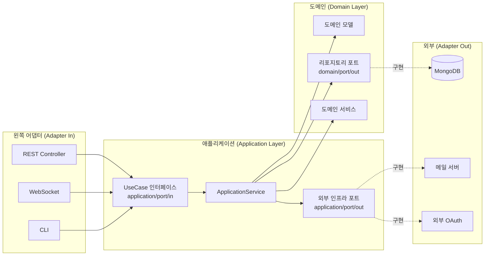

- 헥사고날 아키텍처(Hexagonal Architecture)는 "포트와 어댑터(Ports & Adapters)" 패턴이라고도 불리며, **도메인을 외부 기술로부터 격리**하기 위한 [[패턴(Pattern)]]이다.
- Alistair Cockburn이 2005년에 제안했으며, 모든 외부 입출력(웹, DB, 메시지 큐, 외부 API 등)을 **어댑터(Adapter)**가 책임지고, 핵심 [[비즈니스 로직(Business Logic)]]은 **포트(Port)**로만 외부와 소통한다.

- 의존성 방향이 항상 **외부 → 도메인** 한 방향으로만 흐른다.
- 도메인은 어떤 프레임워크/DB도 모르며, 그 덕분에 갈아끼우거나 단위 테스트하기 쉽다.

## 구조 다이어그램

## 계층별 책임

- **어댑터(Adapter)**: 기술 구현체. 웹 컨트롤러, JPA/Mongo 레포지토리 구현체, 외부 API 호출 클라이언트 등.
    - `adapter/in/web`: 들어오는 요청을 처리하는 [[컨트롤러(Controller)]].
    - `adapter/out/persistence`: 도메인 [[리파지터리(Repository)]] 포트의 구현체.
    - `adapter/out/external`: 외부 API/메일/메시지 큐 어댑터.

- **포트(Port)**: 인터페이스. 도메인과 외부의 약속.
    - `application/port/in`: **인바운드 포트**. UseCase 인터페이스. 컨트롤러가 호출.
    - `application/port/out`: **외부 인프라 포트**. TokenProvider, MailSender 등.
    - `domain/port/out`: **도메인 리포지토리 포트**. 도메인이 영속 계층에 요구하는 약속.

- **애플리케이션(Application)**: UseCase 구현. 도메인 객체를 오케스트레이션하지만 비즈니스 규칙 자체는 도메인에.

- **도메인(Domain)**: 순수 [[자바(Java)]] 객체. 프레임워크 의존 X. 비즈니스 규칙의 본거지.

## 의존성 방향 규칙

- `adapter/in → application/port/in → domain`
- `adapter/out → domain/port/out (구현)`
- `application/service → domain/port/out`
- `application/service → application/port/out`

- 도메인은 어떤 다른 계층도 import 하지 않는다.
- 어댑터는 인터페이스를 구현할 뿐, 인터페이스는 도메인/애플리케이션이 정의한다 (**의존성 역전(DIP)**).

## 왜 쓰는가

- **테스트 용이성**: 도메인을 외부 의존 없이 단위 테스트 가능. 어댑터는 인터페이스로 모킹.
- **기술 교체 자유**: MongoDB → PostgreSQL로 옮겨도 도메인 코드는 그대로.
- **변경 영향 최소화**: 새로운 채널(GraphQL, gRPC) 추가 시 새 어댑터만 작성하면 됨.

## 안티패턴

- [[ApplicationService]]에서 `@Repository` 구현체나 `MongoTemplate`를 직접 import → 도메인 포트로만 의존해야 함.
- 도메인 모델에 Spring 어노테이션 남용 → 실용적으로 [[@Document]] 정도만 허용(Pragmatic DDD).
- 컨트롤러가 [[ApplicationService]] 구체 클래스를 주입 → UseCase 인터페이스를 주입해야 함.

## 관련 개념

- [[포트와 어댑터(Port and Adapter)]]
- [[DDD(Domain Driven Design)]]
- [[Bounded Context]]
- [[DI(Dependency Injection)]]
- [[클린 아키텍처(Clean Architecture)]] - 동심원 구조의 변형 버전
