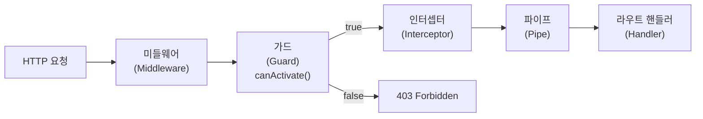

- 가드(Guard)의 주요 목적은 보통 [[컨트롤러(Controller)]]에 접근하기 전의 권한을 체크(401, 403)는 것에 주로 쓰인다.
- 물론 데이터 자체도 제대로 체크할 수 있지만, 이런 기능은 [[class-validator]]가 많이 대신한다.
- [[NestJS 미들웨어(Middleware)]]

- 가드(Guard)는 [[@Injectable()]] [[데코레이터(Decorator)]]를 사용하며 [[CanActivate]] 인터페이스([[Interface]])를 구현한 [[클래스(class)]]이다.

- [[@Injectable()]]를 사용한 이유는 [[인스턴스(Instance)]] 대신 타입을 전달하여 사용하고, [[인스턴스(Instance)]]화에 대한 책임은 프레임워크에 남겨두고 [[의존성 주입(Dependency Injection)]]을 가능하게 하기 위해서이다. 

- 대표적으로 @nestjs/passport의 [[Passport Module]]을 사용한 [[AuthGuard()]]가 있다.


## 가드의 역할

- 가드는 단일 책임을 가지며 특정한 상황들(permissions, role, ACLs 등)에 따라, 주어진 request가 라우트 핸들러에 의해 처리 여부를 결정한다. 
- [[Express]]에서는 주로 [[미들웨어(Middleware)]]로 처리를 하였다.

  

- [[NestJS 미들웨어(Middleware)]]에서는 주로 인증에 관련된 작업을 사용할 때 사용하며 [[NestJS]]에서 인가에 관련된 작업은 가드를 통해 이뤄진다.

- 공식문서에 의하면 [[미들웨어(Middleware)]]는 [[next()]]가 호출 된 후 어떠한 라우트 핸들러가 실행될 지를 모른다.
- 하지만 가드는 [[ExecutionContext]]를 사용할 수 있기 때문에 다음에 어떠한 라우트 핸들러가 실행되는지 정확하게 알 수 있다.

## Guard 구현

- `CanActivate` 인터페이스를 구현한 클래스에 `@Injectable()` 데코레이터를 붙여 Guard를 만든다.
- `canActivate()` 메서드가 `true`를 반환하면 요청이 통과하고, `false`이면 `403 Forbidden`을 반환한다.

```ts
import { Injectable, CanActivate, ExecutionContext } from '@nestjs/common';

@Injectable()
export class AuthGuard implements CanActivate {
  canActivate(context: ExecutionContext): boolean {
    const request = context.switchToHttp().getRequest();
    return !!request.headers.authorization;
  }
}
```

## Guard 적용 방법

- `@UseGuards()` 데코레이터로 컨트롤러 또는 특정 엔드포인트에 적용한다.
- 전역 적용은 `app.useGlobalGuards()`로 설정한다.

```ts
@Controller('cats')
@UseGuards(AuthGuard)
export class CatsController {
  @Get()
  findAll() { ... }
  
  @Post()
  @UseGuards(RolesGuard) // 메서드 단위 추가 적용
  create() { ... }
}
```

## 역할 기반 Guard (Role-based Guard)

```ts
import { SetMetadata } from '@nestjs/common';
export const Roles = (...roles: string[]) => SetMetadata('roles', roles);

@Injectable()
export class RolesGuard implements CanActivate {
  constructor(private reflector: Reflector) {}

  canActivate(context: ExecutionContext): boolean {
    const roles = this.reflector.get<string[]>('roles', context.getHandler());
    if (!roles) return true;
    const { user } = context.switchToHttp().getRequest();
    return roles.includes(user.role);
  }
}

// 사용
@Roles('admin')
@UseGuards(RolesGuard)
@Get('admin')
getAdminData() { ... }
```

## Guard 실행 순서 (mermaid)


